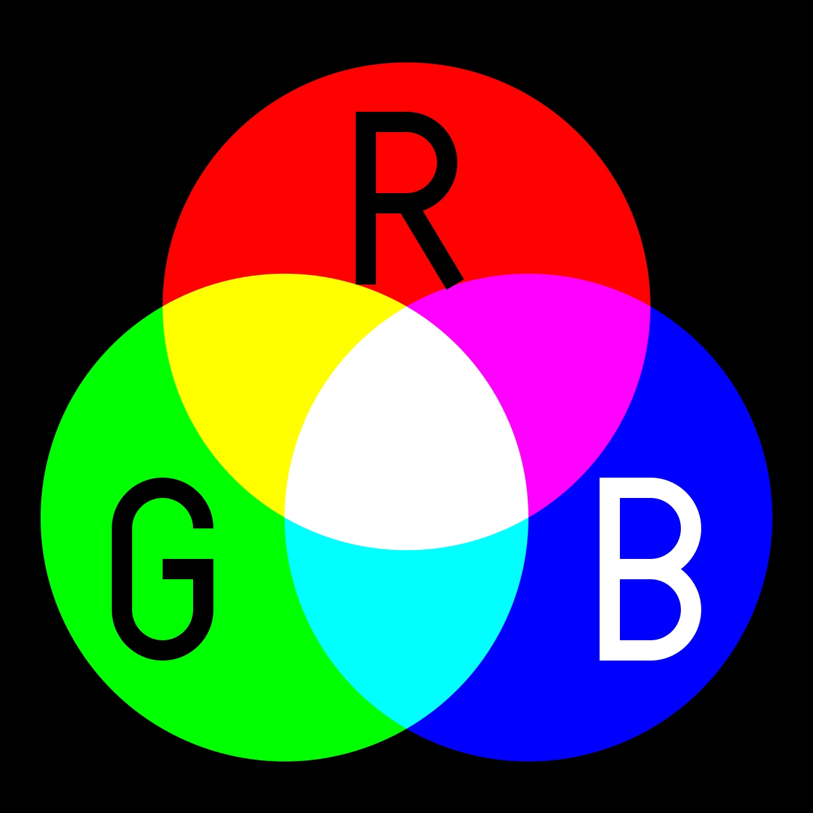
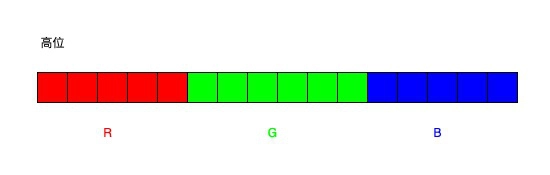
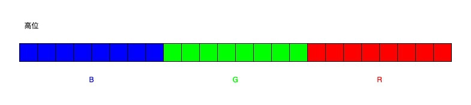
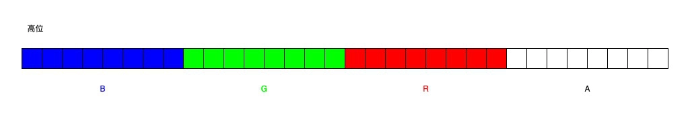

## 1. 什么是RGB？
下面摘自 wikipedia 原文：

**三原色光模式（RGB color model）**，又称**RGB颜色模型**或**红绿蓝颜色模型**，是一种**加色模型**，将红、绿、蓝三原色的色光以不同比例相加，以合成产生各种色彩光。

仔细地拆拆这句话，提出这么些疑问：
- 什么是颜色？
- 什么是加色模型？
- 为什么将RGB定义为三原色？

### 1.1. 什么是颜色？

这个问题看起有些莫名其妙，颜色不就是颜色么，还能是什么？颜色是生物学上的概念，是眼、脑和生活经验对物理世界的感知特征的描述，并且不同生物在颜色感知上是不一样的。在实际物理世界中，颜色只是人类对电磁波谱中可见光部分（特定波长，约312.30nm至745.40nm）的一个别称。

根据初中生物所学过的知识，人类眼底视网膜上遍布了许多能够感受光照刺激的**视锥细胞**，一般分为感受黄绿色（565nm）、绿色（535nm）和蓝紫色（420nm）三种细胞。这些细胞不是只接受这三种颜色的刺激，而是接收到这三种颜色对应光谱光照刺激所产生的信号最强烈，也就是说三种视锥细胞对任意可见光谱中的颜色都会产生相应的信号，这些**信号的组合**就是人眼所能分辨的颜色的总和。

### 1.2. 什么是加色模型？


简单来说，就是通过将不同的颜色混合以产生新的颜色。这里产生新的颜色并不是指混合之后就变成了新的颜色，而是人眼所感受到的颜色。根据上面提到的，人眼所感受的颜色是由三种视锥细胞的不同信号组合产生，比方说，你眼睛所感受到的橙色，可能并不是真的橙色，而是由红色和绿色按照某种比例混合组成的，但是由于眼睛生理原因，我们没法从橙色中分辨出这两种光的颜色。事实上，现实生活中很多光都是都不是物理意义上的单一的纯色光。

既然有加色模型，那么是不是有**减色模型**呢？但是是肯定的。回想一下小时候玩的橡皮泥，最开始买来都是各种颜色分开的，玩着玩着就给混合到一起去了，随着混入的颜色越来越多，橡皮泥慢慢变成了深灰色，显然和上面的加色模型理论相悖。中学物理中有讲到，物体表面的颜色取决于物体反射了什么颜色（波长，其他波长的电磁波都被吸收了），所以不同颜色橡皮泥混合之后，大部分颜色都被吸收了，只能反射少量的颜色，所以看起来就深灰色（不是黑色）。


### 1.3. 为什么将RGB定义为三原色？
现在我们清楚了人眼是如何感知颜色的，那么为什么选用 RGB 作为三原色呢？

其实原色的划分还是基于人眼的生理特性，三种视锥细胞都能接受光的刺激，根据受刺激程度最大时的波长可以分为 S（420nm）、M（535nm）、L（565nm）三种视锥细胞。纵然自然界有千万种颜色，但是从光进入人眼到信号传递到大脑，也就只有三种视锥细胞产生的电信号，而这三种电信号不同强度组合便被大脑解读成了不同颜色。

还有一个有意思的现象是，人眼对这三种电信号的混合信号的感知符合线性规律（格拉斯曼定律），这个也为颜色的线性计算提供了理论基础。到了上世纪20年代，David Wright 和 John Guild 独立地进行了"色匹配实验"，得到了不同光颜色的匹配函数（C = Rr + Gg + Bb）。再后来国际照明协会（CIE）根据实验数据及结论定义了 CIE RGB 色彩空间：


上图中彩色凸形区域描述了人眼所能分辨的所有颜色（色域）。在这个凸形中任取两点的颜色进行混合，得到的颜色一定在这两点的连线上（线性关系）；那么同理，任取三点颜色进行混合，结果也一定在三角形内部的某个点上，三个从顶点射出并经过这个结果点点的射线与对边交点到达结果点的距离与三点颜色比例成正比。所以，为了能够尽量全的覆盖人眼所能识别的颜色，使用凸形三个"顶点"的颜色（RGB）作为三原色将是一个最为理想的选择。当然也应该注意到了，通过三个点构造出来的三角形始终无法覆盖全人眼的色域。

> 这里是从感性角度的不准确描述，更加准确理论基础可以参考References部分🤣

### 1.4. 色域
还有一个非常重要的概念——色域。简单来说，色域就是各种颜色的集合，而人眼所能识别的色域也就是上面的  CIE RGB 色彩空间。但是实际中显示设备都无法完全覆盖人眼的的色域，所以就出现了耳闻能详的sRGB、Adobe RGB 等色域标准，这些色域标准定义了设备如何将**编码表示的RGB**解释成颜色。下面是一些常见的色域标准：


可以很清楚的看到，不同的色域标准所覆盖的色域范围是不一样的，一般来说色域范围越大，就能显示出更加饱满（丰富）的色彩。其中 sRGB 色域是惠普与微软在1996年一起研发用于显示器、打印机以及因特网的标准RGB色域，这种标准得到了W3C、英特尔等厂商的支持，并且许多开源软件以及文件格式也加入到 sRGB 队伍中来，因此可以认为 sRGB 色域能够在现代绝大部分设备上显示（一些高端的摄影设备可能没有支持这一标准）。

当一个色域范围更大的色域标准（Adobe RGB）显示在支持一个较小色域标准的图形设备上时，就会出现**失真**的情况，比如饱和度高的图片变得比较平淡。


## 2. RGB 的计算机表示

### 2.1. 数值表示
最后也最重要的，计算机怎么表示颜色？因为计算机没法像人那样区分红绿蓝，所以只能通过三个数值来描述颜色及其强弱。常用的数值有浮点数、百分数以及整数：
| 数值类型  | 🌰                | 解释                                                                                                                                                                                                                          |
| --------- | ---------------- | ----------------------------------------------------------------------------------------------------------------------------------------------------------------------------------------------------------------------------- |
| 浮点数    | (1.0,1.0,1.0)    | 每个分量取值 [0.0, 1.0]，最终混合。常用在一些浮点系统中，比如 OpenGL，线性运算也一般使用浮点数格式                                                                                                                            |
| 百分数    | (100%,100%,100%) | 类似浮点数表示，只不过替换成了百分比格式                                                                                                                                                                                      |
| 8bit 整数 | (255,255,255)    | 使用 8bit 整数[0, 255] 描述分量强弱，最大是 255，这是计算机中比较常见的表现方式。 除了 8 bit, 还有 12bit、16bit、32bit 的表示。理论上bit位越多（bit 位数也叫色彩深度），能表达的颜色就越细腻，但其实超过 8bit人眼就很难分辨了 |

### 2.2. 常见RGB像素格式

下面是一些目前比较常用的 RGB 像素格式，也就是 bit 位进行表示。

#### 2.2.1. RGB444
RGB 三个分量每个分量占 4bit，一个像素点占 12 bit。这种格式因为图像质量比较差，目前已经不推荐使用。

#### 2.2.2. RGB565
一个像素点用 16bit 表示，其中 R=5、G=6、B=5，G 位数更多是因为人眼对绿色更加敏感。常用一个字表示（short），内存中按照 RGB RGB RGB...排列：


下面的代码演示了如何获取 RGB565 各个分量：
```c++
#define RGB565_MASK_R 0xF800
#define RGB565_MASK_G 0x07E0
#define RGB565_MASK_B 0x001F

int main(int argc, char *argv[])
{
    ushort color = 0xFFFF; // 65535
    // 获取对应分量
    auto red = (color & RGB565_MASK_R) >> 11;
    auto green = (color & RGB565_MASK_G) >> 5;
    auto blue = (color & RGB565_MASK_B);
    LOG_I("RGB(%d,%d,%d)", red, green, blue); // RGB(31,63,31)
    return 0;
}
```

#### 2.2.3. RGB888
一个像素点用24bit表示，其中 RGB 三个分量各占 8 bit。内存中按照 BGR BGR BGR...排列：


下面的代码演示了如何获取 RGB888 各个分量：
```c++
#define RGB888_MASK_R 0x000000FF
#define RGB888_MASK_G 0x0000FF00
#define RGB888_MASK_B 0x00FF0000

int main(int argc, char *argv[])
{
    uint32_t color = 0x00F00FFF; // 15,732,735

    auto red = (color & RGB888_MASK_R);
    auto green = (color & RGB888_MASK_G) >> 8;
    auto blue = (color & RGB888_MASK_B) >> 16;
    LOG_I("RGB(%d,%d,%d)", red, green, blue); // RGB(255,15,240)
    return 0;
}
```


#### 2.2.4. ARGB8888
相比 RGB888 增加一个透明度通道，一个像素点用 32bit(uint32_t) 表示，RGBA 各占 8bit。内存中按照 BGRA BGRA BGRA...排列


下面的代码演示了如何获取 ARGB8888 各个分量：
```c++
#define ARGB8888_MASK_A 0x000000FF
#define ARGB8888_MASK_R 0x0000FF00
#define ARGB8888_MASK_G 0x00FF0000
#define ARGB8888_MASK_B 0xFF000000

int main(int argc, char const *argv[])
{
    uint32_t color = 0xF0E0D0C0; // 4,041,265,344

    auto alpha = (color & ARGB8888_MASK_A);
    auto red = (color & ARGB8888_MASK_R) >> 8;
    auto green = (color & ARGB8888_MASK_G) >> 16;
    auto blue = (color & ARGB8888_MASK_B) >> 24;
    LOG_I("RGB(%d,%d,%d,%d)", alpha, red, green, blue); // RGB(192,208,224,240)
    return 0;
}
```

### 2.3. PNG图片颜色通道分离


## 3. 其他
RGB 色彩模型的主要应用场景是在电子系统中检测，表示和显示图像，简单来说就是显示设备/屏幕。前面提到RGB三原色按比例混合可以产生各种各样的色彩，但实际上这些显示设备显示的彩色并非由加色法产生，RGB三原色子像素按照一定规则排列（并没有重叠），利用大脑强制眼睛失焦而产生感知上的彩色。

目前市面上主流的手机屏幕材质有 LCD 和 OLED，涉及到一些诸如 IPS、AMOLED等名词，这些都是在 LCD、OLED 基础上的增强。LCD 本身并不发光，所以还需要一块发光背板才能正常工作，这也是为什么LCD的黑色不够深邃的原因；而 OLED 具备自发光特性，能够单独控制每个子像素的亮度，所以理论上更加节省能源并且显示黑色更加纯正。

关于屏幕的知识可以参考[知乎](https://zhuanlan.zhihu.com/p/109841385)上讲解，非常清晰。

> 了解屏幕像素排列后，才明白为什么新买的显示要通过显示纯红、纯绿、纯蓝检测坏点


## 4. 参考文章
[RGB_color_model](https://en.wikipedia.org/wiki/RGB_color_model)

[你说的三原色究竟是哪三种颜色？](https://zhuanlan.zhihu.com/p/82225495)

[格拉斯曼定律](http://en.wikipedia.org/wiki/Grassmann%27s_law_(optics))

[色彩空间基础](https://zhuanlan.zhihu.com/p/24214731)

[三原色理论与颜色匹配实验](https://zhuanlan.zhihu.com/p/84897327)

[色域马蹄图是怎么来的？](https://zhuanlan.zhihu.com/p/137639368)

[CIE 色度图与色域](https://www.zhangxiaochun.com/color-space-2/)