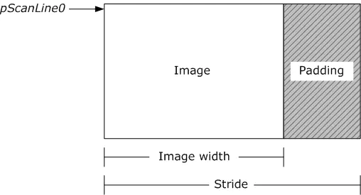

## 1. YUV 简介

与 RGB 类似，YUV 也是一种非常流行的颜色编码方式。RGB 编码方式诉求人眼对**色彩**的感受，而 YUV 则关注人眼对**亮度**的敏感程度。人眼中除了感受色彩的视锥细胞外还有对亮度(能量)敏感的视杆细胞，在 [RGB](./1.颜色编码方式——RGB.md) 中基本没有提到过视杆细胞对大脑成像的影响，但实际上 RGB 三原色分量都各自包含了亮度信息。

YUV 中 "Y" 表示**亮度(Luminance)**，"U" 和 "V" 则表示**色度**、**浓度(Chrominance、Chroma)**，UV 通常组合起来使用/描述，Y 包含了完整图像信息。

> 在计算机领域中，UV 分量有时也会称作蓝色通道和红色通道，基于此可以分别提取图片中蓝色和红色的物体轮廓

YUV 诞生于黑白电视向彩色电视过渡时期，黑白电视只有灰度/亮度(Y)信号，所以对于彩色电视信号，去除**彩色(UV)信号**就能兼容黑白电视。另一方由于人眼对亮度信号更加敏感，可以适当降低 UV 分量采样率以降低信号传输的带宽压力，实际上大多数YUV格式平均像素位数都小于24bit，所以 YUV 比 RGB 更加适合**传输**场景。

由于历史原因，YUV 实际上是一系列颜色编码(Y'UV，YUV，YCbCr，YPbPr)方式的统称，它们的原理大致相同，具体适用场景有些许差异。讨论这些 YUV族 格式不是这篇文章的重点(没有遇到过需要细分需求)，所以重点会放在 YUV 的采样格式与存储格式上。


## 2. YUV 采样格式

假设 YUV 每个分量使用 8bit 表示，一共24bit，那么一张 1080x1920 分辨率的图像就需要 5.93M 空间(不考虑压缩算法的情况下)：
```
1080 * 1920 * 3 * 8bit = 49,766,400bit = 6,220,800byte = 6,075KB = 5.93M
```

上面提到因为人眼对 Y 比对 UV 信号更加敏感，可以在传输场景中对 UV 分量采样(subsample)来降低数据大小。常用的采样格式有 YUV 4:4:4、YUV 4:2:2、YUV 4:2:0。

### 2.1. YUV 4:4:4 采样
4:4:4 表示全采样，每个像素点拥有完整的 YUV 三个分量：
```
YC  YC  YC  YC

YC  YC  YC  YC

YC  YC  YC  YC

YC  YC  YC  YC
```

> 上面字符表示4x4的图像，其中 UV 分量用 C 表示，下文同理。

因为是全采样，所以并没有达到节省带宽的作用。


### 2.2. YUV 4:2:2 采样
4:2:2 表示水平2:1采样，垂直全采样，每两个 Y 分量共享一组UV分量：
```
Y C Y  Y C Y

Y C Y  Y C Y

Y C Y  Y C Y

Y C Y  Y C Y
```

4:2:2 采样下 UV 分量占用带宽减少了一半，整体数据量也就变成了全采样的 `(1 + 0.5 + 0.5)/3 = 2/3`。

### 2.3. YUV 4:2:0 采样
4:2:0表示2:1的水平采样，垂直2:1采样，每4个 Y 分量共享一组 UV 分量：
```
Y   Y  Y   Y
  C      C
Y   Y  Y   Y

Y   Y  Y   Y
  C      C
Y   Y  Y   Y
```

4:2:0 采样下 UV 分量占用带宽变成了全采样的 1/4，整体数据量也就变成了全采样的 `(1 + 1/4 + 1/4)/3 = 1/2`，这也是目前比较主流的采样格式。

## 3. YUV 存储格式
采样格式描述了YUV三个分量的比例，存储格式描述了YUV分量的排列方式。

前面提到了 YUV 分量可以分开存储，目前有三种主流的存储格式：
- packed(打包格式)，YUV 分量连续交叉存储。
- planar(平面格式)，YUV 三个分量分开存储，分为 Y、U、V 三个平面。
- semi-planar(半平面格式)，Y 分量单独存储为一个平面，UV分量连续交叉存储为另一平面。

根据采用的采样格式与存储格式的不同组合，就有了不同的 YUV 格式：
|                          | 4:2:2 采样 | 4:2:0 采样       |
| ------------------------ | ---------- | ---------------- |
| packed 存储(1Plane)      | YUYV、UYVY |                  |
| planar 存储(3Plane)      | 422P(I422) | YV12、YU12(I420) |
| semi-planar 存储(2Plane) |            | NV12、NV21       |

### 3.1. 4:2:2 采样 YUV 格式
4:2:2 采样下两个 Y 分量共享一组 UV 分量。

#### 3.1.1. YUYV、UYVY
YUYV、UYVY 采用 packed 存储格式，一帧画面只有一个平面(Plane)。这两种格式的存储方式非常直观，每两个像素占用4bytes。

**YUYV**：
```
->
YUYV YUYV
YUYV YUYV
YUYV YUYV
YUYV YUYV
```

**UYVY**：
```
->
UYVY UYVY
UYVY UYVY
UYVY UYVY
UYVY UYVY
```

#### 3.1.2. 422P(I422)
422P 采用 planar 存储格式，YUV 三个分量分开存储，一帧画面有三个平面(Plane)，每两个像素占4bytes。
```
YYYY
YYYY
YYYY
YYYY

UUUU
UUUU

VVVV
VVVV
```

### 3.2. 4:2:0 采样 YUV 格式
4:2:0 采样下四个 Y 分量共享一组 UV 分量。

#### 3.2.1. YV12、YU12(I420)
YV12、YU12(I420) 采用 planar 存储格式，YUV 分开存储，一帧画面有三个平面(Plane)，每四个像素占6bytes。两种格式根据UV存储顺序区分。

**YV12**
```
YYYY
YYYY
YYYY
YYYY

UUUU

VVVV
```

**YU12(I420)**
```
YYYY
YYYY
YYYY
YYYY

VVVV

UUUU
```

可以看到这两种格式只是 U、V 平面排列先后的区别。

#### 3.2.2. NV12、NV21
NV12、NV21 采用 semi-planar 存储格式，Y 分量单独一个平面，UV 分量交叉连续存储为一个平面，每四个像素占6bytes。两种格式按照UV存储顺序区分。

**NV12**
```
YYYY
YYYY
YYYY
YYYY

UVUV
UVUV
```

**NV21**
```
YYYY
YYYY
YYYY
YYYY

VUVU
VUVU
```

> iOS 平台常用 NV12，Android 平台常用 NV21


### 3.3. 内存对齐

现代计算机基本都搭载 32bit 或 64bit 的 CPU，它们一次处理最少读取 4、8 byte，如果少于这些反而需要做一些额外的寻址操作，影响性能，所以就有了内存对齐。内存对齐会在数据尾部补 0 以凑够 4、8byte，牺牲一部分内存换取性能.

大多数情况下图像的分辨率(宽、高)都是4的倍数，但是例外的case也不少，所以很多图像处理的框架中都会有内存对齐相关的概念，比如 FFmpeg 解码后的 linesize.




## 4. YUV<-->RGB 转换

因为图形显示时常用 RGB 模型，而 YUV 常用在数据传输场景，所以这两种颜色模型之间经常需要进行转换。不同的标准下的转换公式(formulas)也不太一样，下面是 [BT.601](https://en.wikipedia.org/wiki/Rec._601) 标准下的转换公式:

<br/>

$$
\begin{bmatrix}
Y\\ U\\ V
\end{bmatrix}
=
\begin{bmatrix}
0.299 & 0.587 & 0.114\\
-0.147 & -0.289 & 0.436\\
0.615 & -0.515 & -0.100
\end{bmatrix}
\begin{bmatrix}
R\\ G\\ B
\end{bmatrix} \tag{1}
$$

<br/>

$$
\begin{bmatrix}
R\\ G\\ B
\end{bmatrix}
=
\begin{bmatrix}
1 & 0 & 1.140\\
1 & -0.395 & -0.581\\
1 & 2.032 & 0
\end{bmatrix}
\begin{bmatrix}
Y\\ U\\ V
\end{bmatrix} \tag{2}
$$

> 矩阵运算能够充分利用现代图形硬件(eg. GPU)进行加速，在SIMD架构处理器还没有出现之前，浮点运算开销比 fixed-point 算法慢很多，所以就是有一些使用整数运算代替浮点数运算的加速公式(存在精度损失).

<br/>


## 5. YUV 图像操作--libyuv
YUV 图像常见的处理有缩放、裁剪、旋转、镜像以及格式转换等，这些操作都可以借助 Google 开源的 [libyuv](https://chromium.googlesource.com/libyuv/libyuv/) 快速实现。

### 5.1. libyuv 简介
libyuv 支持:
- 缩放原始 YUV 数据以压缩大小，支持点、双线性以及盒式插值.
- 将原始 webcam 格式转化成 YUV.
- 将 YUV 转换成 RGB 数据用于渲染或特效处理.
- 以90°倍数旋转图像.
- 针对x86/x64、Arm、Mips 架构处理器指令优化.

### 5.2. libyuv 编译
[Gettting Started](https://chromium.googlesource.com/libyuv/libyuv/+/HEAD/docs/getting_started.md) 详细地介绍了如何获取代码并编译，但是都看完还是比较头大，如果想快速编译出动态库使用，可以只看 [CMake](https://chromium.googlesource.com/libyuv/libyuv/+/HEAD/docs/getting_started.md#building-the-library-with-cmake) 部分.

> 下面的操作都是在 macOS 下完成

首先是 clone 代码到本地，对历史 commit 没兴趣可以指定 `--depth=1`:
```
git clone --depth=1 https://chromium.googlesource.com/libyuv/libyuv
```

代码拉下来后就可以开始编译了，cmake 可以通过 `brew install cmake` 安装:
```shell
$ mkdir out && cd out
# cmake 执行完会有一些 Warning，可以直接忽略
$ cmake ..
$ make
```

执行完 make 不出意外的话，会得到下面三个产物:
```shell
.
├── [595K]  libyuv.a
├── [449K]  libyuv.dylib
└── [391K]  yuvconvert
```
yuvconvert


但是有一种情况很奇怪，当系统安装了 libjpeg 反而编译不过:
```shell
Undefined symbols for architecture x86_64:
  "_jpeg_CreateDecompress", referenced from:
      libyuv::MJpegDecoder::MJpegDecoder() in mjpeg_decoder.cc.o
  "_jpeg_abort_decompress", referenced from:
      libyuv::MJpegDecoder::UnloadFrame() in mjpeg_decoder.cc.o
      libyuv::MJpegDecoder::FinishDecode() in mjpeg_decoder.cc.o
  "_jpeg_destroy_decompress", referenced from:
      libyuv::MJpegDecoder::~MJpegDecoder() in mjpeg_decoder.cc.o
  "_jpeg_read_header", referenced from:
      libyuv::MJpegDecoder::LoadFrame(unsigned char const*, unsigned long) in mjpeg_decoder.cc.o
  "_jpeg_read_raw_data", referenced from:
      libyuv::MJpegDecoder::DecodeImcuRow() in mjpeg_decoder.cc.o
  "_jpeg_resync_to_restart", referenced from:
      libyuv::MJpegDecoder::MJpegDecoder() in mjpeg_decoder.cc.o
  "_jpeg_start_decompress", referenced from:
      libyuv::MJpegDecoder::StartDecode() in mjpeg_decoder.cc.o
  "_jpeg_std_error", referenced from:
      libyuv::MJpegDecoder::MJpegDecoder() in mjpeg_decoder.cc.o
ld: symbol(s) not found for architecture x86_64
clang: error: linker command failed with exit code 1 (use -v to see invocation)
make[2]: *** [libyuv.dylib] Error 1
make[1]: *** [CMakeFiles/yuv_shared.dir/all] Error 2
make: *** [all] Error 2
```

这是因为 libyuv 依赖了 libjpeg，但是 CMakeList.txt 里却没有为其配置链接:
```cmake
# ...
INCLUDE ( FindJPEG )
if (JPEG_FOUND)
  include_directories( ${JPEG_INCLUDE_DIR} )
  target_link_libraries( yuvconvert ${JPEG_LIBRARY} )
  # 加上下面两行就可以了
  target_link_libraries( yuvconvert ${JPEG_LIBRARY} )
  target_link_libraries( yuvconvert ${JPEG_LIBRARY} )
  # HAVE_JPEG 条件编译为真
  add_definitions( -DHAVE_JPEG )
endif()
# ...
```
> [FindJPEG](https://cmake.org/cmake/help/latest/module/FindJPEG.html) 是 Cmake 内置模块.

### 5.3. libyuv 使用

~~留个坑，后面实战了再来补上~~


## 6. 参考文章

[YUV](https://en.wikipedia.org/wiki/YUV)

[一文理解YUV](https://zhuanlan.zhihu.com/p/75735751)

[一文读懂YUV采样与格式](https://glumes.com/post/ffmpeg/understand-yuv-format/)

[yuvrgb-conversion-formulas](https://www.pcmag.com/encyclopedia/term/yuvrgb-conversion-formulas)