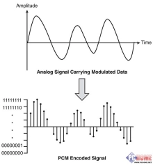
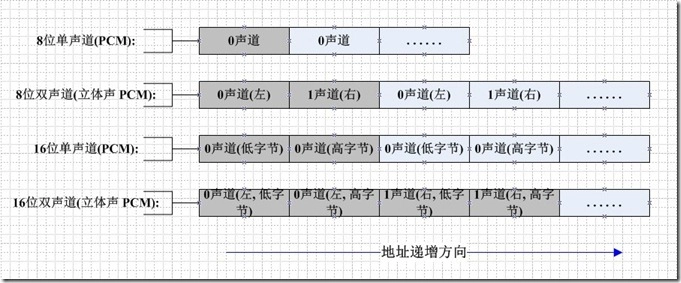
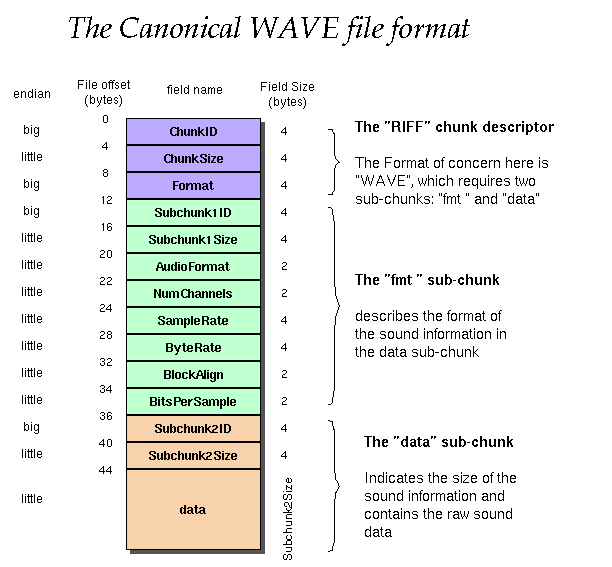

## 1. 声音三要素

声音主观感受上主要有响度、音高、音色以及掩蔽效应等特征，其中响度、音高、音色在物理上可以量化成具有振幅、频率、相位的波，故称它们为声音的"三要素"。

1. 响度。表示声音能量的强弱，振幅越大，能量越大。
2. 音高。表示人耳对音调高低的主观感受，物理上用频率与之对应，频率越高，音高越高。人耳可以识别的声音频率范围是 20~20kHz。
3. 音色。从音乐的角度来讲，音色由乐器的材质决定。物理上，音色是是众多相位不同波形叠加产生，其中波形的基频产生的听得最清楚的音称为基音，各谐波(其它相位)微小震动产生的声音称为泛音。

## 2. A/D转换与PCM

要将自然界中的**信号**进行传输，声音转换成**计算机能够识别的形式**，前者称为**模拟信号**，后者称为**数字信号**，模拟信号与数字信号之间的转换过程就叫做**数模转换(A/D)**。

PCM(Pulse Code Modulation) 是数字通信中编码方式的一种，也即计算所能识别的信号形式。PCM 通过对模拟信号进行采样、量化、编码而产生，接收 PCM 信号的端则将编码"还原"成模拟信号。采样过程将连续的信号按照固定时间间隔离散化(声音是一个连续信号)，根据奈奎斯特采样定理，为了保证最终的数字信号能比较完整的还原成模拟信号，采样频率必须是原信号频率的2倍及以上。采样完成了信号在时间纬度上的离散，但仍是模拟信号，因为样值在一定范围内仍然具有无限多取值可能，所以将取值范围按照一定步长划分为有限个取值，这就是量化。将量化后的样值按照一定规则排列就是编码了。

> 简单来说，A/D 转换就是将连续变成离散，将无限变成有限。



在音视频领域，PCM 常用来保存原始音频数据，并且约定 PCM 等价于无损编码。很多高保真的音频也都采用 PCM 保存，缺点就是占用空间会比较多一些。

## 3. 音频编码

### 3.1. 音频参数

音频数据参数有**采样率**、**采样位数**以及**声道数**。

采样率指声音信号在 A/D 转换过程中单位时间内的采样次数，单位是 Hz; 采样位数是指用多少 bit 数据对声音进行量化，常用的有 8 bit、16bit; 声道数又称音轨，不准确地理解是声源，人听到声音时会对声源进行定位，不同位置的声道数越多，效果就越逼真，常见声道数有:
* 单声道，mono。
* 双声道，stereo，最常见的类型，包含左声道以及右声道。
* 2.1声道，在双声道基础上加入一个低音声道。
* 5.1声道，包含一个正面声道、左前方声道、右前方声道、左环绕声道、右环绕声道、一个低音声道，最早应用于早期的电影院。
* 7.1声道，在5.1声道的基础上，把左右的环绕声道拆分为左右环绕声道以及左右后置声道，主要应用于BD以及现代的电影院。


若音频PCM格式描述为 44100kHz 16LE stereo，意思是采样率是 44100Hz，采样位数是 16bit(无符号数)并且单个采样采用小端法存储，stereo 表示双声道。

> 量化的值可能是整数也可能是浮点数。


### 3.2. 音频PCM存储
如果是单声道音频，那么采样数据按照时间顺序一次存储。如果音频是双声道，则左右声道采样按照时间顺序交错存储。



当使用 ffplay 播放 PCM 数据时，需要指定音频的采样率、采样位宽以及声道数:
```shell
$ ffplay -autoexit -ar 44100 -channels 2 -f s16le -i raw.pcm
```

### 3.3. WAV 格式
原始PCM数据的一个问题就是每次播放时需要显式指定采样率等参数，比较直接的解决方案就是将这些参数也写入音频文件，让播放器帮我们解析这些参数。WAV 是 Microsoft 和 IBM 为 PC 开发的音频文件格式，它做的事情就是在文件头部写入一些描述信息，用来告诉播放器所需要的参数。

WAV 采用 RIFF 规范进行数据存储:



第一列表示对应区块是采用大端法还是小端法进行存储; 第二列是区块在文件中的偏移位置，第四列是每个区块的大小，限定了区块的固定占用空间; 中间第三列就是每个区块的定义，规定了每个区块需要存放什么数据。

图中每个 Chunk 都有 ChunkID 和 ChunkSize，后面的 Chunk 都是第一个 Chunk 的 SubChunk。

第一个 ChunkID 内容是 "RIFF"，指明文件存储格式，随后 ChunkSize 内容是剩余文件长度(byte，4+(4+4+SubChunk1Size)+(4+4+SubChunk2Size))。Format 中存储 "WAVE"，表明这个文件存储的是 PCM 数据，确定了 Format 也就决定了如何解析剩余文件内容。

第二个 Chunk 描述了音频参数。AudioFormat 指明音频数据格式，PCM = 1，如果不是 1 就表示音频数据是其它相应的压缩格式(比如 MP3)。BlockAlign = NumChannels * BitsPerSample/8，每次对音频数据的读写大小必须是 BlockAlign 的整数倍，并且只能从一个完整的 Block 的起始地址开始读写，从其它位置开始读写都是非法的。

前两个 Chunk 描述了音频数据的基本信息，第三个 Chunk 存储实际音频数据。


### 3.4. 读写 WAV
下面演示如何将 PCM 存储为 WAV 文件以及如何从 WAV 文件中读取出原始 PCM 数据并打印音频参数。

> pcm 文件使用 `ffmpeg -i audio.mp3 -f s16le -acodec pcm_s16le out.pcm` 从音频文件中提取。

```c++
/**
 * @param0 executable program's file path
 * @param1 raw pcm data file path
 * @param2 sample rate
 * @param3 sample size in bits
 * @param4 number of channels
 * @param4 output file path
 */
void write_wav(int argc, char const *argv[])
{
    std::string pcm_file = std::string(argv[1]);
    int sample_rate = std::atoi(argv[2]);
    int sample_size = std::atoi(argv[3]);
    int nr_channels = std::atoi(argv[4]);
    std::string wav_file = std::string(argv[5]);

    // read/write in binary mode
    std::ifstream pcm_st;
    pcm_st.exceptions(std::fstream::failbit | std::fstream::badbit);
    try
    {
        pcm_st.open(pcm_file, std::ios::in | std::ios::binary);
    }
    catch (const std::fstream::failure &e)
    {
        LOG_E("Failed to open: %s-%d %s", argv[1], pcm_st.fail(), e.what());
        return;
    }

    std::ofstream wav_st;
    wav_st.exceptions(std::fstream::failbit | std::fstream::badbit);
    try
    {
        wav_st.open(wav_file, std::ios::out | std::ios::binary);
    }
    catch (const std::fstream::failure &e)
    {
        LOG_E(e.what());
    }
    // define Header Chunk
    ChunkHeader wav_header{};
    memcpy(wav_header.ChunkID, "RIFF", strlen("RIFF"));
    memcpy(wav_header.Format, "WAVE", strlen("WAVE"));
    wav_st.seekp(sizeof(ChunkHeader), std::ios::cur);

    // define SubChunk1
    ChunkFmt wav_fmt{};
    memcpy(wav_fmt.ChunkID, "fmt ", strlen("fmt "));
    wav_fmt.ChunkSize = sizeof(wav_fmt) - 8;
    wav_fmt.AudioFormat = 1;
    wav_fmt.NrChannels = nr_channels;
    wav_fmt.SampleRate = sample_rate;
    wav_fmt.ByteRate = sample_rate * nr_channels * sample_size / 8;
    wav_fmt.BlockAlign = nr_channels * sample_size / 8;
    wav_fmt.BitsPerSample = sample_size;
    wav_st.seekp(sizeof(ChunkFmt), std::ios::cur);
    // define SubChunk2
    ChunkData wav_data{};
    memcpy(wav_data.ChunkID, "data", strlen("data"));
    wav_st.seekp(sizeof(ChunkData), std::ios::cur);

    LOG_I("Writing pcm data");
    int total_raw_data_size = 0;
    int readed_size = 0;
    char *buffer = static_cast<char *>(malloc(1024));

    try
    {
        do
        {
            pcm_st.read(buffer, 1024);
            readed_size = pcm_st.gcount();
            total_raw_data_size += readed_size;
            wav_st.write(buffer, readed_size);
        } while (pcm_st.gcount() > 0);
    }
    catch (const std::fstream::failure &e)
    {
        LOG_E("Oops, some error occured: %s", e.what());
    }

    wav_header.ChunkSize = 4 + sizeof(ChunkFmt) + sizeof(ChunkData) + total_raw_data_size;
    wav_data.ChunkSize = total_raw_data_size;

    // seek at the beggining of the output file
    wav_st.seekp(0, std::ios::beg);
    // write the header
    LOG_I("Writing header chunk");
    wav_st.write(reinterpret_cast<char *>(wav_header.ChunkID), sizeof(char) * 4);
    wav_st.write(reinterpret_cast<char *>(&wav_header.ChunkSize), sizeof(uint32_t));
    wav_st.write(reinterpret_cast<char *>(wav_header.Format), sizeof(char) * 4);

    LOG_I("Writing format chunk");
    wav_st.write(reinterpret_cast<char *>(wav_fmt.ChunkID), sizeof(char) * 4);
    wav_st.write(reinterpret_cast<char *>(&wav_fmt.ChunkSize), sizeof(uint32_t));
    wav_st.write(reinterpret_cast<char *>(&wav_fmt.AudioFormat), sizeof(uint16_t));
    wav_st.write(reinterpret_cast<char *>(&wav_fmt.NrChannels), sizeof(uint16_t));
    wav_st.write(reinterpret_cast<char *>(&wav_fmt.SampleRate), sizeof(uint32_t));
    wav_st.write(reinterpret_cast<char *>(&wav_fmt.ByteRate), sizeof(uint32_t));
    wav_st.write(reinterpret_cast<char *>(&wav_fmt.BlockAlign), sizeof(uint16_t));
    wav_st.write(reinterpret_cast<char *>(&wav_fmt.BitsPerSample), sizeof(uint16_t));

    LOG_I("Writing data chunk");
    wav_st.write(reinterpret_cast<char *>(wav_data.ChunkID), sizeof(char) * 4);
    wav_st.write(reinterpret_cast<char *>(&wav_data.ChunkSize), sizeof(uint32_t));

    pcm_st.close();
    wav_st.close();
    LOG_I("completed, %s", argv[5]);
}

/**
 * @param0 executable program's file path
 * @param1 wav file path
 * @param2 output file path
 */
void read_wav(int argc, char const *argv[])
{
    std::string wav_file = std::string(argv[1]);
    std::string pcm_file = std::string(argv[2]);

    // read/write in binary mode
    std::ifstream wav_st;
    wav_st.exceptions(std::fstream::failbit | std::fstream::badbit);
    try
    {
        wav_st.open(wav_file, std::ios::in | std::ios::binary);
    }
    catch (const std::fstream::failure &e)
    {
        LOG_E(e.what());
    }
    std::ofstream pcm_st;
    pcm_st.exceptions(std::fstream::failbit | std::fstream::badbit);
    try
    {
        pcm_st.open(pcm_file, std::ios::out | std::ios::binary);
    }
    catch (const std::fstream::failure &e)
    {
        LOG_E("Failed to open: %s-%d %s", argv[1], pcm_st.fail(), e.what());
        return;
    }

    ChunkHeader wav_header{};
    ChunkFmt wav_fmt{};
    ChunkData wav_data{};

    // read RIFF chunk
    LOG_I("Reading RIFF chunk");
    wav_st.read(reinterpret_cast<char *>(wav_header.ChunkID), sizeof(char) * 4);
    wav_st.read(reinterpret_cast<char *>(&wav_header.ChunkSize), sizeof(uint32_t));
    wav_st.read(reinterpret_cast<char *>(wav_header.Format), sizeof(char) * 4);
    if (std::string(wav_header.Format) != "WAVE")
    {
        LOG_E("Invalid format: %s", wav_header.Format);
        return;
    }
    // read fmt chunk
    LOG_I("Reading fmt chunk");
    wav_st.read(reinterpret_cast<char *>(wav_fmt.ChunkID), sizeof(char) * 4);
    wav_st.read(reinterpret_cast<char *>(&wav_fmt.ChunkSize), sizeof(uint32_t));
    wav_st.read(reinterpret_cast<char *>(&wav_fmt.AudioFormat), sizeof(uint16_t));
    wav_st.read(reinterpret_cast<char *>(&wav_fmt.NrChannels), sizeof(uint16_t));
    wav_st.read(reinterpret_cast<char *>(&wav_fmt.SampleRate), sizeof(uint32_t));
    wav_st.read(reinterpret_cast<char *>(&wav_fmt.ByteRate), sizeof(uint32_t));
    wav_st.read(reinterpret_cast<char *>(&wav_fmt.BlockAlign), sizeof(uint16_t));
    wav_st.read(reinterpret_cast<char *>(&wav_fmt.BitsPerSample), sizeof(uint16_t));

    // read data chunk
    LOG_I("Reading data chunk");
    wav_st.read(reinterpret_cast<char *>(wav_data.ChunkID), sizeof(char) * 4);
    wav_st.read(reinterpret_cast<char *>(&wav_data.ChunkSize), sizeof(uint32_t));

    LOG_I("Reading pcm data");
    int total_raw_data_size = 0;
    int readed_size = 0;
    char *buffer = static_cast<char *>(malloc(1024));

    try
    {
        do
        {
            wav_st.read(buffer, 1024);
            readed_size = wav_st.gcount();
            total_raw_data_size += readed_size;
            pcm_st.write(buffer, readed_size);
        } while (wav_st.gcount() > 0);
    }
    catch (const std::fstream::failure &e)
    {
        LOG_E("Oops, some error occured: %s", e.what());
    }

    pcm_st.close();
    wav_st.close();
    LOG_I("completed, %s", argv[2]);
}
```

程序运行执行后可以通过 ffplay 测试音频是否能正常播放:
```shell
# 写 pcm 写入 wav 文件
$ ffplay -autoexit -i build/out.wav
# 从 wav 文件提取 pcm
$ ffplay -autoexit -ar 44100 -channels 2 -f s16le -i build/out.pcm
```


## 4. 参考文章

[声音"三要素"](https://blog.csdn.net/junllee/article/details/7217435)

[音频属性相关](https://www.cnblogs.com/yongdaimi/p/10722355.html)

[WAV](https://zh.wikipedia.org/wiki/WAV)

[WAVE PCM soundfile format](http://soundfile.sapp.org/doc/WaveFormat/)