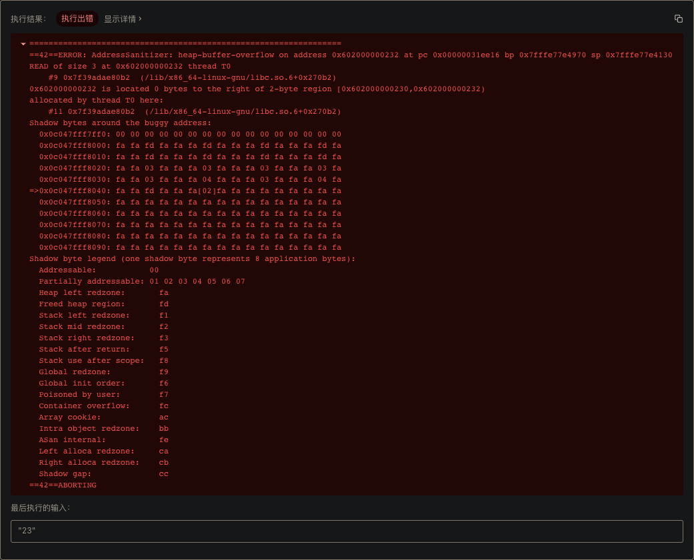
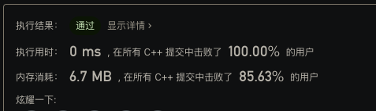

昨晚刷 LeetCode-17 最后提交时，本以为能一遍就 pass，结果直接给报了个 heap buffer overflow：


第一次碰到这种内存错误，信息量比较少，加上本地能正常运行，一时间也不知道问题在哪里。

下面是提交的代码：

```c++
class Solution {
   private:
    std::vector<std::vector<char>> mapping = {
        {'a', 'b', 'c'},
        {'d', 'e', 'f'},
        {'g', 'h', 'i'},
        {'j', 'k', 'l'},
        {'m', 'n', 'o'},
        {'p', 'q', 'r', 's'},
        {'t', 'u', 'v'},
        {'w', 'x', 'y', 'z'},
    };

   public:
    std::vector<std::string> letterCombinations(const std::string& digits) {
        std::vector<std::string> result;
        std::vector<char> path;
        backtrace(digits, path, result);
        return result;
    }

    void backtrace(const std::string& digits, std::vector<char>& path, std::vector<std::string>& result) {
        size_t index = path.size();
        if (index == digits.size()) {
            result.push_back(std::string(path.data()));
            return;
        }

        std::vector<char>& choices = mapping[digits[index] - '2'];
        for (size_t i = 0; i < choices.size(); i++) {
            path.push_back(choices[i]);
            backtrace(digits, path, result);
            path.pop_back();
        }
    }
};
```

---

## 1. Address Sanitizer

遇到问题没有思路时的思路就是 Google，因为确实不是什么疑难杂症（鄙人才疏学浅），所以很快也就找到了问题：LeetCode 使用 Address Sanitizer 检测非法内存操作。

Address Sanitizer 其实是 [sanitizer](https://github.com/google/sanitizers) 项目的下工具之一，它的核心功能就是检测非法内存访问。同一项目下还有其它不同的检测工具：
- MemorySanitizer，检测未初始化内存的使用；
- ThreadSanitizer，检测并发和死锁；
- LeakSanitizer，检测内存泄漏；
- HWASAN，硬件优化的 Address Sanitizer；
- 其它工具。

LLVM 从 3.1 起就已经内置了 ASAN，所以只要在编译时传递 flag 就能开启了，非常方便：
```shell
$ clang++ -fsanitize=address -O1 -fno-omit-frame-pointer -g -o main.out main.cpp
```
`-fsanitize=address` 告诉编译器开启 ASAN，`-O1` 保证性能损耗不会太大并且禁用内联，`-fno-omit-frame-pointer` 在输出错误信息时保留完整的调用栈（LeetCode 上就没有栈信息）。


ASAN 大致原理是插桩+hook malloc，关于 ASAN 更多详细介绍及配置可以参考 https://github.com/google/sanitizers/wiki/AddressSanitizer。


## 2. CMake 集成 ASAN

了解 ASAN 后就是将它集成到工程里并复现开头的错误。

我的 LeetCode 源码使用 CMake 管理，所以就是配置 CMake，让 CMake 告诉底层 clang++ 开启 ASAN：

```cmake
# ...
set(CMAKE_CXX_FLAGS "${CMAKE_CXX_FLAGS} -fsanitize=address -O1 -fno-omit-frame-pointer")
# ...
```

这样就为工程全局开启了 ASAN，如果只想为某个编译 target 开启 ASAN，则可以使用 `target_compile_options` 。


## 3. 解决问题

集成 ASAN 后再直接运行，果然就给抛出了异常：
```shell
=================================================================
==30037==ERROR: AddressSanitizer: heap-buffer-overflow on address 0x602000000352 at pc 0x000100d2d634 bp 0x7ffeeef9eb50 sp 0x7ffeeef9e310
READ of size 3 at 0x602000000352 thread T0
    #0 0x100d2d633 in wrap_strlen+0x183 (libclang_rt.asan_osx_dynamic.dylib:x86_64h+0x1a633)
    #1 0x100c7ed98 in std::__1::char_traits<char>::length(char const*) __string:253
    #2 0x100c7ed74 in std::__1::basic_string<char, std::__1::char_traits<char>, std::__1::allocator<char> >::basic_string<std::nullptr_t>(char const*) string:819
    #3 0x100c653f8 in std::__1::basic_string<char, std::__1::char_traits<char>, std::__1::allocator<char> >::basic_string<std::nullptr_t>(char const*) string:817
    #4 0x100c7da8a in leetcode_0017::Solution::backtrace(std::__1::basic_string<char, std::__1::char_traits<char>, std::__1::allocator<char> > const&, std::__1::vector<char, std::__1::allocator<char> >&, std::__1::vector<std::__1::basic_string<char, std::__1::char_traits<char>, std::__1::allocator<char> >, std::__1::allocator<std::__1::basic_string<char, std::__1::char_traits<char>, std::__1::allocator<char> > > >&) 0017.cpp:42
    #5 0x100c7db38 in leetcode_0017::Solution::backtrace(std::__1::basic_string<char, std::__1::char_traits<char>, std::__1::allocator<char> > const&, std::__1::vector<char, std::__1::allocator<char> >&, std::__1::vector<std::__1::basic_string<char, std::__1::char_traits<char>, std::__1::allocator<char> >, std::__1::allocator<std::__1::basic_string<char, std::__1::char_traits<char>, std::__1::allocator<char> > > >&) 0017.cpp:49
    #6 0x100c7db38 in leetcode_0017::Solution::backtrace(std::__1::basic_string<char, std::__1::char_traits<char>, std::__1::allocator<char> > const&, std::__1::vector<char, std::__1::allocator<char> >&, std::__1::vector<std::__1::basic_string<char, std::__1::char_traits<char>, std::__1::allocator<char> >, std::__1::allocator<std::__1::basic_string<char, std::__1::char_traits<char>, std::__1::allocator<char> > > >&) 0017.cpp:49
    #7 0x100c70406 in leetcode_0017::Solution::letterCombinations(std::__1::basic_string<char, std::__1::char_traits<char>, std::__1::allocator<char> > const&) 0017.cpp:35
    #8 0x100c6ff0b in leetcode_0017::main() 0017.cpp:59
    #9 0x100c70b78 in main main.cpp:64
    #10 0x7fff20336620 in start+0x0 (libdyld.dylib:x86_64+0x15620)

0x602000000352 is located 0 bytes to the right of 2-byte region [0x602000000350,0x602000000352)
allocated by thread T0 here:
    #0 0x100d687ed in wrap__Znwm+0x7d (libclang_rt.asan_osx_dynamic.dylib:x86_64h+0x557ed)
    #1 0x100c72b98 in std::__1::__libcpp_allocate(unsigned long, unsigned long) new:253
    #2 0x100c78ed8 in std::__1::allocator<char>::allocate(unsigned long, void const*) memory:1869
    #3 0x100c78db8 in std::__1::allocator_traits<std::__1::allocator<char> >::allocate(std::__1::allocator<char>&, unsigned long) memory:1586
    #4 0x100c7e5ef in std::__1::__split_buffer<char, std::__1::allocator<char>&>::__split_buffer(unsigned long, unsigned long, std::__1::allocator<char>&) __split_buffer:318
    #5 0x100c7e498 in std::__1::__split_buffer<char, std::__1::allocator<char>&>::__split_buffer(unsigned long, unsigned long, std::__1::allocator<char>&) __split_buffer:317
    #6 0x100c7e079 in void std::__1::vector<char, std::__1::allocator<char> >::__push_back_slow_path<char const&>(char const&) vector:1623
    #7 0x100c7dd45 in std::__1::vector<char, std::__1::allocator<char> >::push_back(char const&) vector:1640
    #8 0x100c7db25 in leetcode_0017::Solution::backtrace(std::__1::basic_string<char, std::__1::char_traits<char>, std::__1::allocator<char> > const&, std::__1::vector<char, std::__1::allocator<char> >&, std::__1::vector<std::__1::basic_string<char, std::__1::char_traits<char>, std::__1::allocator<char> >, std::__1::allocator<std::__1::basic_string<char, std::__1::char_traits<char>, std::__1::allocator<char> > > >&) 0017.cpp:48
    #9 0x100c7db38 in leetcode_0017::Solution::backtrace(std::__1::basic_string<char, std::__1::char_traits<char>, std::__1::allocator<char> > const&, std::__1::vector<char, std::__1::allocator<char> >&, std::__1::vector<std::__1::basic_string<char, std::__1::char_traits<char>, std::__1::allocator<char> >, std::__1::allocator<std::__1::basic_string<char, std::__1::char_traits<char>, std::__1::allocator<char> > > >&) 0017.cpp:49
    #10 0x100c70406 in leetcode_0017::Solution::letterCombinations(std::__1::basic_string<char, std::__1::char_traits<char>, std::__1::allocator<char> > const&) 0017.cpp:35
    #11 0x100c6ff0b in leetcode_0017::main() 0017.cpp:59
    #12 0x100c70b78 in main main.cpp:64
    #13 0x7fff20336620 in start+0x0 (libdyld.dylib:x86_64+0x15620)

SUMMARY: AddressSanitizer: heap-buffer-overflow (libclang_rt.asan_osx_dynamic.dylib:x86_64h+0x1a633) in wrap_strlen+0x183
Shadow bytes around the buggy address:
  0x1c0400000010: fa fa 00 04 fa fa 00 00 fa fa 00 06 fa fa fd fd
  0x1c0400000020: fa fa 00 00 fa fa fd fa fa fa fd fa fa fa fd fa
  0x1c0400000030: fa fa fd fa fa fa fd fa fa fa fd fa fa fa fd fa
  0x1c0400000040: fa fa fd fa fa fa 03 fa fa fa 03 fa fa fa 03 fa
  0x1c0400000050: fa fa 03 fa fa fa 03 fa fa fa 04 fa fa fa 03 fa
=>0x1c0400000060: fa fa 04 fa fa fa fd fa fa fa[02]fa fa fa fa fa
  0x1c0400000070: fa fa fa fa fa fa fa fa fa fa fa fa fa fa fa fa
  0x1c0400000080: fa fa fa fa fa fa fa fa fa fa fa fa fa fa fa fa
  0x1c0400000090: fa fa fa fa fa fa fa fa fa fa fa fa fa fa fa fa
  0x1c04000000a0: fa fa fa fa fa fa fa fa fa fa fa fa fa fa fa fa
  0x1c04000000b0: fa fa fa fa fa fa fa fa fa fa fa fa fa fa fa fa
Shadow byte legend (one shadow byte represents 8 application bytes):
  Addressable:           00
  Partially addressable: 01 02 03 04 05 06 07
  Heap left redzone:       fa
  Freed heap region:       fd
  Stack left redzone:      f1
  Stack mid redzone:       f2
  Stack right redzone:     f3
  Stack after return:      f5
  Stack use after scope:   f8
  Global redzone:          f9
  Global init order:       f6
  Poisoned by user:        f7
  Container overflow:      fc
  Array cookie:            ac
  Intra object redzone:    bb
  ASan internal:           fe
  Left alloca redzone:     ca
  Right alloca redzone:    cb
  Shadow gap:              cc
==30037==ABORTING
```

根据上面的调用栈（#10~1）异常在调用 `result.push_back(std::string(path.data()))` 时抛出：
```c++
// path: std::vector<char>
if (index == digits.size()) {
    result.push_back(std::string(path.data()));
    return;
}
```
更准确地讲，异常是在构造 `std::string` 时抛出。`std::string` 构造函数接收一个以 `\0` 结尾 `char*`，这样它才能确定根据 `\0` 确定需要拷贝的 `char` 的数量，但是 `std::vector<char>::data` 返回的 `char*` 并不是以 `\0` 结尾，所以构造器就会（非法）访问到 `char*` 后面的内存，因为 `vector` 是在 heap 上动态申请分配内存，所以错误描述就是 **heap-buffer-overflow**。至于为什么本机没有报错，大概是后一字节内存内容恰好是 `\0` 。


最后的修复方案就不赘述了，在完成一些优化并提交后，得到了下面的分数😃 ：


## 4. 总结

如果你正在刷 LeetCode，不妨也开启 ASAN ，模拟更真实的 LeetCode 环境。


## 5. 参考文章

[AddressSanitizer](https://github.com/google/sanitizers/wiki/AddressSanitizer)

[LeetCode 报错解决](https://blog.csdn.net/zhangpeterx/article/details/88775434)
