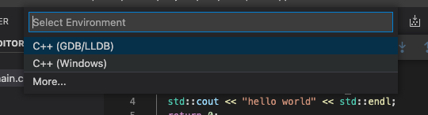
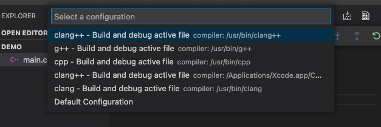
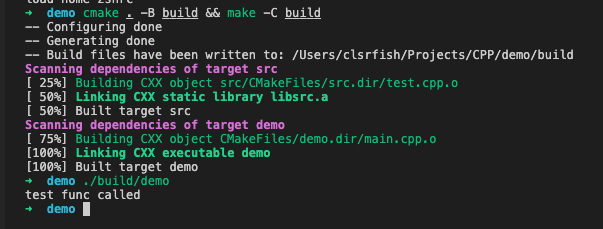
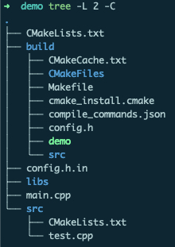

毕业后开始对 C++ 着迷，但是毕竟工作基本用不上，所以大多数时候都是写一些小程序。因为日常开发使用 Android Studio，所以在选择 C++ 编辑器/IDE 时自然而然想到了它的兄弟 CLion，不过还是因为 JB 家的东西都太吃内存而放弃了；第二个想到的是 XCode，颜值与实力并存，最终没有选择 XCode 还是因为它"过度"封装，无法把握工程细节和编译过程（也可能是我没找到相关设置）。最后选择 VSCode 是因为它足够轻量，简单配置后就能像 IDE 一样一键运行/调试，同时工程文件所见即所得，不会像 XCode 无法直观地知道源文件的磁盘路径。

---

## 1. 安装拓展

VSCode 原生并不支持 C/C++ 开发，所以需要安装一些拓展来提供一些必要的能力：**语法高亮**、**错误提示**、**自动补全**以及最重要的**调试/运行**。

### 1.1. C/C++


巨硬提供的 [C/C++](https://marketplace.visualstudio.com/items?itemName=ms-vscode.cpptools) 拓展，安装量远超其它 C/C++ 拓展，提供了几乎所有 C++ 开发所需要的功能。

默认配置下也能用得比较开心，但是每个人的快乐都不太一样，所以还是要简单配置下，下面是一些个人认为需要额外配置的设置项：

- C_Cpp.formatting，格式化风格，Unix[-like]下就选 clangFormat 吧；
- C_Cpp.clang_format_sortIncludes，include 的头文件排序（很棒）；
- C_Cpp.clang_format_fallbackStyle，配置默认的代码风格，可选的有 LLVM、Google 等，每个都试试选个自己喜欢的就好；
- C_Cpp.intelliSenseUpdateDelay，默认的智能提示延迟比较大，设置小点可以更快地看到提示；
- C_Cpp.default.configurationProvider，智能提示配置，比如C++ 标准、头文件目录等，但是后面我们也会在 CMakeLists.txt 里配置相同的信息，为避免重复，就有了这个选项，填 `ms-vscode.cmake-tools` 就好了（下面会安装）。有可能在安装完 C/C++ 后 VSCode 自动创建了个 `c_cpp_properties.json` 它就是 C/C++ 默认的智能提示配置，不过我们设置 configurationProvider 后，可以删除这个文件。

> 更多的配置可以看 C/C++ 的 README。
>
> C/C++ 的智能提示响应速度有点慢，如果追求极致体验，可以另外安装 clangd 插件，并关闭 C/C++ 的语法检测和智能提示。实际体验速度确实快，不过格式化配置有点小问题，所以我暂时就没有使用，可能后续回有改进吧。


### 1.2. CMake 拓展

其实安装完 C/C++ 拓展已经可以开发 C++ 程序了，不过随着学习的深入，需要借助一些工具来管理我们的 C/C++ 工程，减少不必要的手工操作。

这里安装 [CMake](https://twxs.gallerycdn.vsassets.io/extensions/twxs/cmake/0.0.17/1488841920286/Microsoft.VisualStudio.Services.Icons.Default) 和 [CMake Tools](https://marketplace.visualstudio.com/items?itemName=ms-vscode.cmake-tools) 就好了。前者为 CMake 脚本文件提供语法高亮和智能提示，后者为 CMake-based 工程提供快捷操作。

具体怎么配置到后面用到的时候再讨论。

> CLion 默认使用 CMake 管理工程


## 2. 开始调试

国际惯例，以 hello world （main.cpp）为例：

```c++
#include <iostream>

int main(int argc, char *argv[]) {
  std::cout<<"hello world!" << std::endl;

  return 0;
}
```

### 2.1. 编译运行

安装好 C/C++ 拓展后直接 **F5** 运行（调试）程序（单文件的 hello world），第一次运行会提示你完成一些基本配置。



如果用的 macOS/Linux ，那就选 **GDB/LLDB**，Window 用户就选 **Windows**， 选完调试工具后紧接着需要选择要使用的**编译器**，下面是 macOS 下给出的几个选择，对齐 Xcode 使用 clang++ 就好了。



指定好编译器后就会开始编译并运行程序，不出意外就能在 *Debug Console* 中看到 `hello world` 了。

### 2.2. 编译产物

执行完上面操作后目录下多了一些文件：

```shell
.
├── .vscode # VSCode 生成的编译/调试配置文件
│   ├── launch.json
│   └── tasks.json
├── main # 可执行程序
├── main.cpp # 源代码
└── main.dSYM # 调试信息，添加编译选项 -g 时产生，没有它就无法调试
    └── Contents
        ├── Info.plist
        └── Resources
            └── DWARF
                └── main
```

`tasks.json` 中定义了编译任务：
```json
{
    "tasks": [
        {
            "type": "cppbuild", // 决定了任务是以单独进程还是命令执行
            "label": "C/C++: clang++ build active file",
            "command": "/usr/bin/clang++", // 指定编译器
            "args": [
                "-g", // 开启调试
                "${file}", // 需要编译的文件
                "-o",
                "${fileDirname}/${fileBasenameNoExtension}" // 指定输出文件
            ],
            "options": {
                "cwd": "${workspaceFolder}" // 指定工作目录
            },
            "problemMatcher": [ // 定如何去匹配任务输出信息（比如语法错误、警告），并将信息展示在 PROBLEMS 中，这里选择 C/C++ 拓展提供的 gcc
                "$gcc"
            ],
            "group": { // 指定任务所属集合
                "kind": "build",
                "isDefault": true // 是否为任务集中默认任务
            },
            "detail": "Task generated by Debugger." // 描述信息
        }
    ],
    "version": "2.0.0"
}
```

`launch.json` 中定义了启动配置：
```json
{
    "version": "0.2.0",
    "configurations": [
        {
            "name": "clang++ - Build and debug active file",
            "type": "cppdbg", // 指定调试类型，有 C/C++ 拓展提供支持
            "request": "launch", // 指定调试方式，是新启动程序并调试还是调试一个已启动的进程
            "program": "${fileDirname}/${fileBasenameNoExtension}", // 可执行文件
            "args": [], // 可执行文件启动时的参数，对应 argv
            "stopAtEntry": false,
            "cwd": "${workspaceFolder}",
            "environment": [], // 环境变量
            "externalConsole": false, // 是否打开外部终端进行调试
            "MIMode": "lldb", // 调试工具，lldb 或 gdb
            "preLaunchTask": "C/C++: clang++ build active file" // 启动之前执行的任务, 调试之前需要有可执行文件，所以这里是执行一个编译任务
        }
    ]
}
```


## 3. 使用 CMake 管理工程

上面的配置方式对于单文件的 demo 是够用了，但是面对多文件工程，还是显得力不从心，比如需要手工把参加编译的源文件添加到编译任务的 `args` 参数中，并且源文件改名、变更目录都需要手工修改对应配置，否则会编译失败。

C++ 一直依靠社区发展，工程组织和依赖管理也没有一个“标准”，不过近年来 [CMake](https://cmake.org/) 似乎已经成为了事实上的 C++ 工程管理工具，CMake 并不直接编译，而是有序地组织系统构建工具来支持开发、测试以及发布等。CMake 还一个非常棒的功能是它能够根据配置文件（CMakeLists.txt）生成其它工具、平台的工程配置（Unix[-like] 的 Makefile、MSVC 的 solution等），非常适合需要跨平台的项目。

> CMake is an open-source, cross-platform family of tools designed to build, test and package software. CMake is used to control the software compilation process using simple platform and compiler independent configuration files, and generate native makefiles and workspaces that can be used in the compiler environment of your choice. The suite of CMake tools were created by Kitware in response to the need for a powerful, cross-platform build environment for open-source projects such as ITK and VTK.

macOS 下 CMake 可以通过 `brew install cmake` 安装。

### 3.1. CMake 配置

CMake 使用 CMakeListx.txt 来组织工程，一般来说就是每个文件夹一个都拥有一个 CMakeLists.txt。为了演示 CMake 管理多源文件工程，我们新增一个 `src/test.cpp` 文件：

```shell
.
├── build # 编译输出目录
├── libs # 第三方依赖
├── CMakeLists.txt # 工程根 CMakeLists.txt 文件
├── config.h.in # 配置模板，用来生成工程信息 h 文件
├── main.cpp # 入口文件，调用 test.cpp 中定义的函数
└── src
    ├── CMakeLists.txt # 子目录 CMakeLists.txt
    └── test.cpp # 定义一个简单函数的 cpp 文件
```


这里只需要关注两个 CMakeLists.txt 文件，首先是根目录的 CMakeLists.txt：

```cmake
cmake_minimum_required(VERSION 3.0.0) # cmake 版本要求
project(demo VERSION 0.0.1) # 配置项目名称以及版本号，详细配置可以查阅 CMake 文档

set(CMAKE_CXX_STANDARD 11) # 选择 C++ 版本，一般都是 11 及往上
set(CMAKE_CXX_STANDARD_REQUIRED True) # 我也忘了具体干啥的了
set(CMAKE_EXPORT_COMPILE_COMMANDS ON) # 项目 configure 结束后输出 compile_commands.json 到 build 目录，clang 等一些工具依赖它做智能提示，等会执行编译就能看到了
# 这里就是指定配置模板文件以及对应的输出目录，PROJECT_SOURCE_DIR 是根 CMakeLists.txt 所在目录，PROJECT_BINARY_DIR 是编译输出目录，也即 build（执行cmake 时指定） 目录
configure_file (
  ${PROJECT_SOURCE_DIR}/config.h.in
  ${PROJECT_BINARY_DIR}/config.h
)

# 配置去哪些目录下寻找头文件，
# 当项目引入第三方依赖是就可以把第三方依赖的头文件目录加进来
include_directories(
    /usr/local/include
    ${PROJECT_BINARY_DIR}
)
# 配置去哪些目录寻找动态/静态库
# 当项目引入第三方依赖是就可以把第三方依赖的库文件目录加进来
link_directories(
    /usr/local/lib
    ${PROJECT_BINARY_DIR}
)
# 添加一个子目录/工程，注意这里的 src 和下面的 src 不是同一个东西，这里是一个路径，下面是库名称，只不过 库-src 是在 路径-src 里定义，因为没想到好名字就都用 src 了
add_subdirectory(src)

# 定义一个可执行文件的构建目标，这里直接使用项目名称（demo）作为输出文件名称
add_executable(${PROJECT_NAME} main.cpp)
# 将构建目标与库（静态/动态）进行链接
target_link_libraries(${PROJECT_NAME} src)
```

再来看 src 目录下的 CMakeLists.txt：
```cmake
# 当目录下有多个源文件时，aux_source_directory 可以搜集指定目录下所有 c/cpp 文件，并结果存储在 SRC 中
aux_source_directory(. SRC)

# 定义一个静态库的构建目标 src，这就和上面的配置呼应上了。
# add_library 默认是构建静态库，也可以配置成 SHARED
add_library(src ${SRC})
```

简单配置后，就可以执行命令开始构建了：
```shell
# -B 指定输出目录，-C 指定工作目录
$ cmake . -B build && make -C build
```


执行完命令后的 build 目录长这样：



**demo** 文件就是可执行文件，`config.h` 就是模板配置生成的头文件。

### 3.2. 更加优雅地运行

到目前为止，我们已经用 CMake 将工程组织了起来，但是 run 代码的方式还比较原始，而且也没有办法利用 VSCode 进行代码调试。所以接下来就继续配置，可以通过 F5 一键执行 cmake 并启动调试。

这里还是修改 `launch.json` 和 `tasks.json` ，将构建的操作交给 cmake 执行，首先看 `launch.json` ：
```json
{
    "version": "0.2.0",
    "configurations": [
        {
            "name": "CMake - Build and debug",
            "type": "cppdbg",
            "request": "launch",
            "program": "${workspaceFolder}/build/demo", // 修改 program 为构建后的可执行文件路径
            "args": [],
            "stopAtEntry": false,
            "cwd": "${workspaceFolder}",
            "environment": [],
            "externalConsole": false,
            "MIMode": "lldb",
            "preLaunchTask": "C/C++: make" // 修改前置任务为构建任务
        }
    ]
}
```

接着修改/重写 `tasks.json`：
```json
{
    "tasks": [
        {
            "type": "process",
            "label": "C/C++: cmake debug build",
            "command": "cmake",
            "args": [
                "-g", // -g Generate source-level debug information
                ".."
            ],
            "options": {
                "cwd": "${workspaceFolder}/build"
            },
            "problemMatcher": [
                "$gcc"
            ],
            "group": "build",
            "detail": "Run cmake debug build"
        },
        {
            "type": "process",
            "label": "C/C++: make",
            "command": "make",
            "args": [
                // "-d"
            ],
            "options": {
                "cwd": "${workspaceFolder}/build"
            },
            "dependsOn": [ // make 依赖 cmake 输出
                "C/C++: cmake debug build"
            ],
            "group": {
                "kind": "build",
                "isDefault": true
            },
            "problemMatcher": [
                "$gcc"
            ],
            "detail": "Make the target file"
        }
    ],
    "version": "2.0.0"
}
```

`tasks.json` 中的两个 task 对应着 `cmake . -B build && make -C build`，那么启动 `launch.json` 之前就会先执行构建命令，从而做到了一键运行并启动调试。


## 4. 总结

到这里，一个满足基本开发需求的 VSCode C++ 环境算是搭好了，对于一个完整的项目，还需要**测试**（**test**） 以及 **发布**（**pack**） ，这俩的配置方式和**构建**（**build**）类似，并且 CMake 也提供了相应的功能，感兴趣可以将环境配置继续完善。

然后呢打算等有时间了把一些常用工程模板打包成 VSCode 插件，挖个坑。


## 5. 参考文章

[C++ Extension](https://marketplace.visualstudio.com/items?itemName=ms-vscode.cpptools)

[c_cpp_properties.json reference](https://code.visualstudio.com/docs/cpp/c-cpp-properties-schema-reference)

[CMake](https://cmake.org/)

[C++ 工程依赖管理新方向：CMake & Git](https://kingsamchen.github.io/2019/02/10/use-cmake-and-git-as-your-cpp-dependency-manager/)
