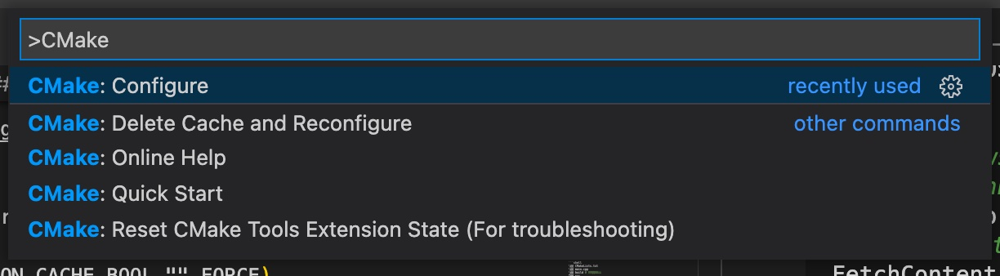
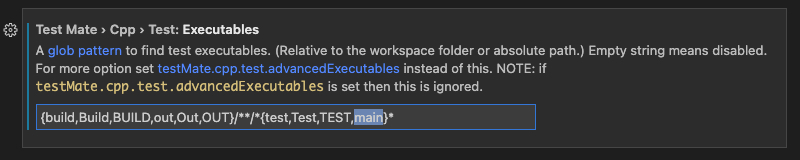
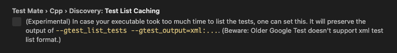

> 这篇文章将记录怎么用 [GoogleTest](https://google.github.io/googletest/) 来管理 LeetCode 的测试 case，以及优化 CMakeLists 配置避免每次都需要编译、链接整个工程，最后再利用 GitHub Action 进行自动化测试。文中不会对 Google Test 细节进行介绍，感兴趣的可以去官网阅读。
>
> 如果还不了解如何使用 VSCode 和 CMake 管理你的 C++ 工程，建议先看看[这篇文章](./1.VSCode搭建C++开发环境.md)。
>
> 本文基于 macOS 10.15，Linux 环境下差别不大，后面也会提到一些 Linux 相关的配置 。
>

---


## 1. 前言

为了方便回顾每道 LeetCode 的 AC 过程，每道题的解答都在同一个 CMake 工程中进行管理，公共数据结构（比如 ListNode、TreeNode 等）使用单独的 model 模块进行管理，不同 LeetCode 就用命名空间 `leetcode_xxx` 进行隔离，通过 `xxx` 确定某次需要运行的 LeetCode 解答，整个工程统一编译链接，构建一个可执行文件。使用这种方式管理的工程目录结构大概长这样：

```shell
├── CMakeLists.txt
├── main.cpp
├── build # 编译产物
└── src
    ├── 1.cpp
    ├── 2.cpp
    ├── xxx.cpp
    ├── CMakeLists.txt
    ├── model # 存放公共数据结构
    │   ├── CMakeLists.txt
    │   ├── list_node.cpp
    │   └── list_node.hpp
    └── utils # 存放工具函数
        ├── CMakeLists.txt
        ├── stl_utils.cpp
        └── stl_utils.hpp
```

每道 LeetCode 解答（xxx.cpp）代码结构如下：
```c++
namespace leetcode_xxx {

string key = "xxx";

class Solution {
 public:
    void solutionName(){}
};

int main() {
  std::cout << key << ": 标题" << std::endl;
  Solution().solutionName();
  return 0;
}

}
```

所有 LeetCode 解答在 `main.cpp` 中用 `map<std::string, int (*)()>` 保存，通过指定 key 确认需要执行的 LeetCode：
```c++
int main(int argc, char const *argv[]) {
    std::map<std::string, int (*)()> leetcodes{
      PROBLEM(leetcode_xxx), ...
    };

    std::string lckey = "xxx"
    // 通过参数指定需要执行的 LeetCode
    if (argc > 1) {
    std::string input = std::string(argv[1]);
    if (leetcodes.count(input) > 0) {
      lckey = input;
    } else {
      std::cout << "invalid input:" << input << ", running " << lckey << " instead" << std::endl;
    }
  }
    return leetcodes[lckey]();
}
```
每道题解代码格式固定，可以使用 VSCode [Snippet](https://code.visualstudio.com/docs/editor/userdefinedsnippets) 避免模板代码。这样，我们就可以在 VSCode 中快速创建新的 LeetCode 题解并调试了。

### 1.1. 编译速度影响刷题体验

按照上面的方式组织代码一开始运行得还不错，在有编译缓存的情况下 **F5** 能够在**数秒内**调试运行，全量编译耗时也在一个可接受的水平（**20s** 左右）。但是随着刷题量越来越多，编译链接速度出现了非常明显的下降，有时候也会在办公电脑上刷题（系统版本不同），全量编译造成的糟糕开发体验也越来越不可接受。

所以需要调整 CMakeLists 配置，**指定需要调试的 LeetCode ，减少参与编译的源码数量（cpp 文件）**。

### 1.2. 测试 Case 编写繁琐

第二个影响刷题体验的问题是测试 Case 的编写。

正如上面实例代码，所有的测试 case 都需要自己手动构造参数并检验运行结果：

```c++
namespace leetcode_xxx {

int main() {
    // 1. 编排测试 case
    std::vector<std::tuple<std::string, int>> testCases{
        std::make_tuple("hello", 5),
        std::make_tuple("world", 5),
        std::make_tuple("", 0)
    };
    // 2. 遍历测试 case
    for (auto it = testCases.begin(); it != testCases.end(); it++) {
        std::string input;
        int expected;
        std::tie(input, expected) = *it;
        int actual = Solution().charCount(input);
        // 3. 组装输出日志
        if ( actual != expected ) {
            std::cout << "input(" << input << ")" << " FAILED"<< std::endl
            std::cout << "\texpected: "<< expected << "actual: "<< actual << std::endl;
        } else {
            std::cout << "input(" << input << ")" << " PASSED"<< std::endl
        }
    }
    return 0;
}
}
```

每道题都需要手动完成上面代码中的 3 个步骤，存在一定量的模板代码，入参、返回值的数量和类型也没法用 Snippet 很好解决。特别是当某个 Test Case 计算出错需要调试时，需要注释某些 Test Case 进行针对调试，轻度强迫症患者认为这种操作不够优雅。


## 2. 使用 GoogleTest 管理 TestCase

> 每道 LeetCode 题解都是一个简单函数调用，非常适合单元测试。


GooleTest 是 Google 开源的 C++ 测试、Mock 框架，基于 **xUnit** 架构实现，用过 xUnit 的朋友上手几乎没有额外的理解成本。GoogleTest 遵照以下理念（摘自官网）实现：
1. Tests should be independent and repeatable. It’s a pain to debug a test that succeeds or fails as a result of other tests. googletest isolates the tests by running each of them on a different object. When a test fails, googletest allows you to run it in isolation for quick debugging.
2. Tests should be well organized and reflect the structure of the tested code. googletest groups related tests into test suites that can share data and subroutines. This common pattern is easy to recognize and makes tests easy to maintain. Such consistency is especially helpful when people switch projects and start to work on a new code base.
3. Tests should be portable and reusable. Google has a lot of code that is platform-neutral; its tests should also be platform-neutral. googletest works on different OSes, with different compilers, with or without exceptions, so googletest tests can work with a variety of configurations.
4. When tests fail, they should provide as much information about the problem as possible. googletest doesn’t stop at the first test failure. Instead, it only stops the current test and continues with the next. You can also set up tests that report non-fatal failures after which the current test continues. Thus, you can detect and fix multiple bugs in a single run-edit-compile cycle.
5. The testing framework should liberate test writers from housekeeping chores and let them focus on the test content. googletest automatically keeps track of all tests defined, and doesn’t require the user to enumerate them in order to run them.
6. Tests should be fast. With googletest, you can reuse shared resources across tests and pay for the set-up/tear-down only once, without making tests depend on each other.

如果上面这些理解都落实到了 GoogleTest 实现中，我们将从繁琐的测试 Case 编写中解放出来，专注于问题本身。利用 GoogleTest，我们不用手动遍历参数组合、不用在某个统一位置（`main.cpp`）手动指定需要执行那个问题（第 5 条）；当测试失败时，框架会自动输出参数和结果，并且可以运行特定参数组合的 Test Case 而不是通过注释代码实现（第 1 条，第 4 条）。


### 2.1. 添加 Google Test 依赖

有很多种方式添加 GoogleTest 的依赖，比如 拷贝源码或依赖静态/动态库、git submodule 以及 CMake FetchContent。显然，第一种方式是灵活性最低的一种，既没办法快速升级新版本，还要配置好 header、.so、.a 路径，在新机器上还需要重新下载这些文件（如果把它们加入版本控制就另当别论了）。第二种方式较第一种稍好，可以快速升级并在新机器上建立环境。第三种方式是本文使用的方式，也是 GoogleTest 官方推荐的，较 git submodule，可以让 CMake 帮我们管理 gtest 项目路径变量，下面是相关配置：

```cmake
# include 要求 CMake >= 3.11
include(FetchContent)
# Google Test 官网推荐使用最新 commit，非常勇
FetchContent_Declare(
    gtest
    GIT_REPOSITORY https://github.com/google/googletest.git
    GIT_TAG release-1.10.0
)
# For Windows: Prevent overriding the parent project's compiler/linker settings
set(gtest_force_shared_crt ON CACHE BOOL "" FORCE)
# 获取/创建 gtest 相关变量
FetchContent_GetProperties(gtest)
# 注意这里的 gtest 是上面 gtest 的小写, 个人感觉全小写可读性更高.
if(NOT gtest_POPULATED)
    # 下载gtest源码到指定目录
    FetchContent_Populate(gtest)
    # message(${gtest_SOURCE_DIR} ${gtest_BINARY_DIR})
    # 将 gtest 工程添加到编译流程
    add_subdirectory(${gtest_SOURCE_DIR} ${gtest_BINARY_DIR})
endif()
# FetchContent_Declare 后面的配置可以用下面一行配置代替.
# FetchContent_MakeAvailable(googletest)
```

配置好后重新执行 `CMake: Configure` 就会自动下载 gtest 项目并解压到 `build/_dep`（默认目录）。



### 2.2. 创建测试程序

接下来需要为测试创建一个 executable target，首先编写测试代码：
```
// hello_test.cpp
TEST(HelloTest, BasicAssertions) {
  // Expect two strings not to be equal.
  EXPECT_STRNE("hello", "world");
  // Expect equality.
  EXPECT_EQ(7 * 6, 42);
}
```
`TEST` 是一个宏函数，它定义了测试集合名称和测试 Case 名称，宏展开后会一个 `class`，类似的宏函数还有 `TEST_F`、`TEST_P`，至于它们的实现细节，以及如何做到自动收集所有的测试 Case，暂时还没来得及去探究，等后面有时间了再回过头补上。

然后修改 `CMakeLists.txt`：
```cmake
# 开启测试，非常重要
enable_testing()

add_executable(
  hello_test
  hello_test.cpp
)
# gtest_main 在 gtest 项目中定义，在前面用 add_subdirectory 引入了，所以这里可以直接使用
target_link_libraries(
  hello_test
  gtest_main
)

include(GoogleTest)
gtest_discover_tests(hello_test)
```
`gtest_discover_tests` 使用 post-build 从 target（hello_test）中获取所有定义的测试 Case。`gtest_main` 中定义了 main 函数，会根据输入参数（--gtest_filter 等）自动执行测试 Case。

> 所以即使只想执行某一个测试Case，也需要完整编译工程。
> 使用 `TEST_F` 和 `TEST_P` 也还是会存在一定模板代码，继续用 Snippet 解决。


### 2.3. C++ TestMate 拓展

完成上面两个步骤之后就可以编译并运行单元测试了：
```shell
$ cmake -S . -B build
$ cmake --build build
$ cd build && ctest
```

在[VSCode搭建C++开发环境](../../Cpp/1.VSCode搭建C++开发环境.md)中讲解过怎么使用 VSCode **F5** 代替命令行一键运行，这里就不做过多赘述了。

**F5** 虽然能快速地运行测试，但是测试 Case 的执行结果在 **DEBUG CONSOLE** 中不是非常直观（没有高亮显示），并且无法单独调试某个失败的 Case，粒度比较粗。这里推荐安装 [C++ TestMate](https://github.com/matepek/vscode-catch2-test-adapter)，它会在 **Test Explorer** 中列举出所有的测试 Case，支持一键运行所有 Case 的同时也支持或特定 Case/Suite 的运行、调试（见截图，实际体验会很不错）。


因为 C++ TestMate 通过可执行文件列举测试 Case，安装拓展后要根据你实际的工程配置下可执行文件/编译产物的位置：


> 如果可执行文件名带有 test 字样，并且在 build、out 等目录中，使用默认配置就可以了。

**一个小坑**

在配置 VSCode 一键运行时掉进了一个坑，导致 **F5** 一键运行无法断点调试，但是用 C++ TestMate 的调试按钮就可以断点调试。但是 C++ TestMate 列举测试 Case 依赖可执行文件的构建成功，所以修改完代码需要先 **build** 再在 C++ TestMate 中启动调试，流程变麻烦了。

各种排查之后发现是因为添加了两个参数：
```json
// launch.json
{
    "configurations": [
        {
            "name": "CMake - Build and launch debuging(lldb)",
            "type": "cppdbg",
            "request": "launch",
            "program": "${workspaceFolder}/build/main_test",
            "args": [
                // cause debugger not able to attach
                "--gtest_list_tests",
                "--gtest_output=xml:${workspaceFolder}/build/gtest_list.xml"
            ]
        }
    ]
}
```
当时是安装好 C++ TestMate 后去查看它都有哪些可以优化体验的配置，然后就看到了 **Test List Caching** 配置，说是能加速测试 Case 在 Test Explorer 中刷新的速度，没多想就给加上了参数，然后就掉坑了。因为实际体验这两个参数加上好像也没啥变化，所以就不要画蛇添足了。




## 3. 优化编译速度

第 2 节中我们利用 GoogleTest 解决了测试 Case 编写繁琐的问题，现在要解决是如何优化编译速度，**进一步提高刷题的幸福感**。

先看下 `src/CMakeLists.txt` 的内容：
```cmake
aux_source_directory(. SRC)
add_library (src ${SRC})
```
内容非常简单，就是将 **src** 目录下所有 `.cpp` 编译链接成一个 *libsrc.a* 。由于每个 `.c/.cc/.cxx/.cpp` 文件都是一个独立的编译单元，都需要独立解析 include 的 header 文件，如果 header 中有 template（STL、Boost），就会实例化相同的模板实例。LeetCode 到目前为止一共 2K+ 道题，触发一次全量编译差不多得花 30min+（MacBook pro 2017），所以随着刷题数量的增加，在编译上浪费的时间也会越来越多，体验越来越差。

所以最直接的想法就是**指定需要参与编译的源文件，即指定 LeetCode 题号对应的源文件**，将编译耗时保持在数秒之内。

> 题解文件名按 xxx.cpp 命名，对应测试代码是 xxx_test.cpp

下面是优化后的 `src/CMakeLists.txt`：
```cmake
set(LEETCODE_SRC_FILE "ALL" CACHE STRING "Which src files need compiling.")
if(${LEETCODE_SRC_FILE} STREQUAL "ALL" OR NOT EXISTS ${LEETCODE_SRC_FILE})
  aux_source_directory(. SRC)
  add_library (src ${SRC})
else()
  add_library (src ${LEETCODE_SRC_FILE})
endif()
```
我们定义 `LEETCODE_SRC_FILE` 指定需要编译的源文件，然后在根目录的 `CMakeLists.txt` 中接收命令行参数并传递值给 `LEETCODE_SRC_FILE`：
```cmake
# ...
set(LEETCODE_PROBLEM "ALL" CACHE STRING "Choose the problem to run, all problems will be build if not specified or not found.")

if(${LEETCODE_PROBLEM} STREQUAL "ALL")
    # Build all.
    set(LEETCODE_SRC_FILE "ALL" CACHE STRING "" FORCE)
    aux_source_directory(./test TEST_SUIT_SRCS)
    add_executable(main ${TEST_SUIT_SRCS})
else()
    # Build single.
    set(LEETCODE_SRC_FILE ${LEETCODE_PROBLEM}.cpp CACHE STRING "" FORCE)
    add_executable(main test/${LEETCODE_PROBLEM}_test.cpp)
endif()
add_subdirectory(src)
# ...
```

这里再次定义了个类似的 `LEETCODE_PROBLEM` 变量，即“题号”，然后在编译时通过 `-DLEETCODE_PROBLEM=XX` 传递给 CMake，这样就做到了指定源码编译。
> `set` 命令的用法见 [CMake 文档](https://cmake.org/cmake/help/git-stage/command/set.html)，`FORCE` 是为了保证参数不受缓存影响而及时生效。


对应的，再调整下 `tasks.json`，加上 `LEETCODE_PROBLEM` 参数：
```json
{
    // ...
    "tasks": [
        {
            "type": "process",
            "label": "C/C++: cmake debug build",
            "command": "cmake",
            "args": [
                "--log-level=DEBUG",
                "-DCMAKE_BUILD_TYPE=Debug",
                // twoSum
                "-DLEETCODE_PROBLEM=1",
                // cwd: build
                ".."
            ]
            // ...
        },
        // ...
    ]
}
```
这样每次只需要修改 `tasks.json` 就可以直接 **F5** 调试了。

## 4. 使用 GitHub Action 自动化测试

虽然到这里我们已经可以愉快地刷题了，但是刷题过程中对数据结构的修改可能影响了已有题解，考虑到编译耗时，我们又不太可能会随时全量编译，这些未及时发现的问题就累积下来了。

这里我们可以借助 GitHub Actions 提供的 CI/CD 能力，在 push 之后执行全量编译并执行测试，失败了还可以配置邮件通知，及时暴露问题。

这里就直接贴配置了：
```yaml
name: Test

on: [push]

jobs:
  gtest:
    name: Run tests on GTest
    strategy:
      # 在 macOS 和 Linux 两个平台测试，提高代码可移植性.
      matrix:
        os: [macos-latest, ubuntu-latest]
    runs-on: ${{ matrix.os }}
    env:
      buildDir: "${{ github.workspace }}/build"
      executable: main

    steps:
      - name: Project checkout
        uses: actions/checkout@v2

      - name: Get latest CMake and ninja
        uses: lukka/get-cmake@latest

      - name: Run CMake, build with CMake
        uses: lukka/run-cmake@v3
        with:
          cmakeListsTxtPath: ${{ github.workspace }}/CMakeLists.txt
          buildDirectory: ${{ env.buildDir }}
          # 不指定 LEETCODE_PROBLEM 默认是全量编译.
          cmakeAppendedArgs: "--log-level=DEBUG -Wdev -DCMAKE_BUILD_TYPE=Debug"

      - name: Run executable
        run: ${{ env.buildDir }}/${{ env.executable }}
```

然后可以在 README.md 中配置个[徽标](https://docs.github.com/en/actions/managing-workflow-runs/adding-a-workflow-status-badge)，显示上次自动化测试的执行结果。

> 如果本地没有 Linux 环境，可以使用 docker 容器曲线救国。

## 5. 总结

GoogleTest 将我们从繁琐的测试 Case 中解放出来；而最小化编译使我们免于低效地等待编译；GitHub Actions 则帮助我们及时纠正不小心引入的问题。工欲善其事，必先利其器，善于利用工具，改进影响效率的瓶颈，避免陷入低效陷阱。

完整项目代码见 https://github.com/Clsrfish/leetcode 。


## 6. 参考文章

[Google Test](https://google.github.io/googletest/)

[FetchContent](https://cmake.org/cmake/help/latest/module/FetchContent.html)

[CMake set](https://cmake.org/cmake/help/git-stage/command/set.html)

[GoogleTest Module](https://cmake.org/cmake/help/git-stage/module/GoogleTest.html)

[GitHub Actions](https://github.com/features/actions)

[Adding a workflow status badge](https://docs.github.com/en/actions/managing-workflow-runs/adding-a-workflow-status-badge)