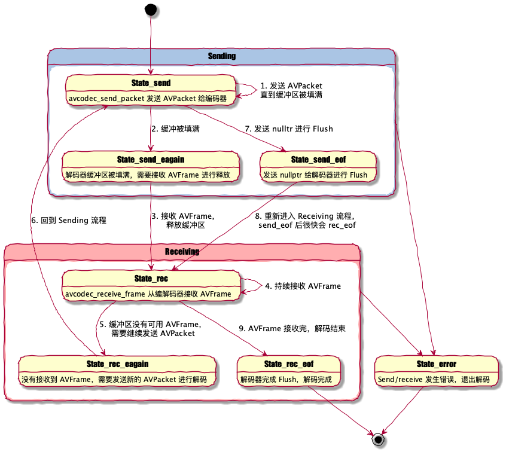

本文是 《DangerFFmpeg》系列教程第一节，系列完整目录：
《[开篇](/2021/05/14/8cf36b195b05.html)》
《[第一节、屏幕截图](/2021/05/15/1c458d50c524.html)》
《[第二节、输出到屏幕](/2021/05/16/aeb0b6c30d08.html)》
《[第三节、播放声音](/2021/05/20/d4b63d917433.html)》
《[第四节、多线程](/2021/05/22/71765970ad7e.html)》
《[第五节、视频同步](/2021/05/30/088658998748.html)》
《[第六节、同步音频](/2021/06/05/d8b51b0cff00.html)》
《[第七节、快进快退](/2021/06/09/2f01ccb59968.html)》
《[结语](/2021/06/19/7ddfef63d330.html)》

系列所有代码托管在 [GitHub](https://github.com/clsrfish/dangerffmpeg) 。

---

## 概述

视频文件有一些基本构成成分。首先，视频文件本身叫做 **容器（container）**，容器的类型决定信息在文件中如何存储。AVI 和 Quicktime 就是容器的两个例子。然后，你会遇到一组 **流（stream）**，举例来说，视频文件通常会有 *音频流* 和 *视频流*（ *流* 描述了 “一组按时间先后排列的数据（data element）”）。流中的数据称作 **帧（frame）**（帧一般会被编码成一个个包，包解开后才是帧）。每个流都是事先使用各种 **编解码器（codec）** 编码好的。编码器定义了原始数据是何如  **编码（COded）** 和 **解码（DECoed）** 的，所以组合起来就叫做 **编码器（CODEC）** 了。DivX 和 MP3 就是编解码器的两个例子。**包（Packet）** 紧接着从流中被读取出来。包是可以包含（*有的包可能不会携带原始数据*）能够被解码原始数据帧的数据块，拿到数据帧后我们就可以根据需要对其进行修改了。对于我们来说，每个包都包含完整的数据帧，音频则是多个数据帧。

对于简单的需求，处理视频和音频的流程非常简单：
```
OPEN video_stream FROM video.avi
READ packet FROM video_stream INTO frame
IF frame NOT COMPLETE GOTO 20
DO SOMETHING WITH frame
GOTO 2
```

使用 FFmpeg 处理多媒体文件就和上面的流程差不多，不过一些大型项目的 **DO SOMETHING** 步骤可能会非常复杂。在本节教程中，我们将打开视频文件并从中读取视频流，然后在 DO SOMETHING 步骤中将帧数据写入 PPM 文件。

> PPM 文件是啥？
> [PPM](http://netpbm.sourceforge.net/doc/ppm.html) 是 Portable PixMap 的缩写，是一种用文本格式紧密存储的 24-bit RGB 图像。后面在写 PPM 文件时还会再提到。

## 打开文件

首先，看下如何打开一个文件。使用 FFmpeg 前，你必须对其进行初始化。
```c++
#include <libavcodec/avcodec.h>
#include <libavformat/avformat.h>
#include <libswscale/swscale.h>
int tutorial01::main(int argc, char const* argv[]) {
  av_register_all();
  return 0;
}
```
这段代码注册 FFmpeg 中所有可用的文件和编解码器，后面打开对应格式文件时可以自动使用这些编解码器了。你只需要调用 `av_register_all` 一次，所以上面代码在 main 里调用。如果你不想注册所有的格式和编解码器，也可以单独注册指定的文件格式和编解码器，不过这通常没必要。
> ~~`av_register_all`~~ 在 FFmpeg 4.0 被标记为 deprecated，文件格式和编解码器会自动地进行注册。

现在我们可以真正地去打开文件了：

```c++
AVFormatContext *pFormatCtx = nullptr;

// Open video file
if (avformat_open_input(&pFormatCtx, argv[1], nullptr, nullptr) != 0) {
    return -1;  // Couldn't open file'
}
```

我们从第一个输入参数从获取文件名。 `avformat_open_input` 读取文件头并且将读取到的信息存储在 `pFormatCtx` 中。最后两个参数分别用来指定文件格式，和格式（解封装）参数，这里都传了 `nullptr`，libavformat 会自动检测这些参数值。

因为 `avformat_open_input` 只读取文件头信息，所以接下来我们还要确认文件中的流信息：

```c++
// Retrive stream information
if (avformat_find_stream_info(pFormatCtx, nullptr) < 0) {
    return -1;  // Couldn't find stream information
}
```

`avformat_open_input` 将读取的信息填充到 `pFormatCtx->streams`。这里介绍一个非常方便的调试函数，将文件中的信息输出到终端：

```c++
// Dump information about the file onto standard error
av_dump_format(pFormatCtx, 0, argv[1], 0);
```

`pFormatCtx->streams` 只是一个**指针数组**，大小是 `pFormatCtx->nb_streams`，我们将遍历这个数组并找到视频流：

```c++
AVCodecContext *pCodecCtxOrig = nullptr, *pCodecCtx = nullptr;
// Find the first video stream
unsigned int videoStream = -1;
for (unsigned i = 0; i < pFormatCtx->nb_streams; i++) {
    if (pFormatCtx->streams[i]->codec->codec_type == AVMEDIA_TYPE_VIDEO) {
        videoStream = i;
        break;
    }
}
if (videoStream == -1) {
    return -1;  // Didn't find a video stream
}

// Get a pointer to the code context for the video stream
pCodecCtxOrig = pFormatCtx->streams[videoStream]->codec;
```

`pFormatCtx->streams` 与编解码器（codec）相关的信息叫做 “编解码器上下文（codec context）”，上下文里包含了对应 *stream* 所使用编解码器的所有信息、参数等，而现在我们拿到了上下文的指针。不过我们还是需要根据上下文找到实际的编解码器实现并打开：

```c++
AVCodec* pCodec = nullptr;
// Find the decoder for the video stream
pCodec = avcodec_find_decoder(pCodecCtxOrig->codec_id);
if (pCodec == nullptr) {
    spdlog::error("Unsupported codec!");
    return -1;  // Codec not found
}
// Copy context parameters
pCodecCtx = avcodec_alloc_context3(pCodec);
AVCodecParameters* pParams = avcodec_parameters_alloc();
avcodec_parameters_from_context(pParams, pCodecCtxOrig);
if (avcodec_parameters_to_context(pCodecCtx, pParams) < 0) {
    avcodec_parameters_free(&pParams);
    spdlog::error("Couldn't copy codec contxt!");
    return -1;  // Error copying codec context
}
avcodec_parameters_free(&pParams);

// Open codec
if (avcodec_open2(pCodecCtx, pCodec, nullptr) < 0) {
    return -1;  // Couldn't open codec'
}
```

注意我们不能直接使用 *stream* 里的 `AVCodecContext`，需要使用 `avcodec_parameters_to_context` 将 stream 中编解码器参数拷贝到新的 `pCodecCtx` 中。

> 原文使用 ~~`avcodec_copy_context`~~ 实现参数拷贝，但在新版 FFmpeg 中已经被标记为 deprecated。


## 暂存数据

现在还需要有个地方存 **帧数据（frames）**：

```c++
// Allocate video frame
AVFrame* pFrame = av_frame_alloc();
```

因为我们打算输出 PPM 文件，所以还需要把 FFmpeg 解码出来的原始格式转换成 RGB 格式，FFmpeg 也能帮我们完成这些转换操作。对于大多数项目（包括我们的），都会将原始的数据帧转换成特定格式。现在让我们为新格式分配一个 `AVFrame`：

```c++
AVFrame* pFrameRGB = av_frame_alloc();
if (pFrameRGB == nullptr) {
    return -1;
}
```

分配好 `pFrameRGB` 后，还需要指定一块内存区域存放转好的 RGB 数据。我们使用 `avpicture_get_size` 计算缓冲区的大小并申请内存：

```c++
// Determine required buffer size and allocate buffer
int nbBytes = avpicture_get_size(AV_PIX_FMT_RGB24, pCodecCtx->width, pCodecCtx->height);
uint8_t* buffer = reinterpret_cast<uint8_t*>(av_malloc(nbBytes * sizeof(uint8_t)));
```

`av_malloc` 是 FFmpeg 对 malloc 函数的简单封装，它可以保证申请到的内存地址是对齐的。不过 `av_malloc` 不会帮你解决内存泄漏、重复释放以及其它内存分配相关问题。

接着我们使用 `avpicture_fill` 将帧和新分配好缓冲区绑定。

```c++
// Assign appropriate parts of the buffer to iamge planes in pFrameRGB
// Note that pFrameRGB is an AVFrame, but AVFrame is superset
// of AVPicture
avpicture_fill(reinterpret_cast<AVPicture*>(pFrameRGB), buffer, AV_PIX_FMT_RGB24, pCodecCtx->width, pCodecCtx->height);
```

终于，我们可以开始从流读取数据了。


## 读取数据

接下来我们会读取整个视频流，从中读取数据包，并解码到数据帧中，当数据帧被填满后，进行格式转换并输出到 PPM 文件。

```c++
// initialize SWS context for software scaling
SwsContext* pSwsCtx = sws_getContext(pCodecCtx->width, pCodecCtx->height, pCodecCtx->pix_fmt, pCodecCtx->width,
                                      pCodecCtx->height, AV_PIX_FMT_RGB24, SWS_BILINEAR, nullptr, nullptr, nullptr);

int i = 0;
AVPacket packet;
int ret;
bool hasError = false;
bool hasPktUnconsumed = false;
bool hasPktEof = false;
bool hasFinished = false;

while (!hasError) {
  while (!hasError && !hasPktEof) {
    // Read packet from stream
    if (!hasPktUnconsumed) {
      while (true) {
        ret = av_read_frame(pFormatCtx, &packet);
        if (ret == 0 && packet.stream_index == videoStream) {
          hasPktUnconsumed = true;
        } else if (ret == AVERROR_EOF) {
          hasPktEof = true;
        } else if (ret < 0) {
          hasError = true;
        } else {  // Read next packet
          continue;
        }
        break;
      }
    }
    // Send packet to decoder
    if (!hasError) {
      if (hasPktUnconsumed && !hasPktEof) {
        ret = avcodec_send_packet(pCodecCtx, &packet);
      } else {
        ret = avcodec_send_packet(pCodecCtx, nullptr);  // Flush decoder, EOF will returned, then receive returns EOF.
      }
      if (ret == AVERROR(EAGAIN) || ret == AVERROR_EOF || ret == 0) {
        hasPktUnconsumed = false;
        break;
      } else {
        hasError = true;
      }
    }
  }

  // Receive frame from decoder
  while (!hasError) {
    ret = avcodec_receive_frame(pCodecCtx, pFrame);
    if (ret == 0) {
      sws_scale(pSwsCtx, reinterpret_cast<uint8_t**>(pFrame->data), pFrame->linesize, 0, pCodecCtx->height,
                pFrameRGB->data, pFrameRGB->linesize);
      // Save the frame to disk
      if (i++ < 5) {
        SaveFrame(pFrameRGB, pCodecCtx->width, pCodecCtx->height, i);
      }
    } else if (ret == AVERROR(EAGAIN) || ret == AVERROR_EOF) {
      hasFinished = ret == AVERROR_EOF;
      break;
    } else {
      hasError = true;
      break;
    }
  }
  if (hasFinished) {
    break;
  }
}
```

整个的过程还是比较简单：`av_read_frame` 读取数据包并将数据存储在 `AVPacket` 中。要注意这里的只分配了 packet 结构体，FFmpeg 内部会帮我们分配缓冲区，即 `packet.data`，不再使用后通过 `av_free_packet` 释放。`avcodec_send_packet` 将 packet 发送给解码器进行解码，`avcodec_receive_frame` 从解码器中接收帧数据。通常情况下一个 packet 可以解码出一个 frame，也存在一个 packet 解出多个 frame 或多个 packet 解出一个 frame 的情况。这种 send/receive 模式是 FFmpeg 3.3 新引入的，本质上是一个状态机模型，用户根据不同的 send/receive 状态决定下一步操作。



> 视频编码后的帧（P帧、B帧）会参考其前后的帧进行解码，所以有时候发送一个 packet 之后，由于参考帧还 ready 就需要等包含参考帧的 packet 解码之后才解码这个 packet。
> 另外有一些编码格式会用 packet 存储一些元数据，它们并不会解码出视频帧，只是为解码器提供参数。

解码出 frame 后我们使用 `sws_scale` 将原始图像格式（pCodecCtx->pix_fmt）转换成 RGB 格式。最后使用 `SaveFrame` 将帧数据写入 PPM 文件。

现在剩下的是实现 `SaveFrame` 将 RGB 格式的帧数据写入 PPM 文件。等会会简单介绍些 PPM 文件格式。

```c++
void SaveFrame(AVFrame* pFrame, int width, int height, int iFrame) {
  std::stringstream ss;
  ss << "frame" << iFrame << ".ppm";
  std::string filename = ss.str();

  // Open file
  std::ofstream file(filename, std::ios_base::out | std::ios_base::binary);
  // Write header
  std::stringstream headerSs;
  headerSs << "P6\n" << width << " " << height << "\n255\n";
  std::string header = headerSs.str();
  file.write(reinterpret_cast<const char*>(header.c_str()), header.size());
  // Write pixel data
  for (size_t y = 0; y < height; y++) {
    file.write(reinterpret_cast<const char*>(pFrame->data[0] + y * pFrame->linesize[0]), width * 3);
  }
  file.close();
}
```

`SaveFrame` 使用 `out|binary` 模式打开文件，然后将 RGB 数据写入，一次写入一行数据。PPM 文件是 RGB 数据排列成一个长字符串的文件格式。如果你了解 HTML 颜色编写方式，PPM 就像是将每个颜色的像素值紧密排列起来，比如 *#ff0000#ff0000...* 是纯红色（注意实际存储的二进制，并没有 *#* 等分隔符）。Header 行存储了图像的尺寸和 RGB 色值的最大值。


现在回到 `main` 函数，当我们读取完视频流后，只需要完成一些清理工作就可以了：

```c++
// Free frame
av_free(buffer);
av_free(pFrameRGB);
av_free(pFrame);

// Close the codec
avcodec_close(pCodecCtx);
avcodec_close(pCodecCtxOrig);

// Close the video file
avformat_close_input(&pFormatCtx);
```

你应该注意到我们使用 `av_free` 释放那些使用 `avcodec_alloc_frame` 和 `av_malloc` 申请的内存。


> 程序运行部分就不赘述了，可以下载源码查看，执行后就能得到五张本文的封面图！！！


这些就是本节教程的全部内容，源码已经上传 [GitHub](https://github.com/clsrfish/dangerffmpeg) 。


## 参考文章

[原文链接](http://dranger.com/ffmpeg/tutorial01.html)

[send/receive encoding and decoding API overview](https://ffmpeg.org/doxygen/3.3/group__lavc__encdec.html)

[FFmpeg 解码 API](https://www.cnblogs.com/TaigaCon/p/10041926.html)
