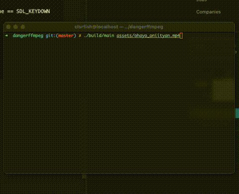

本文是 《DangerFFmpeg》系列教程第二节，系列完整目录：
《[开篇](/2021/05/14/8cf36b195b05.html)》
《[第一节、屏幕截图](/2021/05/15/1c458d50c524.html)》
《[第二节、输出到屏幕](/2021/05/16/aeb0b6c30d08.html)》
《[第三节、播放声音](/2021/05/20/d4b63d917433.html)》
《[第四节、多线程](/2021/05/22/71765970ad7e.html)》
《[第五节、视频同步](/2021/05/30/088658998748.html)》
《[第六节、同步音频](/2021/06/05/d8b51b0cff00.html)》
《[第七节、快进快退](/2021/06/09/2f01ccb59968.html)》
《[结语](/2021/06/19/7ddfef63d330.html)》

系列所有代码托管在 [GitHub](https://github.com/clsrfish/dangerffmpeg) 。

> 同原文使用的 SDL 相比，SDL2 API 变更比较大，所以译文和原文会有一定差别。

---

## SDL 和视频

为了绘制到屏幕上，我们将使用 [SDL2](http://www.libsdl.org/) 框架。SDL2 是 Simple Direct Layer2 的缩写，它是个非常棒的多媒体应用开发库，支持跨平台，并且在许多项目中都有使用。你可以从官网获取 SDL2 的源码或直接将其开发包安装到系统上。从本节开始，你需要添加 SDL2 依赖才能编译教程中的代码。
> macOS 上推荐 `brew install sdl2` 安装 SDL2。为了表达方便，如无特别说明，后文提到的 SDL 都表示 SDL2。

SDL 有许多绘制图片的方法，并且有一个适合显示视频 —— `SDL_UpdateYUVTexture`。[YUV（准确地说是 YCbCr）](http://en.wikipedia.org/wiki/YCbCr) 是与 RGB 类似的图像存储格式。不准确地说，Y 代表 **亮度（brightness or luma）** 分量，U 和 V 就是 **颜色（color）** 分量。YUV 要比 RGB 更加复杂，为了实现各种优化（主要是体积），YUV 可能会丢弃一些颜色信息，比如两个 Y 分量共享一对 UV 分量。SDL 的 SDL_Texture 可以接收 YUV 的三个分量并绘制出来。SDL2 比 SDL 支持的 YUV 格式更多，本文使用性能较好的 YV12 格式。还有一种 YUV 格式，称作 YUV420P，与 YV12 类似，不同的是 U、V 分量的先后顺序相反。其中 *420* 表示的是图像的 YUV 分量是按照 4:2:0 的比例[采样](http://en.wikipedia.org/wiki/Chroma_subsampling)的，差不多是一个颜色分量被四个亮度分量所共享，即颜色分量只有原始数据的 1/4。这种采样方式的优点是可以节省带宽，因为人眼无法感知到这种变化。“P” 表示存储格式是 **分层的（planar）**，即 Y、U 和 V 分开存储在不同的数组里。FFmpeg 可以将图像转换成 YUV420P 格式，另一个便利是，很多视频采用 YUV420P 格式存储，或者很容转换成 YUV420P。

所以我们现在的计划是替换[第一节](https://clsrfish.github.io/2021/05/15/1c458d50c524.html)中的 `SaveFrame`，将**帧数据（frame）**输出到屏幕上。不过在开始之前我们需要先了解如何使用 SDL。首先，我们需要添加头文件并且初始化：

```c++
#include <SDL.h>
#include <SDL_thread.h>

// Initialize SDL
if (SDL_Init(SDL_INIT_VIDEO | SDL_INIT_AUDIO | SDL_INIT_TIMER) != 0) {
  spdlog::error("Could not initialize SDL - {s}", SDL_GetError());
  SDL_Quit();
  return 1;
}
```

`SDL_Init` 的参数表明我们想要的使用什么功能，比如这里就是需要支持视频、音频以及时钟系统。`SDL_GetError` 可以方便地获取调试信息。


> 如何添加 SDL 到项目可以参考源码。


## 创建窗口

现在我们需创建一个窗口（SDL_Window）去渲染的内容，可以使用 `SDL_CreateWindow` 创建：

```c++
SDL_Window* win = SDL_CreateWindow("Tutorial 02: Outputting to the Screen", SDL_WINDOWPOS_CENTERED,
                                     SDL_WINDOWPOS_CENTERED, 640, 480, SDL_WINDOW_SHOWN)
if (win == nullptr) {
    spdlog::error("Could not create window - {s}", SDL_GetError());
    SDL_Quit();
    return 1;
}
```

`SDL_CreateWindow` 接受一个标题，窗口的位置，窗口的大小以及窗口的属性，如果返回值为 `nullptr` 则是窗口创建失败，直接退出程序。

## 创建 Renderer 和纹理

窗口已经显示出来了，看起来还比较简单。为了绘制帧数据，还需要创建 SDL_Renderer 和**纹理（SDL_Texture）**，纹理其实是一块可以存放图像数据的内存，Renderer 则使用纹理中的数据进行绘制。在创建 Renderer 时还要关联窗口，因为 Renderer 需要知道绘制到哪里：

```c++
SDL_Renderer* ren = SDL_CreateRenderer(win, -1, SDL_RENDERER_ACCELERATED | SDL_RENDERER_PRESENTVSYNC);
if (ren == nullptr) {
    SDL_DestroyWIndow(win);
    SDL_Quit();
    return 1;
}
```

第二个参数指定需要使用的图形驱动，传入 -1 表示使用第一个满足要求的驱动。第三个参数（flags）指明了我们的要求，比如这里要支持硬件加速和垂直同步。

Renderer 创建好后就可以创建纹理（SDL_Texture）了：

```c++
SDL_Texture* texture = SDL_CreateTexture(ren, SDL_PIXELFORMAT_YV12, SDL_TEXTUREACCESS_STREAMING, width, height);
```

`SDL_CreateTexture` 可以创建一个空白的纹理对象。它的第二个参数指定了接受的纹理格式，这传入文章开头说的 YV12 对应的常量。第三个参数则指定了我们希望图形驱动如何管理数据，它有三种形式：
- `SDL_TEXTUREACCESS_STATIC`：数据上传之后很少更新。
- `SDL_TEXTUREACCESS_STREAMING`：更新非常频繁。
- `SDL_TEXTUREACCESS_TARGET`：作为渲染的输出目标，比如在后台绘制，但是不希望它显示在屏幕上，就可以用这种纹理暂时存储。

显然我们应该用 `SDL_TEXTUREACCESS_STREAMING`。


## 绘制画面

[第一节](https://clsrfish.github.io/2021/05/15/1c458d50c524.html)中我们将原始帧数据转换成了 24-bit RGB 格式，这里需要改成 YUV420P，FFmpeg 没有直接提供 YV12 格式，我们可以在**使用 YUV420P 时调换一下 UV 的位置**。

```c++
AVFrame* pFrame420P = av_frame_alloc();
if (pFrame420P == nullptr) {
    return 1;
}

// Determine required buffer size and allocate buffer
int nbBytes = avpicture_get_size(AV_PIX_FMT_YUV420P, pCodecCtx->width, pCodecCtx->height);
uint8_t* buffer = reinterpret_cast<uint8_t*>(av_malloc(nbBytes * sizeof(uint8_t)));

// initialize SWS context for software scaling
SwsContext* pSwsCtx = sws_getContext(pCodecCtx->width, pCodecCtx->height, pCodecCtx->pix_fmt, pCodecCtx->width,
                                       pCodecCtx->height, AV_PIX_FMT_YUV420P, SWS_BILINEAR, nullptr, nullptr, nullptr);
```

现在我们可以将 `pFrame420P` 的数据上传到 `testure` 进行展示了：

```c++
// Clear the current rendering target
SDL_RenderClear(ren);
// Update texture
SDL_UpdateYUVTexture(texture, nullptr, pFrameYV12->data[0], pFrameYV12->linesize[0], pFrameYV12->data[1],
                        pFrameYV12->linesize[1], pFrameYV12->data[2], pFrameYV12->linesize[2]);
// Draw texture
SDL_RenderCopy(ren, texture, nullptr, nullptr);
// Update the screen
SDL_RenderPresent(ren);
// Take a quick break after all that hard work
SDL_Delay(50);
```

YUV420P 数据分层存储在 `pFrame420P->data` 中。`pFrame420P->linesize` 正如其命名一样，保存了 `pFrame420P->data` 每层数组的大小/长度，要注意这个长度包含了**内存对齐**添加的额外空间，这个数据和 SDL 的 “pitches” 是对应的。


`SDL_RenderCopy` 最后两个参数指定了显示区域和显示位置，因为这个不是我们的关注点，所以都传 `nullptr`，画面会填满整个窗口，感兴趣可以计算个准确的矩形区域。

每次渲染结束我们都暂停 50ms，避免画面变化过快，当然这里的 50ms 无法在真实项目中使用，后面我们将会看到如何动态调整延时以获得准确的播放帧率。

### SDL event system

我们再看看 SDL 的另外一个功能：事件系统。SDL 配置了当你打字、在窗口内移动鼠标或向 SDL 发送信号时，SDL 会产生一个**事件（event）**。如果你想处理用户输入，你的程序可以检查这些事件。程序也可以构造事件发送给 SDL，这个在多线程编程时是个非常有用的能力，我们将在第四节中看到。回到我们的程序，我们在每次发送 packet 之前检查事件队列。在这里我们只处理 `SDL_QUIT` 和 `SDLK_ESCAPE` 按下的事件，以便主动的退出程序：

```c++
SDL_Event ev;
while (!hasError && !hasFinished) {
    while (SDL_PollEvent(&ev)) {
      if (ev.type == SDL_QUIT || (ev.type == SDL_KEYDOWN && ev.key.keysym.sym == SDLK_ESCAPE)) {
        hasFinished = true;
      }
    }
    if (hasFinished) {
        continue;
    }
    // ...
}
```

### 开始播放

在修改完对应代码后，我们就可以编译运行了。

```shell
$ ./main.sh assets/ohayo_oniityan.mp4
```



运行程序之后发现了什么？帧率和原视频不一致，因为我们写死了 20fps。我们现在还没有计算帧数据该什么时候展示的代码，后面（第五节里）我们会去处理视频同步的问题。但是首先，我们缺少了更重要的东西：声音！


这些就是本节教程的全部内容，源码已经上传 [GitHub](https://github.com/clsrfish/dangerffmpeg) 。


## 参考文章

[原文链接](http://dranger.com/ffmpeg/tutorial02.html)

[SDL](https://libsdl.org)

[SDL 2.0 Tutorial](https://www.willusher.io/pages/sdl2)
