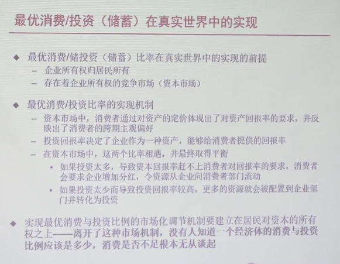

    <iframe src="//player.bilibili.com/player.html?aid=70557114&bvid=BV1oE411Z7TU&cid=122230289&page=1" scrolling="no" border="0" frameborder="no" framespacing="0" allowfullscreen="true" style="position: absolute; width: 100%; height: 100%; left: 0; top: 0;" sandbox="allow-top-navigation allow-same-origin allow-forms allow-scripts"></iframe>

## 课程介绍

不变价格：不变价格，从字面意义上我们不难理解，它是固定不变的价格，因此也叫固定价格，它是用某一时期同类产品的平均价格作为固定价格来计算各个时期的产品价值，目的是为了消除各时期价格变动的影响，保证前后时期之间、地区之间、计划与实际之间指标的可比性。

岔路口：是沿着“东亚奇迹”的轨迹继续高增长10年以上？
还是重蹈巴西、阿根廷陷入“中等收入陷阱”？

- 有关中国经济的关键问题
  - 为什么人还是那些人、资源还是那些资源，中国经济增长的绩效在改革开放前后如此截然不同？
  - 中国经济增长的源泉在哪里，障碍在哪里？
  - 中国经济还能高速增长多久？
  - 中国会落入“中等收入陷阱”吗？
  - 为了尽可能延长高增长，应该采用什么政策？
  - ...

中国经济增长的波动在次贷危机后明显加大。

克强指数：信贷、发电量、铁路货运量平均。

- 有关中国经济波动的关键问题
  - 经济为什么会波动？
  - 经济波动会摧毁经济吗？
  - 什么样的政策可以平滑经济波动？
  - 我们应该试图平滑经济的波动吗？
  - 中国经济的波动为什么在次贷危机之后加大？
  - 我们应该用政策来托底经济增长吗？还是应该放任经济增速的下滑？
  - 怎么预测经济波动？
  - ...

中国居民消费（消费占 GDP 比重）为什么明显偏低？
总量问题是结构问题的反映。

中国的储蓄率为什么大幅高于其他国家和地区？

次贷危机后中国国内债务总量上升得很快，会爆发债务危机吗？

- 有关中国经济结构的关键问题
  - 中国经济结构合适吗？
  - 中国经济有什么问题？
  - 中国经济适宜的结构是什么
  - 判断经济结构是否适宜的标准是什么？
  - 中国经济为什么要调整结构？
  - 中国经济要怎么调整结构？
  - 中国内部经济结构与外部世界又什么联系？
  - ...
- 有关中国经济政策的关键问题
  - 中国存在货币炒法吗？
  - 中国的通胀真是货币引起的吗？
  - 中国高涨的房价是不是货币吹出来的泡沫？
  - 货币政策还有放松的空间吗？
  - 怎么评价利率市场化？融资难荣子贵因何而生？
  - 对影子银行怎么评价和调控？
  - 财政政策和货币政策的界限在哪里？
  - 债务存量的上升是否会带来债务危机？
  - 地方政府的融资是否可持续？
  - ...
- 有关中国经济金融市场的关键问题
  - 资本市场与实体经济的关系事怎么样的？
  - 为什么2014～2015年故事的实体经济增长大幅背离？
  - 金融市场与宏观政策有什么关系？
  - 资产价格泡沫如何识别？如何应对？
  - ...
- 分析中国经济问题的经济学方法
  - 供需分析：S = D，商品价格取决于供需，使得供需匹配

三条线索：
- 中国经济结构的失衡
- 货币政策的传导路径
  - 货币总量（M）与分布
  - 常规货币政策与非常规货币政策
  - 中国金融乱象
- 萨伊定律的历史争论 - 20:17
  - 经济增长瓶颈在供给还是在需求；相信市场还是相信政府
  - 主流宏观经济学世界观 VS 非正统宏观经济学世界观
  - 有关中国经济的政策争论：调结构还是稳增长、供给侧还是需求侧

## 中国经济的供给面分析

国民财富
  - 是什么？
  - 衡量？

为什么关心国民财富？因为关心人的效用（幸福程度），效用来源人对外部的摄入，对产出的摄入比较容易从生产方测量。

GDP 不是我们最关心的（人民幸福），但是却是最接近的一个指标。GDP 越高，人民幸福程度越高，这个逻辑是符合直觉的。

GDP 生产产业占比，对应增速，高占比成分对 GDP 影响大。

资本边际回报递减，对经济增长作用也越来越不明显。比如固定资产的折旧。

扩大劳动力供给，对人均 GDP 增长影响不大，所以需要提升技术对经济增长的贡献。

> 技术贡献的下降是次贷危机后中国经济增速下滑的主要原因。技术水平没有具体指标衡量，只能通过残差得来，但这个残差的内容其实也无法完全确定。

## 发展战略与经济绩效

两类技术：
- 索罗残差（A）: 越高越好的“技术”
- 资本密集度（⍺）：未必越高越好的“技术”，对资本的依赖程度
  - 给定禀赋的资本密集度，对不同资本密集度的生产技术有一个最优选择问题

Y = AK⍺L1-⍺

资本增长速度远高于劳动增长。

企业对技术（劳动密集 or 资本密集）的选择是基于市场的。

改革开放前执行发展重工业的赶超战略，集中力量发展不符合当时的经济禀赋的资本密集型产业。这一看似错误的战略是建立在建国初期国际环境不稳定，新中国随时可能再次陷入战争的局面上的，实属无奈之举。
成就：
- 国防力量：国际地位
- 完备的产业：经济内循环，减少对外部经济环境的依赖

## 消费与储蓄的决定

> 方法论转变

Phillips 曲线：CPI 与 失业率 增长呈负相关关系。

Phillips 曲线消失，高通胀取代低通胀预期。

建立在人的行为基础上的宏观经济数量关系时不稳固的。

微观基础：宏观分析的基础需要构建在经济中最深层次的“不变”——也就人的理性——之上。

企业没有消费。

实然：
- 中国居民消费占GDP比重明显低于世界平均水平
- 中国储蓄率明显高于世界平均水平

应然：
- 居民消费是不是过低？
- 储蓄率是不是过高？

消费者选择消费储蓄行为来最大化贴现效用和。

当消费/储蓄达到最优时，边界上增加储蓄的正面效应和负面效应相等。

市场利率反映了消费者们的跨期主观偏好。

## 中国的消费不足

WIP

## 参考文章

http://www.stats.gov.cn/tjzs/tjcd/200205/t20020528_25325.html
