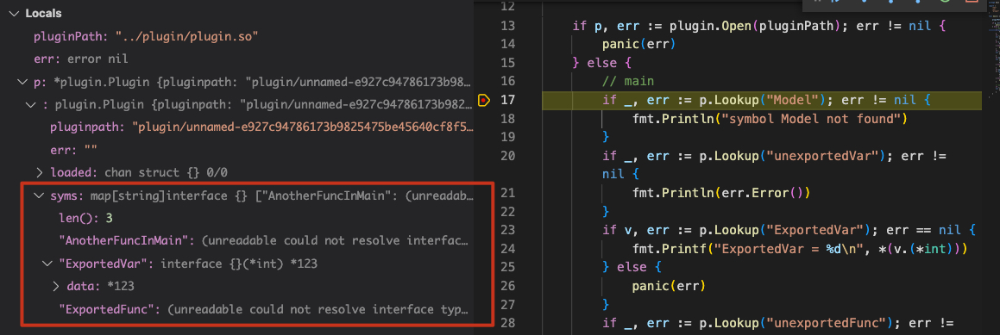

最近在做 MIT 6.824 Lab 1 的时候发现提供的代码中用到了 Go 的插件系统，所以就趁着这个机会简单学习了一下 Go plugin package。


## 静态链接库与动态链接库

写过 C/C++ 的应该对这个非常熟悉，不是编译时遇到 **ld fail**，就是运行时遇到 **dyld fail**，ld 和 dyld 就分别对应了静态链接和动态链接过程。那静态链接与动态链接有什么差异，各自又有什么优缺点呢？

首先不管是静态链接库还是动态链接库，它们都是由程序依赖的外部函数、变量（统称 symbol）组成。静态链接时，链接器（ld）将程序和静态库打包到一个可执行文件，同时将 symbol 解析成对应的地址（address），这个可执行文件可以单独运行；相反地，动态链接就是不把动态库和程序打包成一个可执行文件，将 symbol 的解析延迟到运行时，再由 dyld 完成 symbol 到 address 的解析，不过需要提供动态库才可以运行程序。

对应的优缺点也非常明显了，首先静态链接会把静态库和程序打包成一个可执行文件，产物体积相对较大，且相同的静态库代码不同进程之间无法共享，内存占用较高；好处是可执行文件可以单独运行，部署方便。动态链接的 symbol 解析过程在运行时发生，所以可以实现一些**热插拔**功能，同时多个进程之间共享可以同一动态库，降低了内存占用；但是维护麻烦，symbol 解析失败排查也会麻烦一点。

在如今的硬件条件下，静态链接的易于部署比动态链接的低内存占用更加重要，采用动态链接更多还是看重其灵活性。


## Go plugin package

Go 插件相关能力由 `plugin` 包提供，同时这个包实际上是对 dyld 调用的封装，使其更符合 go 的风格，相关的函数有：

```
# dlfcn.h
dlopen - load and link a dynamic library or bundle
dlsym - get address of a symbol
dlerror - get diagnostic information
dlclose - close a dynamic library or bundle
```

看下 `plugin` 的文档：


> A plugin is a Go **main package** with **exported functions and variables** that has been built with:
> `go build -buildmode=plugin`
> When a plugin is first opened, the init functions of all packages not already part of the program are called. The main function is not run. A plugin is only initialized once, and **cannot be closed**.

简单来说就是，plugin 项目和一般的 Go 项目类似，必须定义一个 main package，同时 main pacakge 中可导出的 Function 和 Variable 可以被动态链接器查找到，注意是只有 main package 中的才可以，后面我们通过实例验证一下。`init` 函数调用规则就和普通项目一样了。

`plugin` 包中只提供了 `Open(path stirng)(*Plugin,error)` 和 `Lookup(symName string)(Symbol,error)` 两个方法，很好理解，加载并解析动态链接库和查找 symbol。先看下 `Plugin` 结构体的定义：
```go
type Plugin struct {
	pluginpath string
	err        string        // set if plugin failed to load
	loaded     chan struct{} // closed when loaded
	syms       map[string]interface{}
}

// A Symbol is a pointer to a variable or function.
type Symbol interface{}
```

这里关注 `syms` 就可以了，它保存了这个动态链接库对外提供的 symbol，`Lookup` 函数实际上就是执行 map get 操作。拿到 `Symbol` 后执行强制类型转换就可以正常使用了。


## 实例

这里我们建立两个工程，`ptest` 和 `plugin`：

```
# ptest
├── main.go
└── go.mod

# plugin
├── add.go
├── add2.go
├── subpkg
│   └── sub.go
└── go.mod
```

重点关注一下 plugin 工程，我们在不同的 package 里定义可导出和不可导出的函数或变量，然后在主工程中断点看是不是与前面的学习一致。

```go
// main - add.go
func init() {
	fmt.Println("add init called")
}

var ExportedVar = 123
var unexportedVar = 456

func ExportedFunc(a int, b int) int {
	return subpkg.NonMainPkgFunc(a, b)
}

func unexportedFunc() {

}

type Model struct {
	ID string
}

// main - add2.go
func init() {
	fmt.Println("add2 init called")
}

func AnotherFuncInMain(a, b int) int {
	return a + b
}

// subpkg
func init() {
	fmt.Println("sub pkg init called")
}

func NonMainPkgFunc(a int, b int) int {
	return a + b
}
```

我们在 `add.go` 中分别定义了可导出/不可导出的变量和函数以及一个可导出的类，在 `add2.go` 中定义了一个可导出函数；在 subpkg 中定义了一个可导出函数。按照文档描述，我们在主工程中可以 `Lookup` 到 `ExportedVar`、`ExportedFunc`、`AnotherFuncInMain`，其它的都将不可见，也即不存在于 `Plugin.syms` 中。

下面是 `main.go` 的实现：

```go
func main() {

	pluginPath := os.Args[1]

	if p, err := plugin.Open(pluginPath); err != nil {
		panic(err)
	} else {
		// main
		if _, err := p.Lookup("Model"); err != nil {
			fmt.Println("symbol Model not found")
		}
		if _, err := p.Lookup("unexportedVar"); err != nil {
			fmt.Println(err.Error())
		}
		if v, err := p.Lookup("ExportedVar"); err == nil {
			fmt.Printf("ExportedVar = %d\n", *(v.(*int)))
		} else {
			panic(err)
		}
		if _, err := p.Lookup("unexportedFunc"); err != nil {
			fmt.Println(err.Error())
		}
		if sym, err := p.Lookup("ExportedFunc"); err == nil {
			res := sym.(func(int, int) int)(1, 2)
			fmt.Printf("ExportedFunc returns %d\n", res)
		} else {
			panic(err)
		}
		if sym, err := p.Lookup("AnotherFuncInMain"); err == nil {
			res := sym.(func(int, int) int)(3, 4)
			fmt.Printf("AnotherFuncInMain returns %d\n", res)
		} else {
			panic(err)
		}

		// subpkg
		if _, err := p.Lookup("NonMainPkgFunc"); err != nil {
			fmt.Println(err.Error())
		}
	}

}
```

然后开始测试我们的代码：

```shell
cd plugin
go build -buildmode=plugin -o plugin.so add.go add2.go

cd ptest
go run main.go ../plugin/plugin.so
```

得到的输出如下：
```
sub pkg init called
add init called
add2 init called
symbol Model not found
plugin: symbol unexportedVar not found in plugin plugin/unnamed-e927c94786173b9825475be45640cf8f5788c833
ExportedVar = 123
plugin: symbol unexportedFunc not found in plugin plugin/unnamed-e927c94786173b9825475be45640cf8f5788c833
ExportedFunc returns 3
AnotherFuncInMain returns 7
plugin: symbol NonMainPkgFunc not found in plugin plugin/unnamed-e927c94786173b9825475be45640cf8f5788c833
```

和我们猜想的一致，再进一步，这些查找失败的会不会是因为它们有特殊的名称呢？我们结合断点探个究竟。



可以看到确实只有那些被导出函数和变量，Type 和未导出函数、变量都无法被 Lookup 查找到。

> 那 `init` 函数又是怎么回事呢？
> VSCode 在调试时会自动添加一个 `-gcflags="all=-N -l"` 的编译选项，所以我们在断点前也需要加上这个编译选项重新构建插件，否则你可能会看到一个 "plugin was built with a different version of package xxx" 的报错。

## 总结

Go 插件系统还是非常好上手，除了不支持 Windows 外，唯一的缺憾就是无法卸载了。最后推荐一个好玩的项目 https://github.com/hashicorp/go-plugin。


## 参考文章

https://pkg.go.dev/plugin

https://youtrack.jetbrains.com/issue/GO-7474
