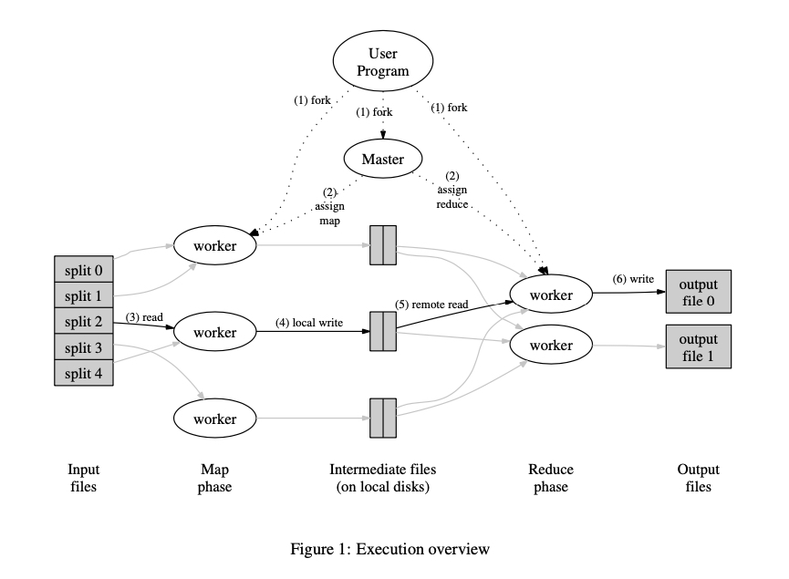

## 什么是 MapReduce

MapReduce 是一种**通用的编程模型**，应用并行在计算机集群上完成大数据处理/计算任务。Google 在 2003 年发表了 《MapReduce: Simplified Data Processing on Large Clusters》，向业界介绍了 MapReduce 编程模型，MapReduce 与 GFS（MIT 6.824 Lec 3）、BigTable 并称为 Google 的“三驾马车”，支撑了 Google 众多计算任务，比如分词、倒排索引等。

MapReduce 出现之前，这些计算任务都需要处理大量输入、计算节点管理以及容错，处理这些问题的代码反而比实际计算任务的更多，即使这些计算操作通常并不复杂。受 Lisp 等函数式编程语言的 *map* 和 *reduce* 原语启发，Google 想到了将计算任务整体划分成 *map* 和*reduce* 两个阶段，简化计算模型，同时对计算逻辑隐藏并行、容错、复杂均衡等的复杂性。

不过 Google 并没有开源他们的 MapReduce 实现，幸运的是 Hadoop 项目提供了 MapReduce 的开源实现。

## 编程模型/范式

MapReduce 模型下计算任务的输入输出都是 key/value，用户将计算逻辑用 *map* 和 *reduce* 表达。其中 map 输出的中间结果（也是 key/value）将写入磁盘，作为后续 reduce 的输入，reduce 再将中间结果进行合并处理，并将最终结果写入磁盘。

下面看看以 word-count 为例的伪代码：

```typescript
map(string key, string value):
    // key: document name
    // value: document contents
    for each w in value:
        emitIntermediate(w, "1")

reduce(string key, List<string> values):
    // key: a word
    // values: a list of counts
    int result = 0
    for each v in values:
        result += v
    emit(result.toString())
```

没有特殊要求，用户就只需要实现类似上面两个函数。计算过程中的数据类型转换如下：

```plaintext
map     (k1, v1)            -> list(k2, v2)
reduce  (k2, list(v2))      -> list(v2)
```

> 理论上 kx 和 vx 可以是任意类型。

通过这种简单的计算模型，用户能够像在单机上的计算一样，关注计算逻辑。

## 实现

### 架构



MapReduce 架构设计了一个 Master 对任务进行管理，多个 Worker 执行相应的 Map 或 Reduce 函数（统称为任务），Master 与 Worker 中间通过 Http/RPC 交互。

一个完整任务执行过程如下：

1. MapReduce（与用户代码编译好的可执行文件） 首先会将输入文件划分成 M 份（大小通常是 16~64M），然后在集群中启动 MapReduce 程序。
2. 集群中某一台机器将被指定为 Master，其余的是 Worker，并切等待 Master 分配任务。刚开始有 M 个 Map 任务和 R 个 Reduce 任务需要进行分配，Master 会挑选空闲的 Worker 分配一个任务（Map 或者 Reduce）。
3. 被分配到 Map 的 Worker 读入对应的输入，解析出 key/value 并传递给用户实现的 Map 函数，Map 函数产生的中间结果暂时存在内存里。
4. Map 函数计算结果会周期性地写入 R 个本地文件，其中分区规则由分区函数决定（可定制）。然后这些本地文件的位置在 Map 任务执行完时发送给 Master，Master 然后把这些文件传递给执行 Reduce 任务的 Worker。注意，Reduce 的输入来自每一个 Map 的输出，同时 key 相同的中间结果不会同时被多个 Reduce 接收到。
5. 当 Master 通知 Reduce Worker 中间结果的位置后，Worker 通过 RPC 读取对应的 Map Worker 的本地文件。等所有中间结果读取完毕后，Reduce Worker 会对中间结果按照 key 进行排序，以便相同 key 的中间结果会聚集在一起。
6. Reduce Worker 然后遍历中间结果，将相同 key 的数据集传递给用户编写的 Reduce 函数。Reduce 函数的输出结果会 append 到输出文件。
7. 所有 Map Task 和 Reduce Task 完成后，Master 会回到用户代码（这里没太懂，大概就是通知用户执行结果吧）。

### 容错性

MapReduce 被设计运行在廉价的机器上，机器的 failure 被当作 norm 而不是 exception，比如 Worker 宕机。

#### Worker 异常

启动后 Master 会定时 ping Worker，如果 Worker 没有在规定时间响应，该 Worker 会被判定为 'failed'。同时，针对 Worker 执行的任务，有如下两种处理：

- 如果 Map 任务完成，该任务被重新标记成 'idle'，以便分配给其它 Worker。至于为什么完成了还要重置，这是因为计算的中间结果是直接存在 Worker 的本地磁盘的，既然 Worker ping 不通，那么接下来的 Reduce 任务自然也无法从 Map Worker 上读取输入。同时，对应从该 Worker 获取输入的 Reduce Workers 也被通知重新执行任务。
- 如果 Map 或 Reduce 任务正在执行，该任务被重新标记成 'idle'，以便分配给其它 Worker。

Worker 在整个任务结束之前，都必须与 Master 保持通信，不然就会被判定成 failed，导致任务重试/重分配。

#### Master 异常

Master 异常处理相比就简单直接一点了，周期性地将状态生成 checkpoint/序列化，Master 挂掉了就在管理台上通知用户，用户重试就可以了。重试的任务会尝试从磁盘取回之前的状态，避免重复计算。

#### 失败时的语义

原文的描述没怎么看懂，我理解就是如果 Reduce 函数是纯函数，那么语义是确定，同样的输入，多次执行结果总是和串行计算的结果相同。

下面是原文:
> In the presence of non-deterministic operators, the output of a particular reduce task R1 is equivalent to the output for R1 produced by a sequential execution of the non-deterministic program. However, the output for a different reduce task R2 may correspond to the output for R2 produced by a different sequential execution of the non-deterministic program.

### 性能优化

虽然[上面](#架构)描述了一个任务执行过程的理论模型，但如果完全按照理论模型落地，还存在一定性能瓶颈，比如网络IO等。

#### 输入文件IO

Map Worker 会从 GFS 读取输入文件，这里就引入了一次网络 IO，特别是在 03 年的网络设施性能相对较差的情况下，光是读取输入文件就要费老鼻子劲。GFS 将文件存储在 chunkserver 上，Master 分配任务时，会根据输入文件的位置，尽量将任务分配到输入文件所在的 chunkserver 对应的 Worker 上，从而避免一次网络 IO。

#### 后备任务

导致 MapReduce 任务总耗时增加的最普遍的原因是 "straggler"，也就是最后一些未完成的任务因为某些原因执行了非常久，比如 CPU 负载、网络 IO 拥挤等。Google 采用了一个非常简单的机制，减缓这种任务对耗时的影响 —— 在只剩少量任务未完成时，启动一些后备任务同时执行计算，这些后备任务和原任务最先完成的就能将对应标记为完成。

#### 排序

Reduce Task 中的排序保证不用把所有不同的 key 数据读入内存处理，更重要的一点是如何在不全部读入内存的情况下对中间结果进行排序。

Map Task 在输入中间结果时，并不是直接写入磁盘，而是写入一个 RingBuffer，写满时就会将 Buffer 写入磁盘，在此之前会对中间结果进行**快速排序**；等 Map Task 结束时，多次写入磁盘的结果最终会进行**归并排序**，得到 Map Task 的最终结果。

Reduce Task 从多个 Map Worker 读取到中间结果后，也会进行一个**归并排序**，得到 Reduce 函数的输入。

所以**整个计算过程有三个排序操作**。

#### Combiner Function

Paper 里对 Combiner Functin 的描述是 "in some cases"，也就是这个东西不是一个普适的优化。以 Word-Count 为例，在 Map Task 结束前进行一次计算，即对当前 Map Task 的输出进行一次 Reduce 操作，减少后面网络 IO 耗时。

## 参考文章

<https://static.googleusercontent.com/media/research.google.com/en//archive/mapreduce-osdi04.pdf>

<https://hadoop.apache.org/docs/r1.2.1/mapred_tutorial.html>

<https://www.talend.com/resources/what-is-mapreduce/>

<https://www.guru99.com/introduction-to-mapreduce.html>
