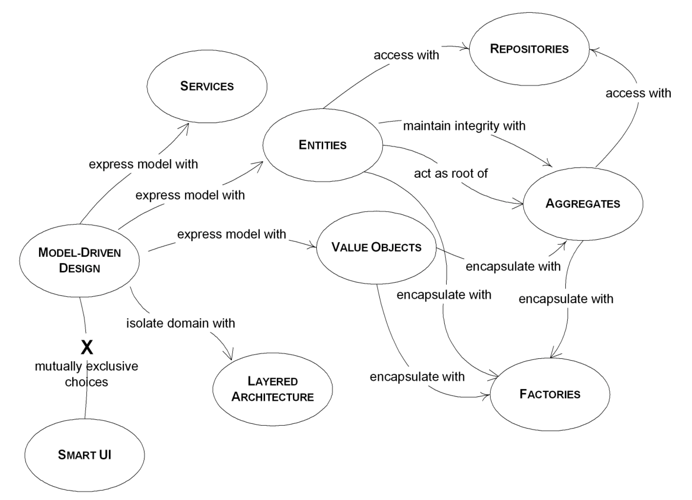
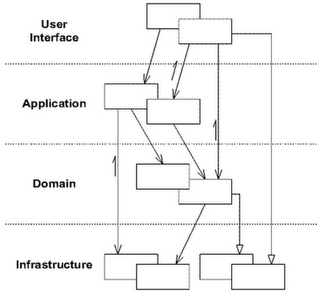
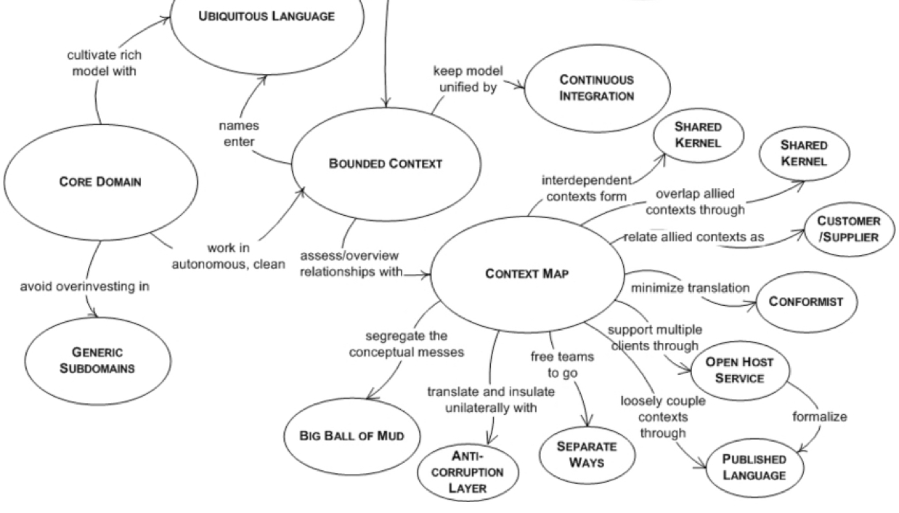
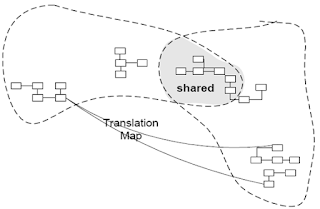
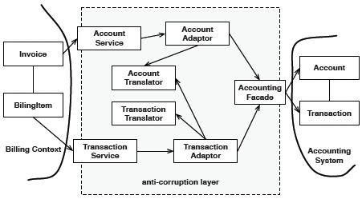

去年连着刷完了[《领域驱动设计》][DDD]、[《实现领域驱动设计》][IDDD]和[《领域驱动设计精粹》][DDDD]，碰到一些案例讲解，走马观花就过了。春节前后两三个月（摸鱼太多）二刷《领域驱动设计》，虽然最后两章《大型结构》和《领域驱动设计的综合运用》还是没能体会透彻，但是相比第一遍时的那种朦胧感，对领域驱动设计的理解要清晰得多了。

## 概览

> A brief introduction to DDD from ChatGPT

Domain-Driven Design (DDD) is a **philosophy** and software development **methodology** that aims to help teams build *complex* software solutions that closely match the domain of the problem they're trying to solve. Instead of focusing on architecture, DDD emphasizes domain analysis, modeling, and design.

In DDD, **the domain model is a central concept that represents the core of the system**. It is a set of well-defined concepts, attributes, and relationships that accurately reflect the business or industry domain the software is meant to solve. A good domain model should provide a common language and understanding for everyone involved in the project, from developers to business stakeholders.

DDD is highly collaborative and relies heavily on the expertise of domain experts. Developers work closely with domain experts to identify, model, and refine the domain model over time. The use of ubiquitous language is critical to ensure clear communication and understanding of the domain model.

Some key concepts in DDD include bounded contexts, aggregates, and repositories. Bounded contexts help to define the scope of a domain, while aggregates define transactional boundaries within the domain model. Repositories help to manage the persistence of the domain model.

DDD is often used in *complex*, highly transactional systems like those found in finance, logistics, and healthcare. It can help teams build software that's easier to maintain, understand, and extend over time.

同一个问题问 ChatGPT 多遍，每遍都会给你不一样的答案，有些回答语句精炼、逻辑清晰，有些则语焉不详、啰里八嗦，就跟本文一样。我还是觉得 ChatGPT 给我的第一个回答最棒，非常适合作为本文的大纲进行展开，可惜手残刷新后就再也没找到了。

回到这个 brief introduction，在跟 ChatGPT 极限拉扯 N 回之后，发现了个很打动我的词，相信你也看到了，就是”philosophy“，虽然后面的“methodology”也被粗体标识出来了，但相比之下略显生硬。二刷《领域驱动设计》的同时，也在看《毛泽东选集》，期间突然就觉得两本书都在揭示某些哲学思想：实践是检验真理的唯一标准，实事求是，辩证法等。

我对上面 ChatGPT 的回答不太满意的一点就是，它前后都强调 DDD 常用于“complex”的业务系统或行业领域，会让人觉得 DDD 是一套非常“重”的方案，轻易不敢在项目中实践。但是个人认为 DDD 最核心的是叫人如何认识领域，抽象问题，分离业务面与技术面，将领域知识运用到建模中，这些不管在哪种业务系统或行业领域都是适用。

好了，废话留着后面再说，进入正题。

## 领域模型

在 DDD 中，领域模型是表达系统的核心概念。后面将讨论到的战术设计，战略设计，都离不开有效建模的领域模型。

那么要怎么理解“领域模型/Domain model”这个词呢？

> 在太多项目代码里见过 `models` 文件夹，但是里面存放的基本都是一些 POJO 或 DB schema，用途也是混乱不清，以至于很多人认为模型就是 POJO，就是 DB schema。

一个大家都认可的事实是，软件的核心就是为用户解决某些问题的能力，而这些问题就构成了软件的领域/domain，有的人也会说 scope。而模型就是对现实问题有选择的抽象，它对领域中的知识进行有组织地提炼，避免现实问题的复杂性造成信息过载。

《领域驱动设计》中提到有效建模的几个因素：

1. 模型和实现绑定。实现与模型脱钩会引入一个额外的翻译过程，开发人员需要不断地将模型翻译成实现，需要将实现翻译成模型并给专家解释。而新加入成员需要阅读大量文档代码才能建立起模型与实现间的映射。
2. 建立基于模型的语言。开发人员与领域专家的沟通语言，它不是某一方的语言，而是包含了对象、操作、事件甚至组织规则。
3. 开发蕴含丰富知识的模型。领域对象除了包含必要的数据/属性外，还应具有动作，一些强制性业务规则和事件，这些是描述并解决领域问题不可或缺的部分。
4. 提炼模型。随着项目发展，对领域模型的理解不断深入，新的概念加入，过时的概念被剔除，核心概念愈发凸显，甚至被提取到一个新的模型中进行表达。
5. 头脑风暴和实验。团队讨论的创造性有助于发现隐藏概念，丰富模型。实验和口头表达则能够帮助检验模型是否清晰，模糊的模型会导致笨拙的表达。

总的来说，领域建模是一个不断学习，消化知识的过程，而领域模型则需要将这些知识显式地体现出来，高效率的团队需要有意识地累积知识。

> 关于表达模型的工具/形式，其实没有特别的约束，只要能够充分地表达出模型中的概念就可以。

## 战术设计

战略和战术分别表达“做什么”和“怎么做”的两个问题。具体到 DDD，战略设计指复杂的业务下，如何将业务划分成不同的子领域并进行集成；而战术则是在一个领域内，怎么划分和组织代码。



### 表达领域模型

DDD 使用 `Entity`、`Value Object` 和 `Service` 表达领域模型，注意这里的 `Service` 不是传统 MVC 里包含领域逻辑的 `MVCService`（用 MVC 前缀以区别领域模型中的 `Service`）。

在传统的 MVC 模式中，model 往往被设计成面向 DB 的，DB schema 成为关注点而不是领域模型的表达；同时，model 被设计成贫血模型，那些本该在 model 中表达的操作，以过程式的方式堆在了 `MVCService` 里；再者是技术面与业务面的耦合，在表达领域概念的同时还要关心技术细节。从而在传统 MVC 的项目中很容易感受到：

1. 代码不易理解。一个完整的用户故事需要在 model 和 `MVCService` 中来回查看，业务代码被技术代码所掩藏，进一步加大难度，稍大一些的项目容易被称为“屎山”。
2. 模型与实现脱钩。与领域专家的沟通开始困难，新成员在理解代码的同时还要学习一套与领域专家沟通的术语。迭代新功能时容易影响现有业务。
3. 领域知识散乱。贫血模型对象需要暴露大量属性供 `MVCService` 完成业务操作，模型对象散布在各处。
4. 单元测试难度提高。

在 DDD 中，`Enitty` 和 `Value Object` 除了定义必要的属性外，上面提到的 `MVCService` 中的业务逻辑，都在 `Entity` 和 `Value Object` 上实现。这样 `Entity` 和 `Value Object` 就不再仅仅是数据容器，而是一个活生生的、有血有肉的对象了。而之前为了业务操作而暴露的属性，现在也可以设为私有了。所有的领域知识集中在一起，并且使用领域模型中的术语来命名类，属性和函数，对象，代码与领域模型关系紧密。这时候可能会惊奇地发现，针对这部分的单元测试居然可以起到一定程度的文档作用，断言规定了执行某个操作后对象应是什么状态。

再回到 `Entity` 和 `Value Object`，这两种对象的之间有什么区别呢？

《领域驱动设计》这么解释：“一个对象是用来表示某种具有连续性和标识的事物呢，还是用于描述某种状态的属性呢？这是 `Entity` 和 `Value Object` 的根本区别。”

一个 `Entity` 非常好的例子就是人，一个人不可能被他所具有的属性，比如相貌、身高、体重等唯一地确定出来，随着年岁增长，即使这些外在属性变化，但这个人还是他。所以 `Entity` 使用标识进行区分并跟踪，常见的手段就是为其分配一个 ID/UUID。

相对地， `Value Object` 就是那些可以通过属性来唯一区分的对象，单一属性不行就多个属性。并且，因为没有标识，不需要跟踪其生命周期，所以在设计上也比 `Entity` 要简单。同时，因为只关心 `Value Object` 的属性，所以 `Value Object` 需要实现为 immutable。

一个事物被建模成 `Entity` 还是 `Value Object`，取决其是否需要标识，标识重要与否。还是用人举例子，但这次的场景是坐电梯，对于电梯是否超载这个业务规则，我们就不再关心人是谁，而是关心其体重，那么这时将人建模成 `Value Object` 是个比较好的选择。

那么 `Service` 呢？领域模型中有一些不适合由 `Entity` 或 `Value Object` 来承担的操作，因为这些操作可能涉及多个 `Entity` 或 `Value Object`。`Service` 就是被设计来处理这种场景的，它强调对象之间的关系。这里以银行转账为例，Account1 向 Account2 进行转账，一般在转账前会对双方账户进行校验，检查有足够资金支取，账户未否被冻结等一系列的业务规则，如果将这样的操作实现在 Account 对象上，那么在处理转账业务时，Account1 除了要处理自己的状态外，还要把手伸到 Account2 的口袋中去，现实中这样的行为是非常别扭的。所以将这类涉及多个对象，不适合放在对象上完成的操作转移到 `Service` 上，然后用这个操作（动词）给 `Service` 命名。

#### 领域对象生命周期

<div style="background:white">


</div>

领域对象在创建出来后会经历各种不同的状态，直到最终被存档，删除。在管理对象状态时，领域模型会遇到下面两个挑战：

1. 领域对象在整个生命周期中保证一致性，满足某种业务规则。
2. 避免对象的创建和重建等生命周期管理的复杂性影响到领域模型。

##### Aggregate/聚合根

大多数业务系统中的对象都具有非常复杂的关联关系，顺着关系链访问对象，会给业务造成混乱。一方面，对象间的这种关联关系属于领域知识，过于暴露会给业务方造成认知负载；另一方面，对象需要满足一定的一致性规则，过分暴露的关系模糊了一致性边界。

为了解决这个问题，DDD 使用 `Aggregate` 将一组**关系紧密**的 `Entity` 和 `Value Object` 聚集起来，并选择一个 `Entity` 作为 `Aggregate Root` 供业务方访问。业务方无法直接访问到除了 `Aggregate Root` 外的内部对象，需要委托 `Aggregate Root` 完成操作。`Aggregate Root` 此时便是充当了边界的作用，在此边界内任何的状态变更都会满足一致性规则要求。

那么怎么定义这个**关系紧密**呢？自然是通过理解领域。一般来讲，同一个 `Aggregate Root` 内的对象间满足的需要是强一致性，两种 `Aggregate Root` 之间可能并不需要时刻保持这种一致性，它们可以通过消息或其它机制实现最终一致性。那么自然的，`Aggregate Root` 指明了数据库的事务边界，同一个事务内不能同时操作两种 `Aggregate Root`。

`Aggregate Root` 引伸出来的一条规则是，业务方通过 `Repository` 只能查询到 `Aggregate Root` 而不能直接查询到内部对象。

##### Factory pattern

DDD 引入 `Factory` 来解决 `Aggregate Root` 创建的问题。

为什么不用 `Aggregate Root` 的构造器而要借助 `Factory` 来完成创建呢？对象装配本身并不属于领域知识的一部分，它是支撑领域的一种技术细节（一些OO语言甚至没有构造器，比如 Golang），所以 `Aggregate Root` 已经承担复杂领域知识的情况下，再承担自身的装配会让 `Aggregate Root` 超载。

显然，`Aggregate Root` 的装配也不适合交由业务方完成，业务方本来只需要关心如何使用 `Aggregate Root` ，现在还要负责创建它，这会将复杂性引入到业务方，同时也破坏了 `Aggregate Root` 的封装性。

所以创建 `Aggregate Root` 的职责需要专门设计，即 `Factory`，它作为支撑领域模型的技术，与 `Aggregate Root` 同属一个代码层级，同时 `Factory` 创建出来的 `Aggregate Root` 必须满足一致性规则，否则需要拒绝创建。

##### Repository pattern

对象创建之后知道被删除前，要么处于 Active 状态，要么被存储在数据库或其它持久化工具里。`Repository` 这个 pattern 在很多领域都有这个概念，目的都是为了隔离具体的存储技术。在 DDD 中，为了避免以数据思维而不是领域思维保存和查询对象，还需要给 `Repository` 加上一些约束：

- 避免随意查询 `Aggregate Root` 内部对象，这会破坏 `Aggregate Root` 的封装。
- 只为需要全局访问的 `Aggregate Root` 提供 `Repository`。

使用 `Repository` 有这样一些优点：

- 使应用程序和领域技术与持久化技术解耦。
- 体现对象的访问设计决策。
- 便于替换底层存储和测试。

### Layered Architecture



软件中用于解决领域问题的部分通常只占整个系统中较小的一部分，我们需要将领域部分代码与其它代码区分，避免在纷繁芜杂的系统中迷失了领域。DDD 也采用分层结构来分离关注点，与 MVC 不同的是，DDD 拥有一个饱满的 Domain 层用于表达领域模型：

| Layer          | Responsibility                                                                                         |
| -------------- | ------------------------------------------------------------------------------------------------------ |
| User Interface | 负责向用户显示信息和解释用户指令，对于后端服务来说，这里定义了交互协议（比如 REST、RPC 或 Event 等）。 |
| Application    | 负责编排任务，指挥领域层对象完成业务逻辑。这里编排包括开启事务，调用其它微服务以及发布订阅事件等。     |
| Domain         | 负责表达业务概念，业务状态信息以及业务规则。                                                           |
| Infrastructure | 为上层提供技术支持：为领域层提供持久化支持，为用接口层提供协议转换，为应用层传递消息等。               |

下面是一个典型的 DDD 分层架构的项目目录划分：

```plaintext
├──interface
│    ├──controller
│    ├──rpc
│    └──function
├──application
│    ├──usecase
│    └──service
├──domain
│    ├──entity
│    ├──valueobject
│    ├──service
│    ├──repository
│    └──event
└──infrastructure
     ├──persistence
     ├──service
     └──repository
```

`interface` 定义了以各种协议对外开放的接口，比如 REST、RPC 等，接收用户请求并解析出 `application` 层所需要的参数。借助框架的帮助，这一层也可以做到访问控制和参数校验。当请求进入 `application`，`application` 可能调用 `infrastructure` 开启事务或发布消息，调用 `repository` 拿到 `domain` 层的 `Aggregate Root` 执行领域逻辑，调用 `application service` 访问其它微服务，最后再调用 `repository` 保存 `Aggregate Root`。

上面目录结构中还隐藏了一些比较重要的知识点。

第一个是在 `domain` 和 `infrastructure` 中都有一个 `repository` 目录， 前者是定义了接口，后者则是基于 `persistence` 的实现。因为 `domain` 专注于表达领域模型，`repository` 的实现其实是一个技术问题，所以将实现放到 `infrastructure` 中是一个合理的决策。

第二个是，在 `application`、`domain`、`infrastructure` 中都存在一个 `service` 目录，那么它们之间有什么区别呢？

| Layer                  | Responsibility                                     |
| ---------------------- | -------------------------------------------------- |
| application#service    | 调用 domain 或 infrastructure 完成功能。           |
| domain#service         | 基于 `Entity` 和 `Value Object` 执行某种业务动作。 |
| infrastructure#service | 纯技术的 service，封装一些功能供上层使用。         |

### 深化领域模型

领域模型的深化，本质上是知识的积累与沉淀，随着对领域知识的理解加深，我们可以突破模型表面形式，找到模型对象的深层关系，模型中的技术因素进一步被淡化，领域模型的核心概念进一步突出。以物流为例，表面上看是货物在时空上的转移，深层次上其实包含责任的转移。

为了深化模型，只能不断地学习领域知识，不断地与业务专家交流，建立起对领域的深刻理解。DDD 并没有提供具体的方法论来完成领域模型的深化，毕竟现实问题各不相同。

#### Spcification pattern

在执行领域操作前，通常会校验一些业务规则以确保领域操作可以被执行，业务规则通常以各种布尔测试体现，比如判断发票是否过期等等。但是对于复杂的业务规则，除了简单的布尔测试外，还可能由多个规则组合，依赖其它类库、微服务的计算，如果将这部分业务规则实现在 `Entity` 或 `Value Object` 中，那么领域对象的基本含义很快就会被复杂规则计算淹没。即使规则不适合作为 `Entity` 或 `Value Object` 的职责，但它仍属于领域层。因此，引入一个特殊的 `Value Object` 对规则进行描述并测试对象是否满足指定的标准，这样的对象称为 `Specification`。

`Specification` 的应用场景有：

- 验证对象，检查它是否满足某些需求或者是否已经为实现某个目标做好准备。
- 从集合中选择一个对象。
- 指定创建新对象时必须满足的某种需求。

这三种场景下，通过 `Specification` 做到了概念上的统一，简化了设计。

#### 柔性设计

柔性设计这个概念是在看书的时候第一次见，很多关于 DDD 的博客中都没有提及它。柔性设计的主要服务对象是开发人员，这里的开发人员包括调用这部分代码的客户开发人员以及将来会修改这部分开发人员，虽然脑海中会有类似的想法，但是书上这么明确提出来，给人的感觉是完全不一样，那一刻就会开发反思实际工作中那些不符合这种思想的做法。软性设计需要让开发人员乐于使用，并且易于做出修改，这样才能突破领域复杂性的限制，一旦领域有了新的变化或对领域有了新的理解，能够快速将这些变化以易于理解方式体现到代码中，并保持代码与领域模型的一致。

下面是一些可以帮助获得柔性设计的一些 pattern:

##### Intention-Revealing Interfaces

在命名类和操作时要描述它们的效果和目的，而不是表露它们是通过何种方式达到目的的。如果开发人员为了使用一个组件而必须要去研究它的实现，那么就失去了封装的价值。避免用文档的方式说明，文档和实际行为之前没有强制绑定关系，拙略的文档或过时的文档反而会误导读者。

##### Side-Effect Free Function

尽可能将程序逻辑放到函数中，因为函数是指返回结果而不产生副作用的操作。尽量把命令隔离到不返回领域信息的简单操作中。

> 操作可以宽泛的分为“命令”和“查询”，命令会引起状态变化产生副作用，而查询只是获取数据或者执行计算并拿到结果。

这里要说一下函数和方法的区别，函数是一段执行特定计算功能的程序，可以传递参数和返回计算结果（也可以没有）。方法类似，但是方法需要由一个显式声明的上下文调用，比如面向对象中的 `this`。一个比较好的例子是 Golang，当在 VSCode 中输入 `func` 和 `meth` 时，自动生成的代码是不一样的：

```go
// snippet for func
func function() {

}

// snippet for meth
func (receiver type) method()  {

}
```

##### Assertion

在操作（副作用）之后通过断言描述预期的状态，帮助开发人员更准确地预测对象的行为。对于不支持断言的语言，可以在单元测试中实现。

##### Conceptual Contour

随着代码不断适应新的概念或需求，模型中的多个部分可能与领域的某一方面吻合，这时需要重构模型将这个隐藏概念显式地表达出来。当连续重构都只对模型产生小范围改动，这就是模型与领域相吻合的信号。

##### Standalone Class

Standalone class 是低耦合的一个极端例子，它强调将对象中所有无关概念剔除，使对象可以独立被理解，使用和测试。我理解并不是说不能有任何依赖，而是尽量减少各种有意义的概念上的依赖，降低认知负担。

##### Closure Of Operation

> 其实没有太理解这个 pattern 的优点

定义操作时让它的返回值与参数类型相同，如果实现者的状态在计算中被用到，这个实现者实际上也是参数。这种 pattern 可以避免引入新的依赖，始终在同一个概念子集中进行思考。

#### 通过重构得到深层理解

DDD 对于重构的观点始终围绕着领域模型的表达。

- 即使代码看上去很整洁的时候也可能需要重构，原因是语言没有与领域专家保持一致，或者新需求不能被自然地添加到模型中。
- 重构可能来自学习，开发人员通过学习获得了对领域更深刻的理解。
- 维持拙劣的设计本身就是一种风险，迁就这种设计也是需要付出代价的。
- 借鉴经验，比如《分析模式》。

## 战略设计

2003 年提出的 DDD 在近几年重新进入人们视野，很大程度上是因为 DDD 对领域的划分与微服务架构设计在本质上都是分解大型系统，使之更易于理解、管理的手段。具体到 DDD 战略设计，其实就是关于模型拆解，子系统集成以及模型精炼的问题。



大型系统使用单一领域模型可能遇到的问题：

1. 协调成本过大。大型系统通常由多个团队一起合作开发，随着团队数量增加，协调成本呈指数级增长。
2. 为满足所有团队的需求，会导致模型包含负责的设计决策。
3. 不同团队关注模型概念的不同方面，单一领域模型会导致信息过载。
4. 团队职责边界模糊，权利和组织管理上的因素也会要求模型分开。

自然地，大型系统中就会出现多个小模型以支撑整个系统的实现。

### Bounded Context

大型系统中的小模型都有各自针对的，需要解决的问题场景，或者叫 Bounded Context（限界上下文）。这个上下文就是模型中术语具有特定含义而必须要应用的一组条件，脱离这个上下文，模型也就变得毫无意义了。在这个上下文边界内，模型不需要考虑其是不是适用于边界之外的情况。边界的划分，通常是由团队组织结构，软件系统的各个部分用法以及物理实现（代码和数据库 schema）决定的。

Bounded Context 与子模型是**一对多**的，即一个 Bounded Context 中可能有多个团队在维护多个模型，但一般建议保持一对一的关系以减少不同团队之间的摩擦。

#### Continuous Integration

多人同时在同一个 Bounded Context 中工作时，模型可能因为不同人的理解而发生分裂，团队规模越大，分裂可能性越大。通过持续集成将同一个上下文中的变更足够频繁地合并到一起，可以避免模型发生分裂，使所有人对模型都能达成一致共识。

### Context Map

Bounded Context 将系统划分成多个小规模的系统和上下文，最后还要将不同的 Bounded Context 集成构成完整的系统。不同 Bounded Context 集成时，它们的边界可能会各种可能的原因变得模糊，导致 Bounded Context 边界外的概念泄漏到 Context 内，由于同一个术语在不同 Context 下的含义可能大不相同，久而久之当前 Context 变得混乱。

Context Map 是 Bounded Context 边界上的概念，它描述模型之间的联系点，明确所有的通信需要的转换，并突出任何共享的内容，维护清晰的边界。

#### Shared Kernel



从领域模型中挑选出两个团队都同意共享的一个子集，同时包括对应的代码实现和数据库设计。这部分内容任何一方不得擅自更改，同时要经常进行集成。Shared Kernel 通过共享减少了两个 Bounded Context 之间的部分重叠，使两个 Context 的集成变得相对容易，因为减少了部分转换工作。

因为共享部分的更改受到限制，所以只有在两个紧密合作的团队见才比较适合使用 Shared Kernel 方式合作。

#### Customer/Supplier

当两个 Bounded Context 之间存在单向依赖时，两个团队间可能采用 Customer/Supplier 这种合作模式。Customer/Supplier 在两个团队间建立一种明确的客户/供应商关系，上游团队根据下游团队的需求来安排任务，下游团队与上游团队共同开发测试套件，保证上游团队在修改时不必担心破坏下游团队的工作。

由于上游团队有多个下游团队客户，有些影响力大的下游团队有可能挤压影响力小的下游团队的需求，同时下游团队的需求可能得不到上游团队的及时支持。

#### Conformist

当两个团队具有 Customer/Supplier 关系时，上游团队可能没有动力来支持下游团队的需求。这时下游团队有两种选择：

1. 完全放弃对上游团队的依赖，下游团队走上 Separate Way 的道路。
2. 如果对上游团队的依赖还具有价值或者管理决策要求，下游团队还有两种做法：
   1. 上游团队软件设计一般，下游团队仍需开发自己的模型并完成模型映射（Anti-Corruption Layer）。
   2. 上游团队软件设计凑活能用，风格能兼容需求，下游团队则采用 Confirmist 模式。

采用 Conformist 模式可以极大地简化集成。但是由于需要追随上游团队的设计，下游团队的设计受到限制，并且没法得到理想的领域模型。

#### Separate Ways

当两个团队间不存在依赖关系或这种关系被消除时可以采用这种模式，这时候两个团队之间也没有集成的问题了。

#### Anti-Corruption Layer



Anti-Corruption Layer 是连接两个 Bounded Context 的一种隔离层，这个隔离层内封装了两个 Bounded Context 之间的映射，下游团队根据自己的需求定义 Anti-Corruption Layer 的接口，内部将输入转换后再与上游团队对话。

Anti-Corruption Layer 的公共接口通常以一组 Service 的形式出现，这些 Service 通常被实现为 Facade、Adapter 和 Translator 的组合（如图所示），其中：

- Facade。对子系统访问的可替换接口，严格按照子系统的领域模型实现。
- Adapter。将调用者请求转换成子系统可理解的请求和将子系统的响应转换成调用者要求的对象。
- Translator。服务于 Adapter，为其完成一些对象、数据的转换工作。

### Core Domain

TODO

## Key takeaways

> 建议先看领域驱动设计精粹，非常精悍的一本小书

[《领域驱动设计精粹》][DDDD]

[《领域驱动设计》][DDD]

[《实现领域驱动设计》][IDDD]

[DDDD]: https://item.jd.com/12447082.html
[DDD]: https://item.jd.com/11961038.html
[IDDD]: https://item.jd.com/11423256.html
