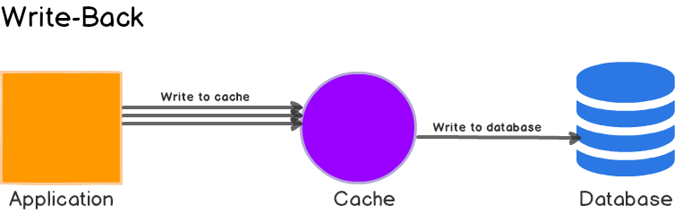

## 1. Cache-aside

这是最常用的 pattern，实现简单也足够灵活，系统能够承受一定程度的 cache failure。

### 1.1. Pros

- 简单灵活。

### 1.2. Cons

- 使用方（Application）需管理缓存与下一级存储。
- 写请求有可能造成缓存与下一级存储不一致，通过**写数据库后删缓存**可以降低不一致的可能性，根据系统要求可以再配合 TTL、异步任务甚至是分布式事务。

## 2. Read-through

相比较 **Cache-aside**，**Read-through** 为使用方管理了缓存与第一级存储，使用更加方便，表现上就像是一个自带缓存的存储接口。

### 2.1. Pros

- 接口简单，使用方便。

### 2.2. Cons

- 灵活性相比 **Cache-aside** 低一些。

## 3. Write-through

结构与 **Read-through** 一样，提供简单的接口。写入缓存后同步写入下一级存储，整个写操作完成，适用写少的情况。

### 3.1. Pros

- 接口简单，使用方便。

### 3.2. Cons

- 写操作延迟稍高，除了写库外，还有一次额外写缓存。

## 4. Write-behind

与 **Write-through** 类似，不过写库操作变为异步。

### 4.1. Pros

- 写性能大大提高。

### 4.2. Cons

- 数据由丢失可能。
- 实现复杂。

## 5. Key takeaways

[缓存更新的套路](https://coolshell.cn/articles/17416.html)

[Caching Strategies and How to Choose the Right One](https://codeahoy.com/2017/08/11/caching-strategies-and-how-to-choose-the-right-one/)
