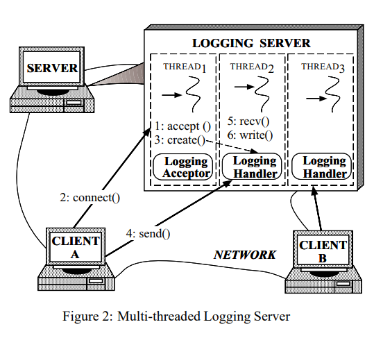
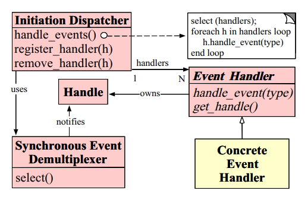
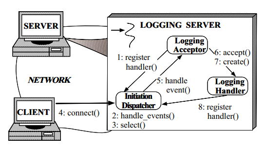
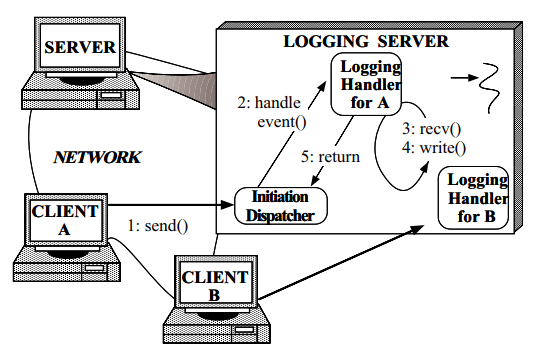

早期服务端程序处理用户请求时，会为每一个新连接创建线程处理请求，随着并发量越来越高，“thread-per-connection” 这种模式的弊端开始显现。一来线程创建本身有开销，二来上下文切换也会带来额外开销。引入线程池可以一定程度上缓解，但更深层次的问题开始浮现，连接建立（`accept`）后通常不能马上读取到client的请求数据（`recv`），也就是说线程池内线程处于挂起状态。

一个直观的想法就是，连接建立后**直到有数据可读时**才开启线程进行处理，避免线程挂起。

## 单线程 Reactor



- `Synchronous Event Demultiplexer`: 指代各种多路复用机制。
- `Handle`: 文件描述符或句柄。
- `Event Handler`: 处理 `Handle` 的上的各种事件，比如 `READ`, `WRITE`。
- `Initiation Dispatcher`: 核心类，维护一个基于 `Synchronous Event Demultiplexer` 的事件循环监听 `Handle` 各种事件并分发给 `Event Handler` 进行处理。



`Logging Acceptor` 是 `Event Handler` 一个实现类，专门处理 socket 上的 READ 事件，即客户端连接建立，大致流程：

1. 将 `Logging Acceptor` 注册至 `Initiation Dispatcher`。
2. `Initiation Dispatcher` 启动事件循环。
3. `Initiation Dispatcher` 通过 `select` 等待客户端发起 `connect`。
4. 客户端发起 `connect`。
5. `Initiation Dispatcher` 从 `select` 返回并将连接建立事件交由 `Logging Acceptor` 处理。
6. `Logging Acceptor` 调用 `accept` 获取连接。
7. `Logging Acceptor` 为了连接创建一个 `Logging Handler` 
8. `Logging Acceptor` 将新创建的 `Logging Handler` 注册到 `Initiation Dispatcher` 的事件循环中，开始新一轮的事件等待直到客户端发送数据（`send`）。



当客户端开始发送数据，大致流程：

1. 客户端发送数据。
2. `Initiation Dispatcher` 从 `select` 返回并将发生 READ 事件的连接交给对应 `Logging Handler` 处理。
3. `Logging Handler` 调用 `recv` 读取客户端数据。
4. `Logging Handler` 处理数据（注意这里的 `write` 在论文里是用作把客户端数据写入存储用的）。
5. 回到 `Initiation Dispatcher` 处理下一个事件或进入下一轮事件循环。

上面这两个过程基本就是 Reactor pattern 的核心流程了，回消息给客户端的流程类似，`Logging Handler` 处理完后再注册一个 WRITE 事件的监听，然后再写入数据。整个流程都在一个线程内工作，没有上下文切换。

Reactor pattern 除了使用多路复用外，还用到了非阻塞IO。设想 `Logging Handler` 一次事件响应中没能读到一个完整请求的数据，那么就需要立即返回等待下一次事件，而不是阻塞在 `recv` 上。

下面是示例代码：

```C++
#include <sys/epoll.h>
#include <sys/socket.h>
#include <cstdio>
#include <cstdlib>
#include <unistd.h>
#include <fcntl.h>

enum EventType {
    CONNECT,
    READ,
    WRITE,
    CLOSE
};

class EventHandler {
protected:
    const int fd;

public:
    EventHandler(const int fd) : fd(fd) {}
    virtual ~EventHandler() {}
    virtual void accept(EventType event) {}
};

class InitiationDispatcher {
private:
    static const int MAX_EVENTS = 16;
    EventHandler *get_handler(epoll_event *ev) const {}
public:
    InitiationDispatcher() {}
    ~InitiationDispatcher() {}

    void register_handler(const EventHandler* handler, EventType et) {}
    void remove_handler(const EventHandler* handler) {}
    void handle_events() {
        const int epfd = epoll_create(1);
        epoll_event events[MAX_EVENTS];
        while (true) {
            // update epfd instance
            epoll_ctl(epfd, EPOLL_CTL_ADD, /*fd*/, /*ev*/);

            const int nevents = epoll_wait(epfd, events, MAX_EVENTS, -1);
            for (size_t i = 0; i < nevents; i++) {
                auto ev = events[i];
                if (/*is CONNECT*/) {
                    auto logging_acceptor = get_handler(&ev);
                    logging_acceptor->accept(EventType::CONNECT);
                }
                else if (/*is READ*/) {
                    auto logging_handler = get_handler(&ev);
                    logging_handler->accept(EventType::READ);
                } else if (/*is WRITE*/) {
                    auto logging_handler = get_handler(&ev);
                    logging_handler->accept(EventType::WRITE);
                } else {
                    /* else */
                }
            }
        }
    }

};

class LoggingHandler : public EventHandler {
private:
    InitiationDispatcher* dispatcher;
public:
    LoggingHandler(const int fd, InitiationDispatcher* dispatcher) : EventHandler(fd), dispatcher(dispatcher) {}
    ~LoggingHandler() {}
    void accept(EventType event) override {
        if (event == EventType::READ) {
            int size = read(this->fd, /*buf*/, /*buf_size*/)
            if (size == EAGAIN)
            {
                return;
            }
            /* process */
            int written = write(this->fd,  /*buf*/, /*data_size*/);
            if (written == EAGAIN)
            {
                this->dispatcher->register_handler(this, EventType::WRITE);
                return
            }
        } else if (event == EventType::WRITE) {
            /*continue writing*/
        }
        
    }
};

class LoggingAcceptor : public EventHandler {
private:
    InitiationDispatcher* dispatcher;
public:
    LoggingAcceptor(const int fd, InitiationDispatcher* dispatcher): EventHandler(fd), dispatcher(dispatcher) {}
    ~LoggingAcceptor() {}
    void accept(EventType event) override {
        int conn_fd = accept4(this->fd, /*addr*/, /*addr_len*/, 0);
        auto handler = new LoggingHandler(conn_fd, this->dispatcher);
        int flags = fcntl(fd, F_GETFL, 0);
        fcntl(fd, F_SETFL, flags | O_NONBLOCK);
        this->dispatcher->register_handler(handler, EventType::READ);
    }
};

int main(void) {
    int socket_fd = socket(/* args */);
    listen(socket_fd, 0);
    auto dispatcher = new InitiationDispatcher();
    auto acceptor = new LoggingAcceptor(socket_fd, dispatcher);
    dispatcher->register_handler(acceptor, EventType::CONNECT);
    dispatcher->handle_events();
    return EXIT_SUCCESS;
}
```

## 多线程 Reactor

单线程 Reactor 中所有的操作在单个线程中完成，如果某个请求处理非常耗时，将导致其它请求无法处理，无法建立新连接。所以就可以将请求处理的逻辑交由线程池进行处理。

## 多线程 Multi-Reactor

不管单线程还是多线程 Reactor，所有的文件描述符/句柄都在同一个事件循环里处理，也就无法同一时间处理大量新连接建立和读写事件。所以可以将两种不同的文件描述符分别在不同的事件循环里处理，交由不同线程处理，提高吞吐量。

```C++
class InitiationDispatcher {
private:
  std::vector<InitiationDispatcher*> sub_dispathcers;
public:
  /**/
}
```

root `InitiationDispatcher` 只负责建立新连接建立，然后已建立的连接则交给 `sub_dispatchers`（RR）处理，每个 `sub_dispacther` 都会创建线程开启事件循环。

## Key takeaways

[The C10K problem](http://www.kegel.com/c10k.html)

[reactor](https://www.dre.vanderbilt.edu/~schmidt/PDF/reactor-siemens.pdf)

[nio netty](https://nicky-chin.cn/2020/06/11/net-nio-netty)
