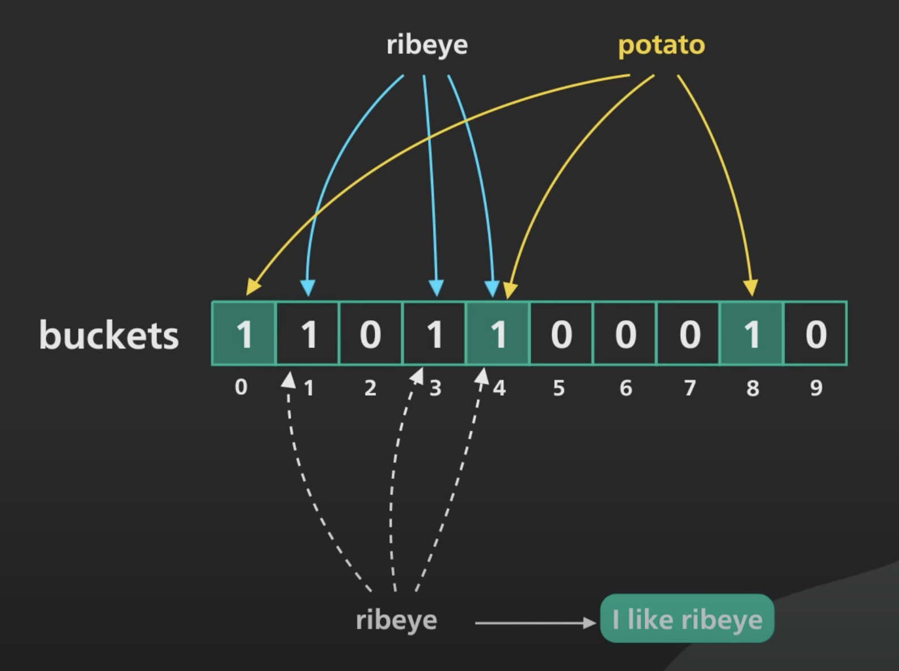

Bloom filter 是用来回答“某元素是否在集合中”这个问题的，答案可能是“Firm no”或“Probably yes”，但是 Bloom filter 相比 hash table 占用内存更少，空间效率更高。也就是说，Bloom filter 通过牺牲准确性交换空间。Bloom filter 主要用在需要减少访问速度更慢的更低一级存储（或数据源）次数的场景，比如优化内存穿透。

## Bloom filter 如何工作

Bloom filter 由 m 个比特的字节数组和 k 个 hash 函数组成。当一个元素被添加到 filter 中时，会先调用 k 个 hash 函数计算得到 k 个整数，将字节数组中对应 bit 置为 1。当查询时，如果对应 bit 全部为 1，则元素可能在集合中（hash 冲突）；如果任一位置 bit 为 0，则元素一定不在集合中。

使用多少个 hash 函数取决于期望的错误率是多少，m 大小则与 k 和集合规模成正比。

## Key takeaways

[Bloom filter wikipedia](https://en.wikipedia.org/wiki/Bloom_filter)

[Bloom Filter](https://www.youtube.com/watch?v=V3pzxngeLqw)
