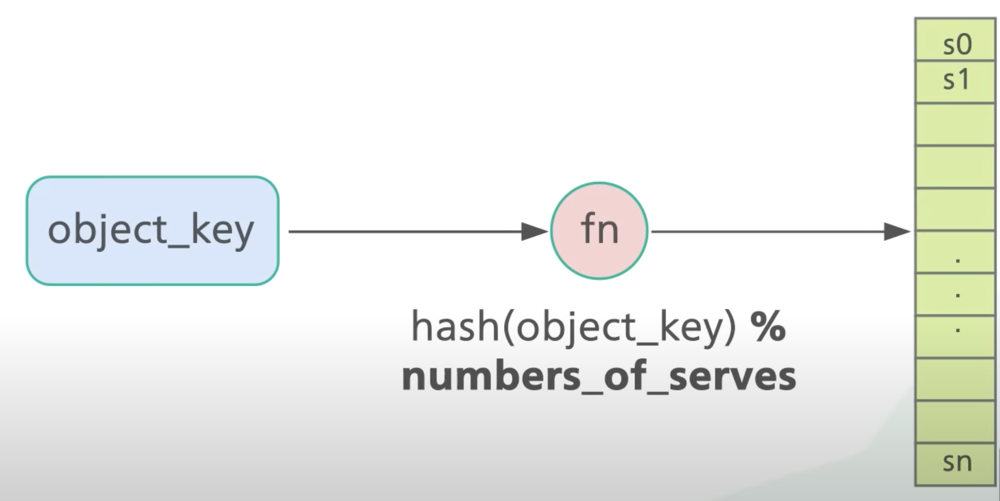
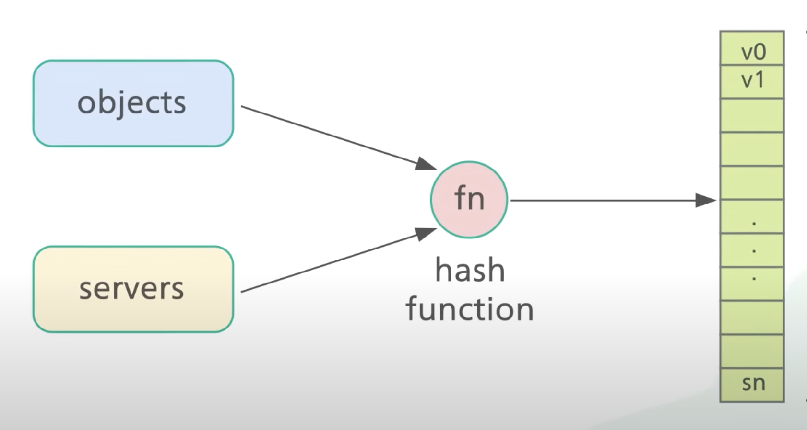
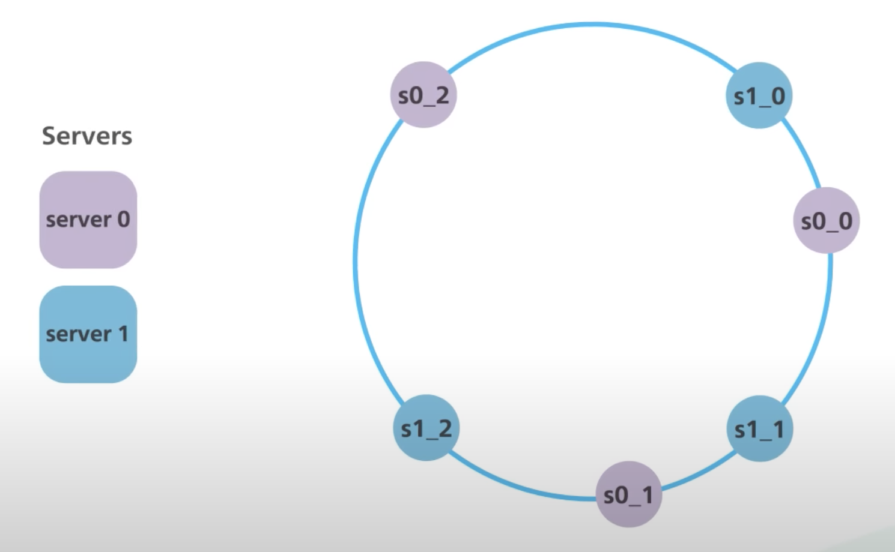

一般大型系统中，数据通常分布在多台机器上，并且为了稳定的性能表现，数据还需要均匀分布。

## 初步的做法

首先计算 `object_key` hash 值，然后对其取模得到目标 server。

这种方式的问题核心是，`numbers_of_servers` 在 server 下线或新 server 加入时会发生变化，从而 `object_key` 的计算结果也因此发生变化。

## hash 环

既然 `numbers_of_servers` 是一个不稳定因素，那么就需要将其替换成稳定的因素。

这里的做法是，对 `server_name` 或 `server_ip` 应用相同的 hash 函数，这时得到了 `v_object` 和 `v_server`。将 hash 函数的取值区间首位相连得到一个环， 然后根据 `v_object` 和 `v_server` 环上的位置，为 `object` 选择对应的 `server`。这里的规则一般是，按照顺时针方向搜索第一个 `server`。

理想情况下，现有节点下线或新节点加入都将不会导致所有 `object_key` 的重新分配。

但是现实中，数据可能不是完全均匀分布，也就是不同节点的上下线带来的影响也是不稳定的，无法预测的。比方说，两台机器，80%的数据分布在机器A，20%的数据分布在机器B，机器B下线将导致机器A负载变成原来5倍。

## 虚拟节点

为了缓解数据在 server 上不均匀分布带来的影响，引入虚拟节点，使一个 server 在环上出现多次，即将 `hash(server_name)` 替换成 `hash(server_name#N)`，`server_name#N` 表示虚拟节点。

这样，某台机器下线带来的影响将由其它节点共同承担，保证了稳定的性能。

## Key takeaways

[Consistent Hashing](https://www.youtube.com/watch?v=UF9Iqmg94tk)
