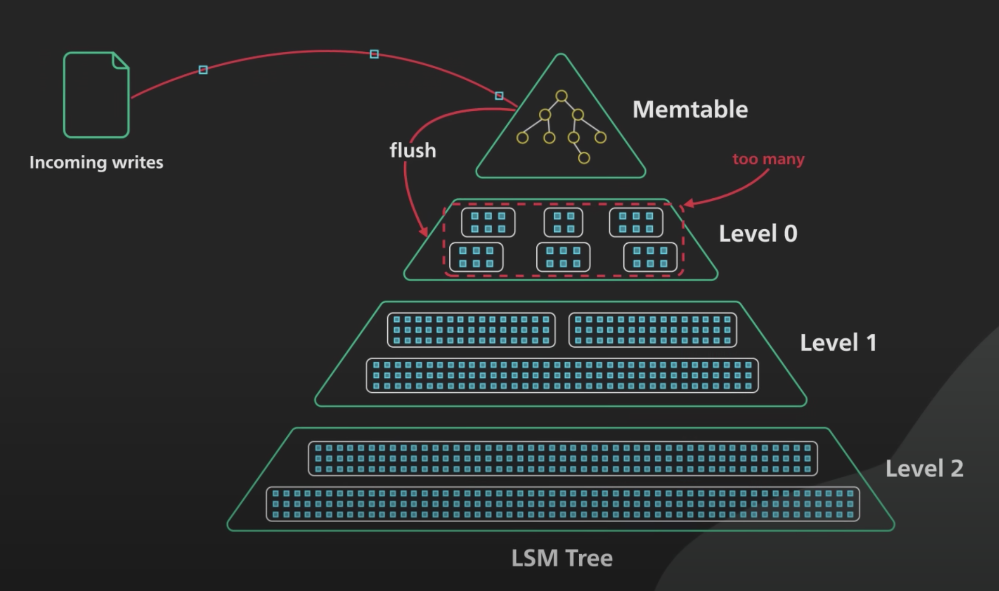

> The Log-Structured Merge-tree (LSM-tree) is a disk-based data structure designed to provide low-cost indexing for a file experiencing a high rate of record inserts (and deletes) over an extended period.

LSM tree 基于“磁盘批量顺序写性能高于随机写”这一理论基础，提供高性能写入能力，代价是牺牲一部分读性能和空间效率。为了弥补读取性能，需要进一步设计，这也是其名字——Log-Structured Merge Tree 的由来。

## 写入过程

LSM Tree 由存在于内存与磁盘上的部分组成，`Memtable` 和 `SSTable`，内存中又可以进一步划分成两个，如上图所示，顶部区域实际包含 `Mutable memtable` 和 `Immutable memtable`。

**Mutable memtable**：

所有操作直接写入 `Mutable memtable`，数据会按照 key 有序存储。一般基于 `Balanced binary tree` 实现。

**Immutable memtable**：

当 `Mutable memtable` 达到特定大小时，就会转换成 `Immutable memtable`，然后 flush 到磁盘上。`Immutable memtable` 只是数据写入磁盘（SSTable）前的临时状态，新数据会写入一个新的 `Mutable memtable`，避免了新数据写入被转储过程影响。

**SSTable(Sorted String Table)**：

有序键值对集合。

```plaintext
+-----------+-----------+-----------+-----------+
| key:value | key:value | key:value | key:value |
+-----------+-----------+-----------+-----------+
```

根据现实场景，文件内部结构可能不一样，key/value 分开存储，建立索引等。

> 对于 Delete 操作，LSM Tree 通过特殊的 *tombstone* 标记完成，这一点是比较反直觉的，因为删除操作并没有释放空间。

可以预想，SSTable 数量会不断增长，由此带来两个问题：

1. 查询操作需要按时间由近至远查询每个 SSTable 直到找到对应 key。
2. 空间冗余，同一 key 可能存在于多个 SSTable 中，但除了最新的那条，其余都是冗余数据。

为了缓解这两个问题，就需要适当对 SSTable 做 Compaction。

## Compaction

Compaction 的一般规则是将上一层 SSTable 合并进入下一层 SSTable，也就是说磁盘上会有多层 SSTable，越下层 SSTable 存储数据也越旧。

不同 Compaction 策略在以下三个指标间进行权衡与取舍：

1. Read amplification。比如需要从上往下在每层 SSTable 中搜索某个 key。
2. Write amplification。比如写入时触发 Compaction 带来额外磁盘 IO。
3. Space amplification。比如某个key存在多条冗余记录，compaction 完成前新的 SSTable 和原始 SSTable 同时存在，最坏情况下 compaction 期间数据膨胀为原来的两倍。

### size-tiered Compaction

size-tiered Compaction 策略比较简单，即限制一层中 SSTable 的数量，当数量达到阈值时，将该层 SSTable 合并成为一个更大的 SSTable 存入下一层。

在这种策略下，某个 key 还是有可能出现在多个 SSTable 中，也即空间放大。

### leveled Compaction

leveled compaction 是 sized-tiered compaction 的改进，大致思路是：对于 L1（第一层 SSTable 为 L0）SSTable 及以上 level，将 size-tiered compaction 中的大 SSTable 拆分成较小且 key range 互不相交的小 SSTable，这种情况下一个 key 不会有多个记录。当发生 L<sub>N</sub> compaction 时，从中挑选若干 SSTable（其 key range 不与其余 SSTable 相交），与 L<sub>N+1</sub> 层 key range 相交的若干 SSTable（必定连续）合并并拆分成新的小 SSTable，如果下层没有匹配 key range 的 SSTable，则 L<sub>N</sub> 层的 SSTable 直接进入 L<sub>N+1</sub> 层。

## Key takeaways

[The Log-Structured Merge-Tree](https://www.cs.umb.edu/~poneil/lsmtree.pdf)

[The Secret Sauce Behind NoSQL: LSM Tree](https://www.youtube.com/watch?v=I6jB0nM9SKU)

[Log Structured Merge Trees](http://www.benstopford.com/2015/02/14/log-structured-merge-trees/)

[LSM-Tree 的Compact策略](https://muzinuo.com/archives/lsm-tree-compact)

[LSM-Tree的存储引擎的Compact机制](https://zhuanlan.zhihu.com/p/437151725)
