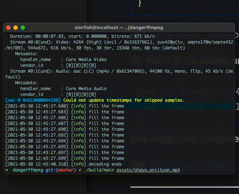

<!--
Created: Sat May 29 2021 09:56:01 GMT+0800 (China Standard Time)
Modified: Sat May 29 2021 10:10:40 GMT+0800 (China Standard Time)
-->
---
title: 【DangerFFmpeg】第四节、多线程
cover: /img/audiovisual/dangerffmpeg_screencap.jpeg
date: 2021-05-22 13:32:23
updated: 2021-05-22 13:32:23
categories:
  + Audiovisual
tags:
  + FFmpeg
  + SDL2
---

本文是 《DangerFFmpeg》系列教程第四节，系列完整目录：
《[开篇](/2021/05/14/8cf36b195b05.html)》
《[第一节、屏幕截图](/2021/05/15/1c458d50c524.html)》
《[第二节、输出到屏幕](/2021/05/16/aeb0b6c30d08.html)》
《[第三节、播放声音](/2021/05/19/d4b63d917433.html)》
《第四节、多线程》

系列所有代码托管在 [GitHub](https://github.com/clsrfish/dangerffmpeg) 。

---

## 概述

前面我们通过 SDL 的音频功能实现了音频播放能力，SDL 启动一个子线程并在需要音频数据的时候回调我们事先定义好的函数。现在我们将用类似的方式播放视频，这可以让代码更加模块化、更好管理，特别是当实现音视频同步时。那么我们从哪里开始聊呢？

首先我们注意到 `main` 函数做了太多事情：事件循环、读取数据包、解码视频。所以我们要做的就是把这些分开：我们将创建一个线程负责从流（stream）中读取数据包（packet），然后把它们添加到对应的队列中，并分别在 audio 线程和 video 线程中读取。我们在第二节中已经配置好了 audio 线程；video 线程将会有一点复杂，因为我们需要自己控制视频的播放。我们将把视频播放代码添加到主循环中，但是并不是每次循环播放一帧，而是将视频播放集成到 SDL 事件中。大致的思路就是解码视频并把帧数据（frame）保存到另一个队列（queue），然后创建自定义事件（FF_REFRESH_EVENT），然后当在事件循环中接收到这个事件时，它就会显示帧队列中的下一帧。下面是我们将要实现结构的 ASCII 插图：

```
 ________ audio  _______      _____
|        | pkts |       |    |     | to spkr
| DECODE |----->| AUDIO |--->| SDL |-->
|________|      |_______|    |_____|
    |  video     _______
    |   pkts    |       |
    +---------->| VIDEO |
 ________       |_______|   _______
|       |          |       |       |
| EVENT |          +------>| VIDEO | to monitor.
| LOOP  |----------------->| DISP. |-->
|_______|<---FF_REFRESH----|_______|
```

使用事件循环控制视频播放的目的是，通过使用 `std::this_thread::delay` ，我们可以精确地控制下一帧画面什么显示在屏幕上。当我们在下一节中实现音视频同步的时候，可以非常简单地添加那些代码，确定下一次视频刷新时间使得画面能够**在正确的时间**显示在屏幕上。

## 简化代码

稍微清理一下代码。我们有所有的音频视频的编解码器信息，并且准备添加队列和缓冲区，还有其它的一些数据。所有的这些东西组合成一个逻辑单元，即视频（moive）。所以我们创建一个大的 `VideoState` 结构体保存这些信息：

```c++
struct VideoState {
  AVFormatContext* formatCtx;
  int videoStream, audioStream;

  AVStream* audioSt;
  AVCodecContext* audioCtx;
  PacketQueue audioQueue;
  uint8_t audioBuf[20480];
  unsigned int audioBufSize;
  unsigned int audioBufIndex;
  AVPacket audioPkt;

  AVStream* videoSt;
  AVCodecContext* videoCtx;
  PacketQueue videoQueue;
  SwsContext* swsCtx;

  std::thread decodeT;
  std::thread videoT;

  VideoPicture picQueue[VIDEO_PICTURE_QUEUE_SIZE];
  int pqWindex = 0;
  int pqRIndex = 0;
  std::mutex* picQueueMutex;
  std::condition_variable* picQueueCond;
  int picQueueSize;

  std::string filename;

  SDL_Window* sdlWin;
  SDL_Renderer* sdlRen;
  SDL_Texture* sdlTex;

  bool quit;
};
```

从结构体里大致知道我们接下来要获取什么信息。首先看到一些基本信息 —— **格式上下文**（AVFormatContext），**音频视频流索引** 以及对应的 `AVStream` 对象。可以看到音频相关的缓冲区也转移到了 `VideoState` 结构内。我们为视频新增了一个队列（queue）和用于存放解码后帧的缓冲区（buffer）。`VideoPicture` 也是新增的，后面会看到它的内部细节。然后我们也为将要创建的两个线程分配了两个 `std::thread` ，一个 `quit` 标识位和文件名：

```c++
int main(int argc, char *argv[]) {
  VideoState *is;

  is = reinterpret_cast<VideoState*>(av_mallocz(sizeof(VideoState)));
}
```

`av_mallocz` 函数的作用是申请内存并用 `0` 填充。

然后我们初始化帧缓冲队列（picQueue）的锁，因为我们在事件循环中调用渲染函数的会从帧缓冲队列中获取预先解码好的视频帧，同时，视频解码器也会将解码好的视频帧存入队列，我们不知道哪个操作先执行。你应该知道这是一个典型的**竞态条件（race condition）**。所以在启动任何线程前，先初始化好锁。然后将将要播放的文件名拷贝到 `VideoState` 中。

```c++
is->picQueueMutex = new std::mutex();
is->picQueueCond = new std::condition_variable();
is->filename = std::string(argv[1]);
```

## 第一个线程：decodeThread

现在我们启动线程，开始工作：

```c++
is->decodeT = std::thread(decodeThread, is);

scheduleRefresh(is, 40);
```

`scheduleRefresh` 将在后面定义，它实际上就是在延迟特定时间后触发 `FF_REFRESH_EVENT` 事件，收到事件后绘制下一帧视频。不过我们现在先把目光集中在 `std::thread` 上。

> 原文是 C 实现，在 C++ 环境下，我们可以使用 `std::thread` 代替 `SDL_CreateThread` 去创建线程。

`std::thread` 会创一个新的线程，这个新的线程完全共享当前进程的内存地址空间，线程启动后执行指定的函数（`decodeThread`），并将参数传递给它。在这里，线程会执行 `decodeThread`，参数是 `VideoState*`。`decodeThread` 的前半部分没有新的知识，还是打开文件，查找音频流和视频流。唯一的不同是我们把获取到的信息保存在 `VideoState` 中。找到流后，我们调用另一个 `streamComponentOpen` 。音频和视频解码器的配置过程差不多，我们可以新增函数来复用这些相同的代码，这是非常自然的代码拆分方式。

`streamCompoenentOpen` 会查找解码器，配置音频参数，将重要的信息保存在 `VideoState` 中，然后启动 audio 线程和 video 线程（audio 线程由 SDL 管理）。下面是相关代码：

```c++
int streamComponentOpen(VideoState* is, int streamIndex) {
  AVFormatContext* pFormatCtx = is->formatCtx;

  if (streamIndex < 0 || streamIndex >= pFormatCtx->nb_streams) {
    return -1;
  }

  AVCodec* pCodec = avcodec_find_decoder(pFormatCtx->streams[streamIndex]->codec->codec_id);
  if (pCodec == nullptr) {
    return -1;
  }

  AVCodecContext* pCodecCtx = avcodec_alloc_context3(pCodec);
  AVCodecParameters* pParams = avcodec_parameters_alloc();
  avcodec_parameters_from_context(pParams, pFormatCtx->streams[streamIndex]->codec);
  if (avcodec_parameters_to_context(pCodecCtx, pParams) < 0) {
    avcodec_parameters_free(&pParams);
    return -1;
  }
  avcodec_parameters_free(&pParams);

  if (pCodecCtx->codec_type == AVMEDIA_TYPE_AUDIO) {
    // setup SDL audio here
    SDL_AudioSpec wantedSpec, spec;
    wantedSpec.freq = pCodecCtx->sample_rate;
    wantedSpec.format = AUDIO_F32;
    wantedSpec.channels = pCodecCtx->channels;
    wantedSpec.silence = 0;
    wantedSpec.samples = pCodecCtx->channels * 2;
    wantedSpec.callback = audioCallback;
    wantedSpec.userdata = is;

    if (SDL_OpenAudio(&wantedSpec, &spec) < 0) {
      spdlog::error("SDL_OpenAudio: {s}", SDL_GetError());
      return -1;
    }
  }

  if (avcodec_open2(pCodecCtx, pCodec, nullptr) < 0) {
    spdlog::error("Unsupported codec!");
    return -1;
  }

  switch (pCodecCtx->codec_type) {
    case AVMEDIA_TYPE_AUDIO:
      is->audioStream = streamIndex;
      is->audioSt = pFormatCtx->streams[streamIndex];
      is->audioCtx = pCodecCtx;
      is->audioBufSize = 0;
      is->audioBufIndex = 0;
      packetQueueInit(&is->audioQueue);
      SDL_PauseAudio(0);
      break;
    case AVMEDIA_TYPE_VIDEO:
      is->videoStream = streamIndex;
      is->videoSt = pFormatCtx->streams[streamIndex];
      is->videoCtx = pCodecCtx;

      packetQueueInit(&is->videoQueue);

      is->videoT = std::thread(videoThread, is);
      // initialize SWS context for software scaling
      is->swsCtx = sws_getContext(pCodecCtx->width, pCodecCtx->height, pCodecCtx->pix_fmt, pCodecCtx->width,
                                  pCodecCtx->height, AV_PIX_FMT_YUV420P, SWS_BILINEAR, nullptr, nullptr, nullptr);
      break;
    defult:
      return -1;
  }
  return 0;
}
```

上面的代码和上两节的差不多，不过现在它同时适用于音频和视频。还有一些小变化，我们使用 `VideoState*` 作为 `audioCallback` 的 userdata。 我们也将音频视频流分别使用 `audioSt` 和 `videoSt` 保存。同时，类似音频，我们为视频添加并配置了队列。最重要的点是启动 video 线程和 audio 线程，由这些代码完成：

```c++
  SDL_PauseAudio(0);
  break;
/* ... */
  is->videoT = std::thread(videoThread, is);
```

`SDL_PauseAudio` 前面的教程讲过，`std::thread` 和前面的使用方式一致。

回到 `decodeThread` 的后半部分，就是一个简单的 while 循环，不断的从流中读取数据包（packet）然后存入对应的队列：

```c++
while (!is->quit) {
  if (is->audioQueue.size > MAX_AUDIOQ_SIZE || is->videoQueue.size > MAX_VIDEOQ_SIZE) {
    std::this_thread::sleep_for(std::chrono::milliseconds(10));
    continue;
  }
  AVPacket packet;
  if (av_read_frame(is->formatCtx, &packet) < 0) {
    if (is->formatCtx->pb->error == 0) {
      std::this_thread::sleep_for(std::chrono::milliseconds(100));
      continue;
    } else {
      break;
    }
  }

  // Is this a packet from video stream?
  if (packet.stream_index == is->videoStream) {
    packetQueuePut(&is->videoQueue, &packet);
  } else if (packet.stream_index == is->audioStream) {
    packetQueuePut(&is->audioQueue, &packet);
  }
  av_packet_unref(&packet);
}
```

除新增了队列大小检查和读取错误检查外，也没有什么新东西。 `AVFormatContext` 内部持有 `ByteIOContext` 类型的 `pb` 对象，`ByteIOContext` 保存了底层的文件信息。

While 循环结束后，会**等待程序的其它部分结束**或**通知其它部分当前的解码工作结束**了。这部分代码演示了如何发送自定义事件，后面我们也会使用同样的方式刷新视频：

```c++
while (!is->quit) {
  std::this_thread::sleep_for(std::chrono::microseconds(100));
}

SDL_Event event;
event.type = FF_QUIT_EVENT;
event.user.data1 = is;
SDL_PushEvent(&event);
```

SDL 定义 `SDL_USEREVENT` 常量作为用户事件/自定义事件的标识，第一个用户事件/自定义事件需要使用 `SDL_USEREVENT` 进行赋值，第二个事件则是 `SDL_USEREVENT + 1`，以此类推。我本节程序中，`FF_QUIT_EVENT` 定义为 `SDL_USEREVENT + 1` 。自定义事件也可以根据情况传递用户数据（user data），这里我们传递的是 `VideoState`。最后调用 `SDL_PushEvent` 发送事件。在事件处理循环中，我们直接把 `FF_QUIT_EVENT` 放置到 `SDL_QUIT_EVENT` 中。后面会看到事件循环处理的详细实现，这里我们只需要保证 `FF_QUIT_EVENT` 发送后，我们能在捕获到这个事件并设置 `VideoState.quit` 。

## 解码帧：video_thread

准备好解码器后，紧接着启动 video 线程进行解码。这个线程会从视频包队列中读取数据包（packet），然后将数据包发送到解码器进行解码，拿到解码后的视频帧后调用 `queuePicture` 将处理好的帧送入帧队列（`VideoState.picQueue`）：

```c++
void videoThread(VideoState* is) {
  AVFrame* pFrame = av_frame_alloc();
  AVPacket pkt1, *packet = &pkt1;
  while (true) {
    int ret = packetQueueGet(&is->videoQueue, packet, true);
    if (ret < 0) {
      // means we quit getting packets
      break;
    }
    // Decode video frame
    ret = avcodec_send_packet(is->videoCtx, packet);
    av_packet_unref(packet);
    while (avcodec_receive_frame(is->videoCtx, pFrame) == 0) {
      if (queuePicture(is, pFrame) < 0) {
        break;
      }
    }
  }
  av_frame_free(&pFrame);
  spdlog::info("decoding ends");
}
```

函数的大部分代码应该还比较熟悉，代码相比第二节做了简化。这里要注意是调用 `av_packet_unref` 解引用，调用 `av_frame_free` 释放内存。

## 视频帧入队

让我们看看将视频帧保存视频帧队列的函数。因为 `SDL_UpdateTexture` 可以直接接收原始 YUV 数据，所以我们直接在 `VideoPicture` 中保存 `AVFrame*`，下面是结构体的实现：

```c++
struct VideoPicture {
  AVFrame *frame;
  int width, height; // source height & width
  bool allocated;
}
```

`VideoState` 持有一个 `VideoPicture` 的数组（即帧队列）做为缓冲。然而，首次写入时需要分配一个 `AVFrame` 对象，后面可以复用了（注意这里添加 `allocated` 标识 `frame` 是否已经分配内存）。

为了把数组当成队列使用，我们还引入了两个“指针” —— 写索引和读索引。同时记录下缓冲队列中有多少可读帧数据。写入帧数据前要确保帧队列中有空闲区。然后我们检查将要写入的位置是否已经分配好了内存，没有则需要分配。当窗口大小发生变化时也需要重新分配！

```c++
int queuePicture(VideoState* is, AVFrame* pFrame) {
  /* wait until we have space for a new pic */
  std::unique_lock<std::mutex> lk((*is->picQueueMutex));
  while (is->picQueueSize >= VIDEO_PICTURE_QUEUE_SIZE && !is->quit) {
    is->picQueueCond->wait(lk);
  }

  if (is->quit) {
    return -1;
  }

  // windex is set to 0 initially
  VideoPicture* vp = &is->picQueue[is->pqWindex];

  // allocate or resize the buffer
  if (vp->frame == nullptr || vp->width != is->videoSt->codec->width || vp->height != is->videoSt->codec->height) {
    vp->allocated = false;
    allocPic(is);
    if (is->quit) {
      return -1;
    }
  }
  // ...
}
```

我们再看下 `allocPic` 函数：

```c++
void allocPic(VideoState* is) {
  VideoPicture* vp = &is->picQueue[is->pqWindex];
  if (vp->frame != nullptr) {
    av_free(vp->frame->data);
    // we already have one make another, bigger/smaller
    spdlog::info("alloc a new frame");
    av_frame_free(&vp->frame);
    vp->frame = nullptr;
  }
  spdlog::info("fill the frame");
  // Allocate a place to put our frame
  vp->frame = av_frame_alloc();
  vp->width = is->videoSt->codec->width;
  vp->height = is->videoSt->codec->height;
  vp->allocated = true;
  // Determine required buffer size and allocate buffer
  int nbBytes = avpicture_get_size(AV_PIX_FMT_YUV420P, vp->width, vp->height);
  uint8_t* buffer = reinterpret_cast<uint8_t*>(av_malloc(nbBytes * sizeof(uint8_t)));

  // Assign appropriate parts of the buffer to iamge planes in pFrameRGB
  // Note that pFrameRGB is an AVFrame, but AVFrame is superset
  // of AVPicture
  avpicture_fill(reinterpret_cast<AVPicture*>(vp->frame), buffer, AV_PIX_FMT_YUV420P, vp->width, vp->height);
}
```

我们看到用于存放转换（`sws_scale`）后的 `AVFrame` 在这里进行了分配。记住我们把帧宽高保存到了 `VideoPicture` 中，因为我们要确保视频尺寸不会因某些原因发生变化。好了，我们分配好了 `AVFrame` 并准备接收帧数据。让我们回到 `queuePicture` 看看转换 `AVFrame` 的代码实现，你应该还熟悉这部分：

```c++
int queuePicture(VideoState* is, AVFrame* pFrame) {
  // ...
  /* We have a place to put our picture on the queue */
    sws_scale(is->swsCtx, reinterpret_cast<uint8_t**>(pFrame->data), pFrame->linesize, 0, is->videoSt->codec->height,
            reinterpret_cast<uint8_t**>(vp->frame->data), vp->frame->linesize);

  // now we inform out displat thread that we have a pic ready
  if (++is->pqWindex == VIDEO_PICTURE_QUEUE_SIZE) {
    is->pqWindex = 0;
  }
  is->picQueueSize++;
  return 0;
}
```

这部分的重点就是使用 `sws_scale` 对原始帧进行转换，剩下的部分就是将数据“入队”。队列的工作原理就是往里添加数据直到填满，同时只要有数据就不断读取，这两个操作都依赖 `VideoState.picQueueSize`，所以需要加锁。所以我们在这里做的是不断增加**写“指针”**（必要时重置为 0），增加队列的数据数量。这样消费者就能直到队列中有可消费数据，如果队列满了，生产者也能知道。

## 显示视频

上面就是 video 线程的所有内容！现在我们完成了所有线程创建及其实现，除了一个 —— 还记得 `scheduleRefresh` 回调的方式嘛？看下它的实现：

```c++
/* schedule a video refresh in 'delay' ms */
void scheduleRefresh(VideoState* is, int delay) {
  SDL_AddTimer(delay, sdlRefreshTimerCb, is);
}
```

`SDL_AddTimer` 在延迟特定时间后触发回调函数，也可以传递数据。我们将使用这个函数触发视频刷新 —— 每次调用这个函数是，它就会设置一个计时器，计时器会触发一个用户事件，在 `main` 的事件循环我们就会从帧队列中获取一帧并展示它！呼（Phew）！

但是首先，看下我们怎么触发这个事件：

```c++
uint32_t sdlRefreshTimerCb(uint32_t interval, void* opaque) {
  SDL_Event event;
  event.type = FF_REFRESH_EVENT;
  event.user.data1 = opaque;
  SDL_PushEvent(&event);
  return 0;
}
```

现在开始了解发送事件。 `FF_REFRESH_EVENT` 定义为 `SDL_USEREVENT + 1`。需要注意的是，当我们返回 `0` 时，SDL 就会停止计数器，避免回调被多次调用。

> 计时器发现当前时间超过预设时间时就会进行回调，当 0 返回就表示事件被消费了，计时器就不会再回调了。

发送完 `FF_REFRESH_EVENT` 后，我们需要在事件循环中进行响应：

```c++
while (!is->quit) {
  SDL_WaitEvent(&event);
  switch (event.type) {
    /* ... */
    case FF_REFRESH_EVENT:
      videoRefreshTimer(event.user.data1);
      break;
  }
```

我们接着看 `videoRefreshTimer`，这个函数实际从帧队列中获取数据：

```c++
void videoRefreshTimer(void* userdata) {
  VideoState* is = reinterpret_cast<VideoState*>(userdata);
  if (is->videoSt != nullptr) {
    if (is->picQueueSize == 0) {
      scheduleRefresh(is, 1);
    } else {
      // VideoPicture* vp = &is->picQ[is->pqRIndex];
      // Timing code goes here

      scheduleRefresh(is, 20);

      std::lock_guard<std::mutex> lk(*(is->picQueueMutex));

      // show the picture
      videoDisplay(is);

      // update queeu for next picture
      if (++is->pqRIndex == VIDEO_PICTURE_QUEUE_SIZE) {
        is->pqRIndex = 0;
      }
      is->picQueueSize--;
      is->picQueueCond->notify_all();
    }
  } else {
    scheduleRefresh(is, 100);
  }
}
```

这是个非常简单的函数：从帧队列中获取数据，设置下次刷新的时间，调用 `videoDisplay` 将视频帧渲染上屏幕，然后移动队列读指针，并它的大小。你可能注意到我们并没有使用 `vp` 变量，原因是：在后面的教程开始实现音视频同步时，我们会访问时间信息，注释中也进行标注了 "Timing code goes here"。到时候，我们会计算出下一帧什么时候展示，并且将这个结果传递给 `scheduleRefresh` 函数。现在我们写死了 20ms 。从原理上讲了，你可以根据播放的文件调整这个数据的大小然后重新编译，不过这个有两个问题：
1. 播放一段时间后，声音和画面会不协调；
2. 这很傻。

这部分下节中再回过头来解决。

我们马上就要完成了，还剩最后一件事：**渲染视频帧**！

```c++
void videoDisplay(VideoState* is) {
  VideoPicture* vp = &is->picQueue[is->pqRIndex];
  if (vp->frame == nullptr) {
    return;
  }
  AVFrame* frame = vp->frame;
  // Present the frame with SDL
  SDL_RenderClear(is->sdlRen);
  // Update texture
  if (is->sdlTex == nullptr) {
    // Create texture for displaying
    SDL_Texture* texture = SDL_CreateTexture(is->sdlRen, SDL_PIXELFORMAT_YV12, SDL_TEXTUREACCESS_STREAMING,
                                             is->videoCtx->width, is->videoCtx->height);
    if (texture == nullptr) {
      spdlog::error("Could not create texture - {s}", SDL_GetError());
      return;
    }
    is->sdlTex = texture;
  }
  SDL_UpdateYUVTexture(is->sdlTex, nullptr, frame->data[0], frame->linesize[0], frame->data[1], frame->linesize[1],
                       frame->data[2], frame->linesize[2]);

  // Calculate rect
  float aspectRatio;
  if (is->videoSt->codec->sample_aspect_ratio.num == 0) {
    aspectRatio = static_cast<float>(is->videoSt->codec->width) / static_cast<float>(is->videoSt->codec->height);
  } else {
    aspectRatio =
        av_q2d(is->videoSt->codec->sample_aspect_ratio) * is->videoSt->codec->width / is->videoSt->codec->height;
  }
  int screenW, screenH, w, h;
  SDL_GetWindowSize(is->sdlWin, &screenW, &screenH);
  h = screenH;
  w = static_cast<int>(std::rint(h * aspectRatio)) & -3;
  if (w > screenW) {
    w = screenW;
    h = static_cast<int>(std::rint(w / aspectRatio)) & -3;
  }
  // Center the movie
  int x = (screenW - w) / 2;
  int y = (screenH - h) / 2;

  SDL_Rect dstRect{x, y, w, h};

  // Draw texture
  SDL_RenderCopy(is->sdlRen, is->sdlTex, nullptr, &dstRect);
  // Update the screen
  SDL_RenderPresent(is->sdlRen);
}
```

因为屏幕可以是任意尺寸（这里写死的是 640x480，当然用户的也能调整窗口大小），我们需要计算出视频显示区域的尺寸和位置。首先我们要计算出视频的宽高比，一些编解码器会有一个奇怪的**采样宽高比（sample aspect ratio）**，它指单个像素或采样的宽高比。编解码器中的宽高以像素作为单位，所以实际画面宽高比是**编解码器宽高比**与**采样宽高比**的乘积。如果编解码器的**采样宽高比**等于 0，这说明每个像素的尺寸是 1x1。然后我们对视频进行缩放，使得画面能够尽量撑满窗口。`& -3` 位操作会将宽高向下取整到最接近的 4 的倍数上。得到缩放后的宽高后就可以进行居中定位了。


就是这样了！开始编译运行：

```shell
$ ./main.sh assets/ohayo_oniityan.mp4
```



可以看到视频已经居中显示了，但是音画还是不同步。下个教程中我们将实现一个可以正常工作的播放器了。

## 参考文章

[原文链接](http://dranger.com/ffmpeg/tutorial04.html)