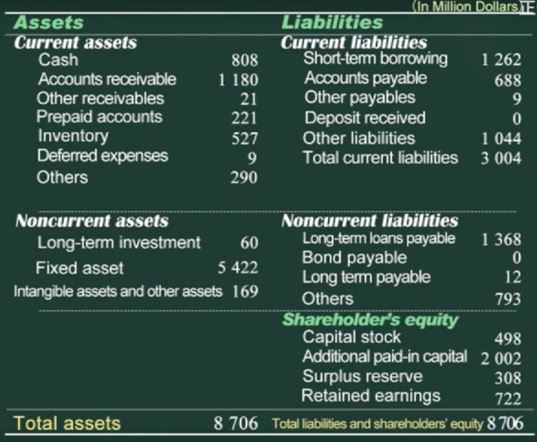
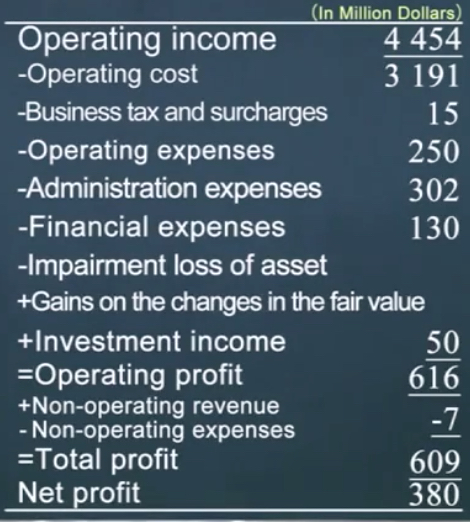
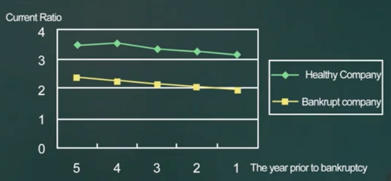
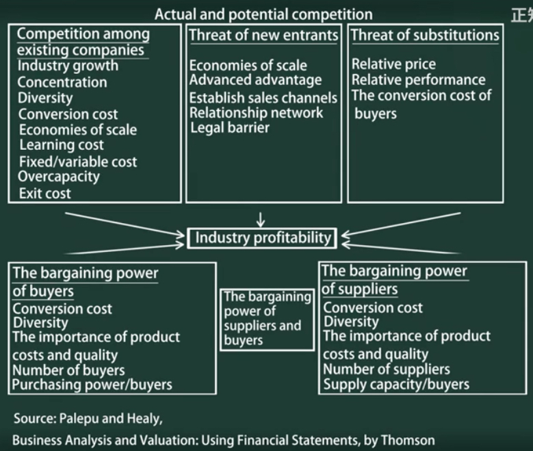
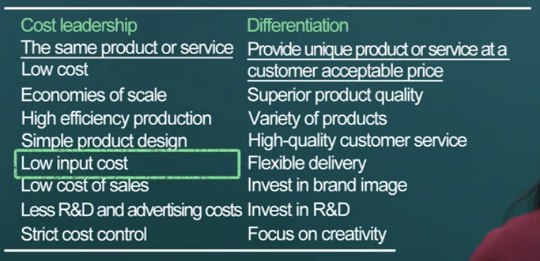
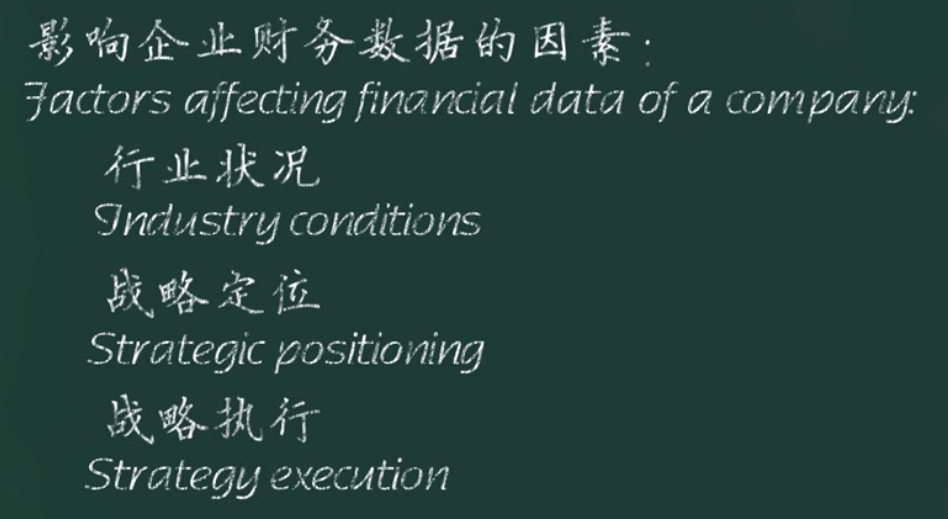
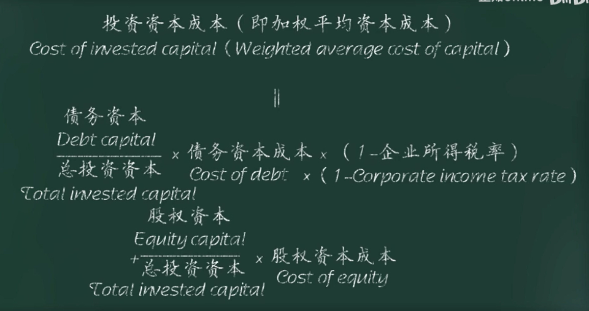

清华大学肖星教授财务公开课笔记。

    <iframe src="//player.bilibili.com/player.html?aid=845598883&bvid=BV1354y1L7kg&cid=346603284&page=1"  scrolling="no" border="0" frameborder="no" framespacing="0" allowfullscreen="true" style="position: absolute; width: 100%; height: 100%; left: 0; top: 0;" sandbox="allow-top-navigation allow-same-origin allow-forms allow-scripts"></iframe>

---

## 财务报表

公司三项活动：经营、投资、融资。

### 资产负债表

资产 = 负债 + 权益
权益 = 资产 - 负债
负债 = 资产 - 权益 ：在经济学概念上不成立，去除股东权益后公司变成债权人的了。

> 资产与费用的异同：
> 同：都需要付出一笔资金。
> 异：如果在未来可以换来一个有用的东西，就是资产，如果什么都没留下，则是费用。

待摊费用：随着时间流逝或经营活动，逐渐发生的费用。

> 待摊费用很有意思。

流动资产与固定资产的区别在于变现的能力。

固定资产要满足使用时间长、价值高这两项条件。

员工/人的所有权不归公司所有，所以也无法体现在报表里，否则就是奴隶制了。

> 棒球俱乐部会花巨额引入球星，这项费用就是一个待摊费用，这时人，更准确地是人的某项所有权，就变成了一项资产体现在报表里。

#### 资产的价值

**购买成本/历史成本** or **当前市价/公允价值**？

历史成本原则：如果资产升值了，忽略，如果减值，则扣除减值部分。

公允价值原则：当市场价格特别客观（交易活跃）时，使用当前市价记录，典型资产有股票、债券等金融产品和投资性房地产。

在使用历史成本统计时，因为资产只计减值，所以当**资产升值**时，可能会通过一项无意义的交易将增值部分计入资产，从而使财报更好看。

#### 债务

员工工资计入其它债务，因为工资一般都是月末发放，这项费用很快就会偿清。

#### 长期应付款

租赁
1. 经营性租赁：
2. 融资性租赁：金额大、期限长，会认定为在分期购买一项资产

#### 股东权益

P7

权益结构：
1. 股本
2. 资本公积
3. 盈余公积：法律规定不可分配净利润部分，中国特色项目。
4. 未分配利润

> 比如增发 1亿股，每股成本 1块，发行价 20块。融资回来 20亿，其中 1亿计入股本，剩余 19亿计入资本公积。持有股本数决定股东拥有公司的份额的比例。

### 利润表

知道企业是不是赚钱了。

毛利/gross profit = 收入/revenue - 成本/cost

营业税：只要企业有经营活动，就需要交。又叫流转税。价内税。

增值税：价外税。

> 100 块钱的菜，饭馆要交5块的税包含在这一百块内，这就是营业税。又比如一台电脑标价10000，但是消费者需要支付11000才能购买，多出来的1000就是增值税。增值税会由商家代收，成为其负债——应交税金，体现在资产负债表中。

所得税：赚钱之后才交。

营业费用：跟产品销售环节有关的费用，运输、广告、销售人员工资、 门店租金等。

管理费用：管理人员的工资、办公楼的折旧等。

财务费用：存款利息、债务利息等。一般情况下是正数，负数可能是资金未及时投入使用。

投资收益：投资虽然不是营业所得，但是可以认为是设立子公司从事经营活动，所以仍然可以认为是营业利润。

资产减值损失：

公允价值变动收益：主要针对金融资产和投资性房地产，这类资产的公允价值变动会产生收益或损失。

营业外收入：存活盘点时发现存货多/少了，就是存货盘盈/盘亏。
营业外损失：比如自然灾害、火灾等造成的损失。

营业外收入或损失一般都是偶发性、不具备可持续性。

应税所得按照税法计算，而利润所得按照会计准则计算，二者之间虽然大致相同，但是有差异。比如广告费用 2KW，虽然会计准则会将这 2KW 计入营业费用，但是税法规定只有 xx% 的广告费可以计入成本，剩下的还是要计税。

#### 利润表表达信息

收入/Revenue - 所有成本费用/Expenses = 利润/Profit

**作用**：
- 现在收入
- 预测未来收入情况

收入/Income != 收到现金/Cash inflow : 比如产生了应收款、预付款

费用/Expenses != 付出现金/Cash outflow : 比如资产折旧、待摊费用

收入现金 - 付出现金 = 现金流 => 利润 != 现金流

### 报表产生的过程

P11

研发投入在研发过程中的算作费用，研发成功后在特定条件下才能作为无形资产。研发是一个高度不确定的活动，会计处于谨慎保守，所以研发投入认为是费用；研发成功不等于商业成功，仍然具有高度不确定性。外购技术可以作为无形资产，因为已经有交易对其进行定价，所以有些企业将研发部门单独成立公司，母公司就需要从子公司购买。

自创技术、自创品牌的投入一般都算在管理费用中，即使这些东西可能非常有价值。

### 现金流量表

P18

现金流量表就是将现金的流入与流出按照公司从事的经营、融资、投资三项活动进行分类描述。描述现金的来龙去脉，描述企业的**风险状况**。

### 三张报表的内在关联

P21

利润表主要描述企业的经营活动，资产负债表描述投资和融资活动，现金流量表描述风险。
三张表从两个维度描述了企业状况：
- 现金流量表从风险角度描述了企业能不能活下去；
- 资产负债表和利润表则描述了如果企业能活下去，未来能取得什么样的收益。

零成本收购：承担负债，获取资产。

## 财务分析

### 常用财务分析方法
最常用的财务分析方法——同型分析，其实就是结构分析，即分析每个部分所占资金总量的比例。

利润表使用营业收入作为整体/分母；资产负债表使用总资产作为整体/分母。

比率分析：对原有报表数据进行处理得到新的数据。

现金流分析：

比较分析：主要是同行业、同水平企业的对比。

### 盈利能力

毛利润率，净利润率。

投入资源就是总资产。

收入/总资产 * 净利润/收入 = 净利润/总资产 = 总资产报酬率（return on total assets）

利润率是效益概念；收入/总资产叫周转率，是效率概念。

### 营运能力

周转率是营运能力指标。

某项资产的周转率 = 收入/某项资产

但是存货是例外，存货周转率 = 成本/存货。

周转率计算时分子来源于利润表，分母来源于资产负债表，但是利润表是时段概念，资产负债表是时刻概念，所以分母使用平均值才更合理。

以应收账款为例，假设应收账款的周转率是 3，则表示应收账款平均在 4 个月内能完成回款。

股东权益 = 总资产 - 负债 = 净资产

净资产回报率 = 净利润/股东权益

### 偿债能力

负债划分为流动、非流动。

#### 短期偿债

短期偿债能力衡量流动债务的偿还能力。

偿债资金来源应该是流动资产，理想情况下，流动资产可以短时间内全部变成现金，保守的方式是去除变现周期较长的存货。

流动资产/流动负债 = 流动比率
(流动资产 - 存货)/流动负债 = 速动比率

流动资产的作用：
1. 流动偿债能力
2. 提供日常营运的资金

> 纵轴：流动比率
> 横轴：破产前年份

> 上面图表由美国学者制作。在中国，银行不太倾向给企业长期贷款，很多短期贷款是长期贷款的一种体现——借新债还旧债，从这个角度来说，需要去除一部分短期借款。

#### 长期偿债

不能用 `长期负债/固定资产` 计算长期偿债能力，当企业变卖固定资产一般是企业要破产关门了。

**偿还利息的能力**

`净利润/利息支出` 也不能用来计算偿还利息的能力，因为净利润已经扣除了债务利息。一般用支付所得税和财务费用前的利润/利息计算偿息能力，这样的利润叫息税前利润。

**偿还本金的能力**

不太精确。

资产负债率 = 负债/资产 = 财务杠杆

大多数行业平均水平在 45%，重资产行业通常比较高，因为资产多，能够抵押的也多。

## 影响财务数据的因素

竞争激化直接影响毛利。

产业链上下游环境，体现在毛利、预付账款和应收账款上。

### 财务数据对战略决策影响

成本领先战略：低毛利高周转率，追求效率。

差异化战略：高毛利低周转，追求高效益。

## 如何理解赚钱？

几个与赚钱相关的指标：净利润率、总资产报酬率、净资产收益率。

总资产报酬率对投资回报的描述不够精确，总资产中除了股东权益，还包含有息债务，所以需要在净利润上加上所支付的利息。

投资资本成本，一般用行业平均水平，P36。
机会成本，即投到同行业别的企业能够获得收益。

经济利润：比行业平均盈利水平多赚的钱，企业为股东真正赚到的钱。

经济利润 > 0 是一个好企业的最基本要求。

## 分析实战

P39

## 现金流分析

P45

净利润 - 现金流 = 非现金资产和负债变化

## 战略投资与投资决策

P51

## 参考

https://www.bilibili.com/video/BV1354y1L7kg
https://www.bilibili.com/video/BV1Mi4y1x7d5